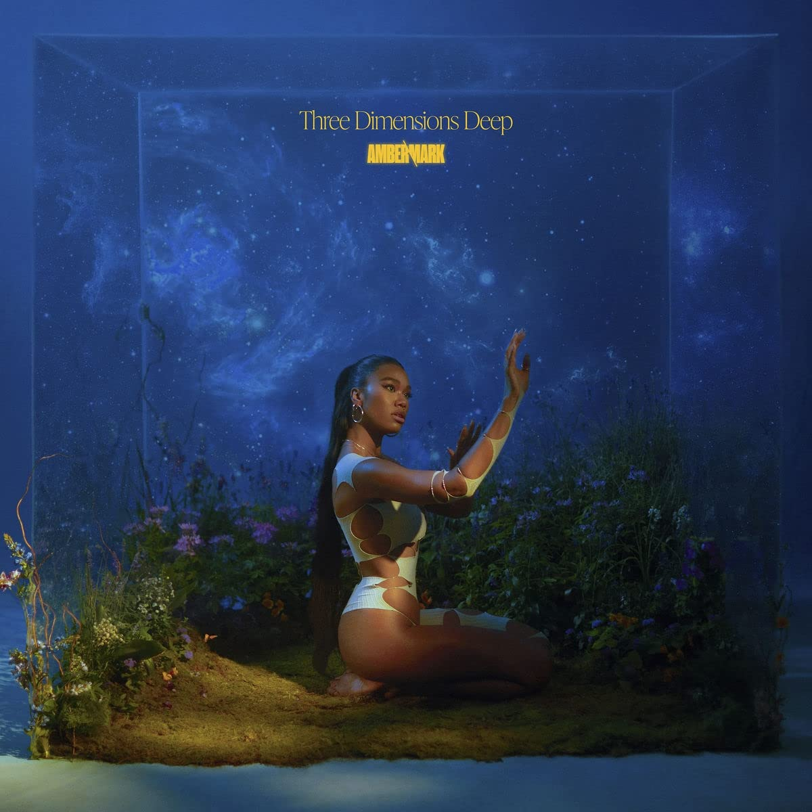

import { Slider, Button } from "carbon-components-react";
import { ArrowUpRight24 } from "@carbon/icons-react";

import SliderJS1 from "../review/slider1";
import SliderJS2 from "../review/slider2";
import SliderJS3 from "../review/slider3";
import SliderJS4 from "../review/slider4";
import AdvJS2 from "../review/adv2";
import AdvJS3 from "../review/adv3";

import { Link } from "gatsby";

Album review

<h1 className="h1--no--margin">{props.pageContext.frontmatter.title}</h1>

<Row  className="image-card-group">
	<Column colMd={"3"} colLg={"4"} noGutterMdLeft="">
       <ImageCard>

</ImageCard>
	</Column>
	<Column colMd={"4"} colLg={"8"} noGutterMdLeft="">
		

			Tennessee生まれのSinger, Song WriterであるAmber Markの1stアルバム。Germanの母とJamaicanの父を持つハーフで、2016年あたりから音楽活動を始め、Singleのリリースを重ねて、28歳の今年、Interscopeよりフルアルバムデビューとなった。
			 言ってしまえば、今どきのR&Bなのだが、ビートが強調されて、カッコ良い曲が多い印象を受ける。ダンサブルな⑧などアップ〰ミドルが中心となるが、癒し系のラスト⑰、アフロな⑦など含め、曲調は相当にバラエティ豊かになっている。加えて、美メロな曲もあり、クオリティの高い曲が多い。
			 Amber MarkのVocalはところどころファルセットを使いつつも、全体的には張りのあるところが特徴的で、Lyricは恋愛系が多くなっている。
		

		

		  <Button className="button-right-mergin"  href="https://amzn.to/3MRD2YQ" kind="primary" size="small" renderIcon={ArrowUpRight24}>
  	    amazon.com
  	  </Button>
  	  <Button className="button-right-mergin"  href="https://amzn.to/3eWklqE" kind="secondary" size="small" renderIcon={ArrowUpRight24}>
  	    amazon.co.jp
  	  </Button>
			<Button className="button-right-mergin"  href="https://apple.co/3VII7qF" kind="tertiary" size="small" renderIcon={ArrowUpRight24}>
  	   	apple music
  	  </Button>
			<AdvJS2/>
		

	</Column>
</Row>
<Row >
	<Column colMd={"4"} colLg={"4"} noGutterMdLeft="">
		

		  <h3>Score card</h3>
			<SliderJS1 value="5" />
		  <SliderJS2 value="2" />
			<SliderJS3 value="1" />
		  <SliderJS4 value="9" />
		

	</Column>
	<Column colMd={"8"} colLg={"8"} noGutterMdLeft="">
		

			<h3>Producers</h3>
			

				Pace Rock, DJ Ross One, Amber Mark and Julian Bunetta(1)
				 Julian Bunetta (2
				 Amber Mark and Julian Bunetta(3,6,10,11,12)
				 Jeff "Gitty" Gitelman(4)
				 Afterhrs and Julian Bunetta(5)
				 Apace People(7)
				 John Ryan(8)
				 Two Fresh Beats, Afterhrs and Julian Bunetta(9,15,16)
				 Amber Mark, Matt Zara, Duck Blackwell and Julian Bunetta(13)
				 Amber Mark, Paul Mond and Julian Bunetta(14)
				 Amber Mark(17)
			

			<h3>Guests</h3>
			

			

		

	</Column>
</Row>

<h3>Tracks</h3>

| No. | Title             | Composers                                                                                                                            | Performer  | Time  |
| --- | ----------------- | ------------------------------------------------------------------------------------------------------------------------------------ | ---------- | ----- |
| 1   | One               | Patrick Johnson / Deadric Malone / Amber Mark / Ross Schwartzman                                                                     | Amber Mark | 03:31 |
| 2   | What It Is        | Julian Bunetta / Amber Mark                                                                                                          | Amber Mark | 05:25 |
| 3   | Most Men          | Amber Mark                                                                                                                           | Amber Mark | 04:15 |
| 4   | Healing Hurts     | Trey Campbell / Jeff Gitelman / Amber Mark                                                                                           | Amber Mark | 02:42 |
| 5   | Bubbles           | Julian Bunetta / Ian Franzino / Andrew Haas / Steph Jones / Amber Mark / John Ryan                                                   | Amber Mark | 02:38 |
| 6   | Softly            | Craig David / Mark Hill / Amber Mark                                                                                                 | Amber Mark | 02:53 |
| 7   | Fomo              | Amber Mark / Space People                                                                                                            | Amber Mark | 03:51 |
| 8   | Turnin' Pages     | Amber Mark / Liza Owen / John Ryan                                                                                                   | Amber Mark | 02:36 |
| 9   | Foreign Things    | Julian Bunetta / Ian Franzino / Andrew Haas / Jason Kellner / Amber Mark / Kendrick Nicholls / Sherwyn Nicholls / Chase Hugh Worrell | Amber Mark | 03:00 |
| 10  | On & On           | Amber Mark                                                                                                                           | Amber Mark | 03:28 |
| 11  | Out of This World | Harris Cole / Amber Mark                                                                                                             | Amber Mark | 03:12 |
| 12  | Cosmic            | Amber Mark                                                                                                                           | Amber Mark | 04:35 |
| 13  | Darkside          | Amber Mark                                                                                                                           | Amber Mark | 03:31 |
| 14  | Worth It          | Amber Mark                                                                                                                           | Amber Mark | 04:18 |
| 15  | Competition       | Julian Bunetta / Ian Franzino / Andrew Haas / Steph Jones / Amber Mark / Kendrick Nicholls / Sherwyn Nicholls / Liza Owen            | Amber Mark | 03:22 |
| 16  | Bliss             | Julian Bunetta / Ian Franzino / Andrew Haas / Steph Jones / Amber Mark / Kendrick Nicholls / Sherwyn Nicholls / Liza Owen            | Amber Mark | 02:53 |
| 17  | Event Horizon     | Lincoin Bliss / Amber Mark                                                                                                           | Amber Mark | 03:56 |

<AdvJS3 />
