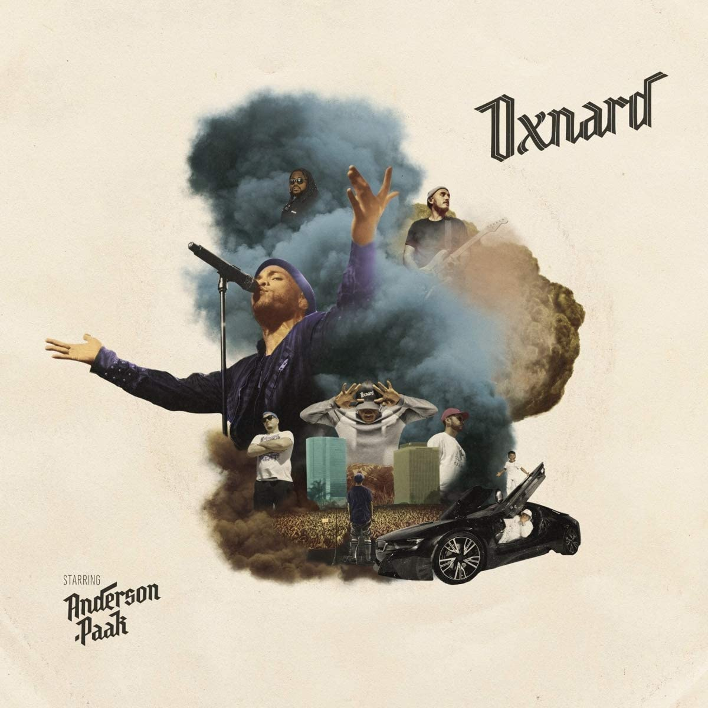

import { Slider, Button } from "carbon-components-react";
import { ArrowUpRight24 } from "@carbon/icons-react";

import SliderJS1 from "../review/slider1";
import SliderJS2 from "../review/slider2";
import SliderJS3 from "../review/slider3";
import SliderJS4 from "../review/slider4";
import AdvJS2 from "../review/adv2";
import AdvJS3 from "../review/adv3";

import { Link } from "gatsby";

import Review1 from "../review/andersonpaak4.mdx";
import Review2 from "../review/andersonpaak2.mdx";
import Review3 from "../review/nxworries1.mdx";

import Review11 from "../review/silksonic1.mdx";

Album Review

<h1 className="h1--no--margin">{props.pageContext.frontmatter.title}</h1>

  <Link to="/best50/2018/">2018 Black Music Best No.35</Link>

<Row  className="image-card-group">
	<Column colMd={"3"} colLg={"4"} noGutterMdLeft="">
       <ImageCard>

</ImageCard>
	</Column>
	<Column colMd={"4"} colLg={"8"} noGutterMdLeft="">
		

			Anderson.Paakの3年弱振りの3作目。DreをExecutive Producerに迎えたが、いわゆるWest Sideの強い影響は無く、Andersonの個性を活かした作りになっている。
			 サンプリングを効果的に使いつつ、ベースはバンド指向になっている。サウンド的には70-80年代のソウルを下敷きにしたミディアム～スロー中心で、今まで以上にPopかつメローで聴きやすい。
			 そんなTrackは本人はRapと唄を自由に行き来している。豪華ゲストが花を添えているところも聞き逃せない。
		

    	

		 		<Button className="button-right-mergin"  href="https://amzn.to/2B4MqYP" kind="primary" size="small" renderIcon={ArrowUpRight24}>
   	  		amazon.com
    	 	</Button>
	 			<Button className="button-right-mergin"  href="https://amzn.to/2YrfouF" kind="secondary" size="small" renderIcon={ArrowUpRight24}>
     			amazon.co.jp
     		</Button>
	 			&nbsp;
			
		

	</Column>
</Row>
<Row >
	<Column colMd={"4"} colLg={"4"} noGutterMdLeft="">
		

  		<h3>Score card</h3>
			<SliderJS1 value="4" />
  		<SliderJS2 value="1" />
			<SliderJS3 value="1" />
  		<SliderJS4 value="9" />
		

	</Column>
	<Column colMd={"4"} colLg={"8"} noGutterMdLeft="">
		

			<h3>Producers</h3>
			

				Anderson .Paak and Jairus "J.Mo" Mozee(1,9)
				 Jose Rios, King Michael Coy and Ron Avant(2)
				 Anderson .Paak and Om'Mas Keith(3)
				 Dr. Dre and Mell(4,8)
				 Anderson .Paak and Mell*(5)
				 9th Wonder(6)
				 King Michael Coy, Callum and Kiefer(7)
				 J.LBS(10)
				 Chris Dave(11)
				 Dr. Dre, Focus... and Q-Tip(12)
				 Mell(13)
				 Dr. Dre, J. LBS and Mell(14)
			

			<h3>Guests</h3>
			

				Kadhja Bonet, Norelle, Kendrick Lamar, Dr. Dre, Cocoa Saraim , Pusha T, Snoop Dogg, The Last Artful, Dodgr, J. Cole, Q-Tip, BJ the Chicago Kid, Tayla Parx, Busta Rhymes
			

		

	</Column>
</Row>

<h3>Tracks</h3>

| No. | Title             | Composers                                                                                                                               | Performer                                                        | Time  |
| --- | ----------------- | --------------------------------------------------------------------------------------------------------------------------------------- | ---------------------------------------------------------------- | ----- |
| 1   | The Chase         | Kadhja Bonet, Brandon Anderson, Jairus Mozee                                                                                            | Brandon Anderson .Paak feat. Kadhja Bonet                        | 03:23 |
| 2   | Headlow           | Brandon Anderson, Jose Rios, Kadhja Bonet, Michael Redict, Ron Avant                                                                    | Brandon Anderson .Paak feat. Norelle                             | 04:10 |
| 3   | Tints             | Brandon Anderson, Jeff Gitelma, Sydney Bennettm Robert Lewis, Kendrick Duckworth, David Pimentel, Taylor Parks, Om'Mas Keith            | Brandon Anderson .Paak feat. Kendrick Lamar                      | 04:28 |
| 4   | Who R U?          | Brandon Anderson, Dwayne Abernathy Jr, .Sylvester Jordan, Andre Young, Melvin Henderson, Andre Brissett                                 | Brandon Anderson .Paak                                           | 02:48 |
| 5   | 6 Summers         | Brandon Anderson, Jason Pounds, Melvin Henderson, Tia Myrie                                                                             | Brandon Anderson .Paak                                           | 04:42 |
| 6   | Saviers Road      | Brandon Anderson, Patrick Douthit, Tia Myrie                                                                                            | Brandon Anderson .Paak                                           | 02:24 |
| 7   | Smile/Petty       | Brandon Anderson, Keifer Shackleford, Matthew Merisola                                                                                  | Brandon Anderson .Paak                                           | 04:42 |
| 8   | Mansa Musa        | Andre Brissett, Andre Young, Brandon Anderson, Abernathy Jr., Eric Mercer, Melvin Henderson, Sylvester Jordan, Tia Myrie, Yannick Koffi | Brandon Anderson .Paak feat. Dr. Dre & Cocoa Sarai               | 02:53 |
| 9   | Brother's Keepers | Brandon Anderson, Abernathy Jr., Jairus Mozee, Kadhja Bonet, Terrence Thornton                                                          | Brandon Anderson .Paak feat. Pusha T                             | 04:14 |
| 10  | Anywhere          | Alana Chenevert, Brandon Anderson, Calvin Broadus Jr., Pounds, Peter Hernandez, Reagan James                                            | Brandon Anderson .Paak feat. Snoop Dogg & The Last Artful, Dodgr | 03:46 |
| 11  | Trippy            | Jermaine Cole, Brandon Anderson, Chris Dave, Curt Chambers, Cleo Sample                                                                 | Brandon Anderson .Paak feat. J. Cole                             | 05:23 |
| 12  | Cheers            | Andre Brissett, Andre Young, Brandon Anderson, Kamaal Fareed, Sylvester Jordan                                                          | Brandon Anderson .Paak feat. Q-Tip                               | 05:34 |
| 13  | Sweet Chick       | Brandon Anderson, Bryan Sledge, Melvin Henderson, Sylvester Jordan, Tia Myrie                                                           | Brandon Anderson .Paak feat. BJ the Chicago Kid                  | 03:57 |
| 14  | Left to Right     | Andre Young, Brandon Anderson, Pounds, Melvin Henderson, Sylvester Jordan, Tia Myrie, Trevor Smith Jr.                                  | Brandon Anderson .Paak                                           | 03:55 |

<h3>Other Reviews</h3>

<Row>
  <Column colMd={3} colLg={3} noGutterMdLeft>
    <Review1 />
  </Column>
  <Column colMd={3} colLg={3} noGutterMdLeft>
    <Review2 />
  </Column>
</Row>

<Row>
  <Column colMd={3} colLg={3} noGutterMdLeft>
    <Review3 />
  </Column>
</Row>

<Row>
  <Column colMd={3} colLg={3} noGutterMdLeft>
    <Review11 />
  </Column>
</Row>

<AdvJS3 />
