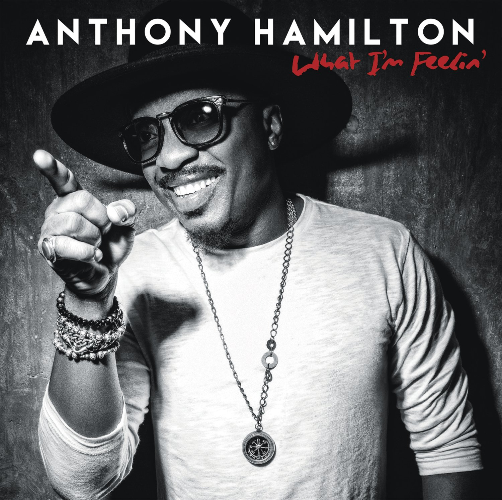

import { Slider, Button } from 'carbon-components-react';
import { ArrowUpRight24  } from '@carbon/icons-react';

import SliderJS1 from "../review/slider1"
import SliderJS2 from "../review/slider2"
import SliderJS3 from "../review/slider3"
import SliderJS4 from "../review/slider4"

import { Link } from "gatsby"

Album Review

<h1 className="h1--no--margin">{props.pageContext.frontmatter.title}</h1>

<Link to="/best50/2016/">2016 Black Music Best No.35</Link>

<Row  className="image-card-group">
	<Column colMd={"4"} colLg={"4"} noGutterMdLeft="">
       <ImageCard>

 

</ImageCard>
	</Column>
	<Column colMd={"4"} colLg={"8"} noGutterMdLeft="">
	

	企画ものだった前作を挟んで5年振りとなるAnthony Hamiltonの7枚目のスタジオ作。2016初夏のリリースである。聴きながらまだまだ若々しいなぁと思ってたら、アルバムリリース時で45歳と意外と若く、そう意味では渋さに年齢が追い付いてきたということだろう。スロー曲中心で落ち着きのある曲がほとんど。沁みてくるような曲が多めで、抜群の安定感を見せている。教会出身だけあって、それっぽいタイトルの曲も多いが、曲調としてはGospelということはなく、いつもの無骨なR&B一直線な作品である。
  

  

	  <Button href="https://amzn.to/3ixYu54" kind="primary" size="small" renderIcon={ArrowUpRight24}>
      amazon.com
    </Button>
    <Button href="https://amzn.to/3gMd6xb" kind="secondary" size="small" renderIcon={ArrowUpRight24}>
      amazon.co.jp
    </Button>
	

	
  
  </Column>
</Row>
<Row >
  <Column colMd={"4"} colLg={"4"} noGutterMdLeft="">
    

      <h3>Score card</h3>
	    <SliderJS1 value="5" />
      <SliderJS2 value="4" />
	    <SliderJS3 value="1" />
      <SliderJS4 value="8" />
    

  </Column>
  <Column colMd={"4"} colLg={"8"} noGutterMdLeft="">
    

      <h3>Producers</h3>
      

      Mark Batson(1,2,3,5,6,7,8,10,11,12)
       Salaamremi.com and James Poyser(4,9)
      

      <h3>Guests</h3>
      

        The Hamiltones
      

    

  </Column>
</Row>

<h3>Tracks</h3>

| No. |	 Title                 |	 Composers                                                      |	 Performer                            |	 Time	|
| --- |	---------------------- | ---------------------------------------------------------------- | ------------------------------------- | ----- |
|	1	  |	Save Me                | Mark Batson / Anthony Hamilton / Darrell Scott                  	|	Anthony Hamilton                     	|	03:57 |
|	2	  |	Ain't No Shame         | Al Anderson / Mark Batson / Anthony Hamilton                    	|	Anthony Hamilton                     	|	04:40 |
|	3	  |	What I'm Feelin'       | Mark Batson / Anthony Hamilton / Harold Lilly                   	|	Anthony Hamilton feat. The Hamiltones	|	04:03 |
|	4	  |	Amen                   | Anthony Hamilton / James Poyser / Salaam Remi                   	|	Anthony Hamilton                     	|	03:37 |
|	5	  |	I Want You             | Mark Batson / Anthony Hamilton                                  	|	Anthony Hamilton                     	|	04:24 |
|	6	  |	Never Letting Go       | Mark Batson / Anthony Hamilton                                  	|	Anthony Hamilton                     	|	03:52 |
|	7	  |	Grateful               | Mark Batson / Anthony Hamilton                                  	|	Anthony Hamilton                     	|	04:18 |
|	8	  |	Walk in My Shoes       | Mark Batson / Anthony Hamilton                                  	|	Anthony Hamilton                     	|	04:04 |
|	9	  |	Take You Home          | Anthony Hamilton / Ramon Montgomery / James Poyser / Salaam Remi	|	Anthony Hamilton                     	|	04:56 |
|	10	|	Still                  | Mark Batson / Anthony Hamilton                                  	|	Anthony Hamilton                     	|	03:25 |
|	11	|	Ever Seen Heaven       | Mark Batson / Anthony Hamilton                                  	|	Anthony Hamilton                     	|	02:50 |
|	12	|	Love Is an Angry Thing | Mark Batson / Anthony Hamilton                                  	|	Anthony Hamilton                     	|	03:38 |