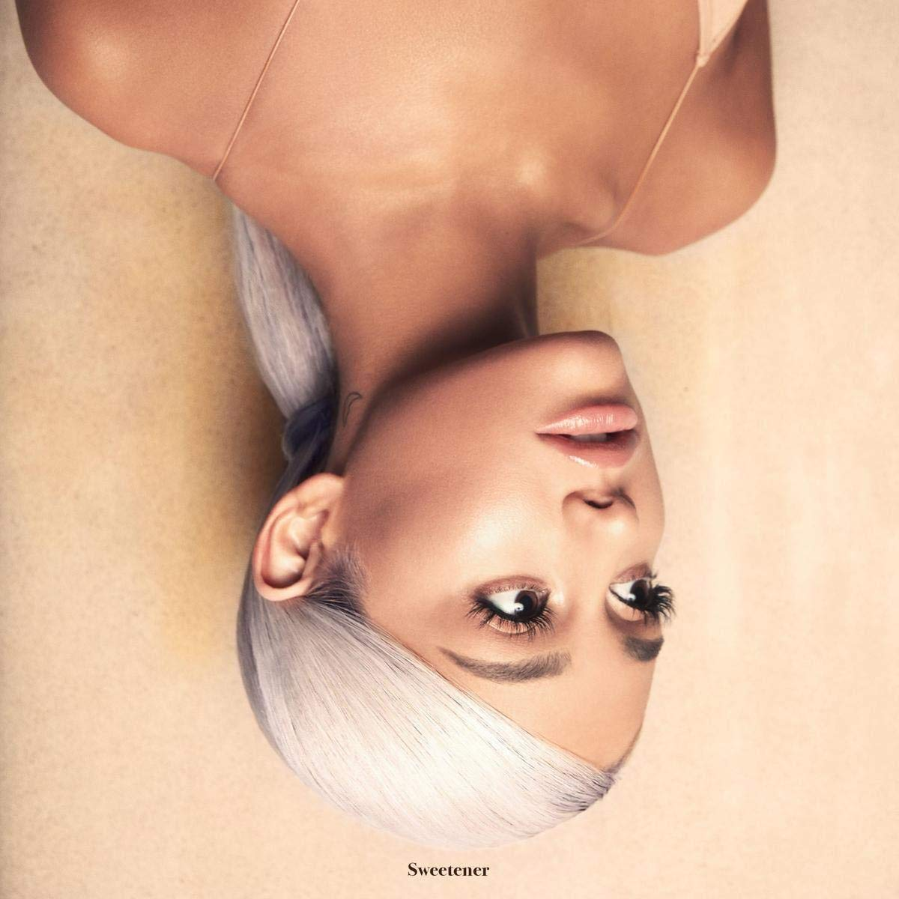

import { Slider, Button } from 'carbon-components-react';
import { ArrowUpRight24  } from '@carbon/icons-react';

import SliderJS1 from "../review/slider1"
import SliderJS2 from "../review/slider2"
import SliderJS3 from "../review/slider3"
import SliderJS4 from "../review/slider4"

import Review1 from "../review/arianagrande5.mdx"

import { Link } from "gatsby"

import './_review.scss';

<h2>CD review</h2>
<h1 className="h1--no--margin">{props.pageContext.frontmatter.title}</h1>
<h3><Link to="/best50/2018/">2018 Black Music Best No.5</Link></h3>

<Row  className="image-card-group">
	<Column colMd={"4"} colLg={"4"} noGutterMdLeft="">
       <ImageCard>

 

</ImageCard>
	</Column>
	<Column colMd={"8"} colLg={"8"} noGutterMdLeft="">
	

	Ariana Grande の2年振りの4作目。アイドル性とArtistとしての歌唱力という二律背反的な才能を持つひとだが、当作では大人っぽいArtworkからも明らかなように、ぐっとArtistのほうに寄せてきた。前者の象徴、Mar Martinは一曲のみで、代わりにPharrellが7曲をProduceし、軽妙なHip-Hop Soul、可憐なPop、流麗なバラードのバランスがうまい具合にとれたアルバムになっている。不幸な出来事にもめげずに、頑張っている彼女だが、クオリティをさらにあげてきたのは流石。
	

	

	  <Button href="https://amzn.to/2YDjSxj" kind="primary" size="small" renderIcon={ArrowUpRight24}>
      amazon.com
      </Button>
      <Button href="https://amzn.to/30OsAvs" kind="secondary" size="small" renderIcon={ArrowUpRight24}>
      amazon.co.jp
      </Button>
	

	
	
	</Column>
</Row>
<Row >
	<Column colMd={"4"} colLg={"4"} noGutterMdLeft="">

    <h3>Score card</h3>
	<SliderJS1 value="4" />
    <SliderJS2 value="1" />
	<SliderJS3 value="1" />
    <SliderJS4 value="9" />

</Column>
<Column colMd={"8"} colLg={"8"} noGutterMdLeft="">

<h3>Producers</h3>

ILYA and Max Martin(1,8,10)
 Pharrell Williams(2,3,4,6,7,11,15)
 ILYA(5,9)
 HIt-Boy, Tommy Brown and Brian Malik Baptiste(12)
 Tommy Brown, Charles Anderson and Michael Foster(13)
 Tommy Brown and Charles Anderson(14)

<h3>Guests</h3>

	Pharrell, Nicki Minaj, Missy Elliott

</Column>
</Row>

<h3>Tracks</h3>

| No. |	 Title                     |	 Composers                                                                      |	 Performer                          | Time	|
| --- |	-------------------------- | ---------------------------------------------------------------------------------- | ------------------------------------- | ----- |
| 1	  |	raindrops (an angel cried) | Bob Gaudio / Ariana Grande / KnocDown / Max Martin                                	| Ariana Grande feat. Pharrell Williams	| 00:38 |
| 2	  |	blazed                     | Maxine Colon / Pharrell Williams                                                  	| Ariana Grande feat. Nicki Minaj      	| 03:16 |
| 3	  |	the light is coming        | Ariana Grande / Onika Maraj / Pharrell Williams                                   	| Ariana Grande                        	| 03:48 |
| 4	  |	R.E.M                      | Pharrell Williams                                                                 	| Ariana Grande                        	| 04:05 |
| 5	  |	God is a woman             | Ariana Grande / Rickard G?ransson / Savan Kotecha / Max Martin / Ilya Salmanzadeh 	| Ariana Grande                        	| 03:17 |
| 6	  |	sweetener                  | Ariana Grande / Pharrell Williams                                                 	| Ariana Grande                        	| 03:28 |
| 7	  |	successful                 | Pharrell Williams                                                                 	| Ariana Grande                        	| 03:47 |
| 8	  |	everytime                  | Ariana Grande / Savan Kotecha / Max Martin / Ilya Salmanzadeh                     	| Ariana Grande                        	| 02:52 |
| 9	  |	breathin                   | Ariana Grande / Savan Kotecha / Ilya Salmanzadeh / Peter Svensson                 	| Ariana Grande                        	| 03:18 |
| 10  |	no tears left to cry       | Ariana Grande / KnocDown / Savan Kotecha / Max Martin                             	| Ariana Grande                        	| 03:25 |
| 11  |	borderline                 | Missy Elliott / Pharrell Williams                                                 	| Ariana Grande feat. Missy Elliott    	| 02:57 |
| 12  |	better off                 | Brian Malik Baptiste / Tommy Brown / Hit-Boy / Kim Krysiuk                        	| Ariana Grande                        	| 02:51 |
| 13  |	goodnight n go             | Charles Anderson / Tommy Brown / Michael Foster / Ariana Grande / Victoria McCants	| Ariana Grande                        	| 03:09 |
| 14  |	pete davidson              | Charles Anderson / Tommy Brown / Ariana Grande / Victoria McCants                 	| Ariana Grande                        	| 01:13 |
| 15  |	get well soon              | Pharrell Williams                                                                 	| Ariana Grande                        	| 05:22 |

<h3>Other Reviews</h3>

<Row>
<Column colMd={3} colLg={3} noGutterMdLeft>
<Review1 />
</Column>
</Row>
