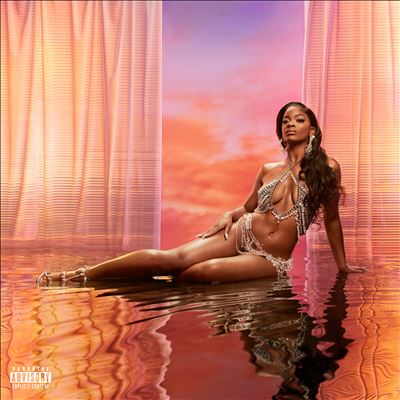

import { Slider, Button } from "@carbon/react";
import { ArrowUpRight } from "@carbon/icons-react";

import SliderJS1 from "../review/slider1";
import SliderJS2 from "../review/slider2";
import SliderJS3 from "../review/slider3";
import SliderJS4 from "../review/slider4";
import AdvJS2 from "../review/adv2";
import AdvJS3 from "../review/adv3";

import { Link } from "gatsby";

import Review1 from "../review/arilennox1.mdx";

Album Review

<h1 className="h1--no--margin">{props.pageContext.frontmatter.title}</h1>

  <Link to="/best50/2022/">2022 Black Music Best No.9</Link>

<Row  className="image-card-group">
	<Column colMd={3} colLg={4} noGutterMdLeft="">
       <ImageCard>

</ImageCard>
	</Column>
	<Column colMd={4} colLg={8} noGutterMdLeft="">
	  

	    J.Cole率いるDreamvilleの歌姫、Ari Lennoxの3年ぶりとなる2nd。レーベルの勢いそのままに前作以上の評価を得ている。
       引き続きのEliteに加え、Kelvin Wootenがメインプロデューサーとなり、さらにOrganaizd NoizeやJermaine Dupri も加わって、90年代ソウルにネオソウルを塗したようなオーソドックスかつメロウでスゥィートなサウンドを届けてくれている。
       曲調はミディアム〰スローが中心となり、Ari Lennoxの柔らかい歌声は、まさにとろけそうな感じで耳に心地よい。
    

    

	    <Button className="button-right-mergin"  href="https://amzn.to/3IAqm8a" renderIcon={ArrowUpRight} size='sm' kind='primary'>
        amazon.com
      </Button>
      <Button className="button-right-mergin"  href="https://amzn.to/3IAqm8a" renderIcon={ArrowUpRight} size='sm' kind='secondary'>
        amazon.co.jp
      </Button>
      <Button className="button-right-mergin"  href="https://apple.co/3lOVCYp" renderIcon={ArrowUpRight} size='sm' kind='tertiary'>
        apple music
      </Button>
	  

	</Column>
  <AdvJS2/>
</Row>
<Row >
  <Column colMd={4} colLg={4} noGutterMdLeft="">
    

      <h3>Score card</h3>
	    <SliderJS1 value="5" />
      <SliderJS2 value="2" />
	    <SliderJS3 value="1" />
      <SliderJS4 value="9" />
    

  </Column>
  <Column colMd={4} colLg={8} noGutterMdLeft="">
    

      <h3>Producers</h3>
      

        J. Cole, DZL and Wu10(1)
         Elite(2,5,7)
         Tim Suby and Loxe(3)
         Jermaine Dupri and Bryan-Michael Cox(4)
         Elite and Wu10(6)
         J. White Did It(8)
         Organized Noise(9)
         Cardiak and Wu10(10)
         Slimwav and DZL(11)
         Elite and Dre Oickney(12)
      

      <h3>Guests</h3>
      

        Lucky Daye, Chloé, Summer Walker
      

    

  </Column>
</Row>

<h3>Tracks</h3>

| No. | Title         | Composers                                                                                                                                                | Performer                      | Time  |
| --- | ------------- | -------------------------------------------------------------------------------------------------------------------------------------------------------- | ------------------------------ | ----- |
| 1   | POF           | Jermaine Cole / Michael Holmes / Courtney Shanade Salter / Kelvin Wooten                                                                                 | Ari Lennox                     | 03:40 |
| 2   | Hoodie        | Jonathan Floyd / Stafford Floyd / Anthony Parrino / Courtney Shanade Salter                                                                              | Ari Lennox                     | 04:06 |
| 3   | Waste My Time | Uzoechi Emenike / Rowan Perkins / Courtney Shanade Salter / Tim Suby                                                                                     | Ari Lennox                     | 02:43 |
| 4   | Pressure      | Johnta Austin / Bryan-Michael Cox / Jermaine Dupri / Jai'Len Josey / Anthony Parrino / Courtney Shanade Salter                                           | Ari Lennox                     | 03:12 |
| 5   | A/S/L         | Ronald Gilmore / Anthony Parrino / Courtney Shanade Salter / Kelvin Wooten                                                                               | Ari Lennox                     | 00:38 |
| 6   | Mean Mug      | Anthony Parrino / Courtney Shanade Salter / Kelvin Wooten                                                                                                | Ari Lennox                     | 04:02 |
| 7   | Boy Bye       | David Debrandon Brown / Ibrahim Hamad / Michael McGregor / Anthony Parrino / Courtney Shanade Salter / Joseph Sample                                     | Ari Lennox feat: Lucky Daye    | 05:01 |
| 8   | Stop By       | Jai'Len Josey / Courtney Shanade Salter / Anthony White                                                                                                  | Ari Lennox                     | 02:49 |
| 9   | Outside       | Patrick Brown / Morris W. Ricks II / Ray Murray / Anthony Parrino / Steve Rosenstein / Courtney Shanade Salter / Dijon Styles / Rico Wade / Vanessa Wood | Ari Lennox                     | 03:18 |
| 10  | Leak It       | Chloe Bailey / Carl McCormick / Courtney Shanade Salter / Kelvin Wooten                                                                                  | Ari Lennox feat: Chloé         | 04:28 |
| 11  | Blocking You  | Michael Holmes / Jerome Monroe Jr. / Anthony Parrino / Courtney Shanade Salter                                                                           | Ari Lennox                     | 03:41 |
| 12  | Queen Space   | Storm Ford / Ronald Gilmore / Anthony Parrino / Andre' Pinckney / Courtney Shanade Salter / Elliott Trent / Summer Walker                                | Ari Lennox feat: Summer Walker | 03:51 |

<h3>Other Reviews</h3>

<Row>
  <Column colMd={3} colLg={3} noGutterMdLeft>
    <Review1 />
  </Column>
</Row>

<AdvJS3 />
