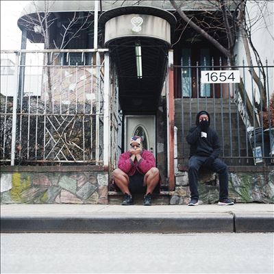

import { Slider, Button } from "@carbon/react";
import { ArrowUpRight } from "@carbon/icons-react";

import SliderJS1 from "../review/slider1";
import SliderJS2 from "../review/slider2";
import SliderJS3 from "../review/slider3";
import SliderJS4 from "../review/slider4";
import AdvJS2 from "../review/adv2";
import AdvJS3 from "../review/adv3";

import { Link } from "gatsby";

import Review1_1 from "../review/armandhammeralchemist1.mdx";

import Review2_1 from "../review/billywoodskennysegal1.mdx";
import Review2_2 from "../review/billywoods1.mdx";

Album review

<h1 className="h1--no--margin">{props.pageContext.frontmatter.title}</h1>

  <Link to="/best50/2023/">2023 Black Music Album Best No.19</Link>

<Row  className="image-card-group">
	<Column colMd={3} colLg={4} noGutterMdLeft="">
       <ImageCard>

</ImageCard>
	</Column>
	<Column colMd={4} colLg={8} noGutterMdLeft="">
		

			前作はAlchemistとの共作だったHip-Hop Duo, Armand Hammerの2年ぶりのアルバム。その前作ほ自分たちのレーベルだったが、今回メジャーなインディレーベルからのリリースとなる。
			 当作では、JPEGMAFIAを始めとした多くのProducerがかかわっているが、不穏でExperimentalの作風は、そのままである。ただ、基本となるTrackがバンド構成によって作られてるところに変化があり、これに環境音やノイズを加えたサウンドコラージュが聴きどころとなっている。
		

		

		  <Button className="button-right-mergin"  href="https://amzn.to/3PgLROy" renderIcon={ArrowUpRight} size='sm' kind='primary'>
  	    amazon.com
  	  </Button>
  	  <Button className="button-right-mergin"  href="https://amzn.to/3VguscF" renderIcon={ArrowUpRight} size='sm' kind='secondary'>
  	    amazon.co.jp
  	  </Button>
			<Button className="button-right-mergin"  href="https://apple.co/3vaOIBx" renderIcon={ArrowUpRight} size='sm' kind='tertiary'>
  	   	apple music
  	  </Button>
			<AdvJS2/>
		

	</Column>
</Row>
<Row >
	<Column colMd={4} colLg={4} noGutterMdLeft="">
		

		  <h3>Score card</h3>
			<SliderJS1 value="1" />
		  <SliderJS2 value="2" />
			<SliderJS3 value="3" />
		  <SliderJS4 value="8" />
		

	</Column>
	<Column colMd={8} colLg={8} noGutterMdLeft="">
		

			<h3>Producers</h3>
			

				JPEGMAFIA(1,2,15)
				 Child Actor(3)
				 JPEGMAFIA and P.U.D.G.E.(4)
				 Preservation(5)
				 DJ Haram(6,13)
				 August Fanon(7)
				 El-P(8)
				 Steel Tipped Dove andMessiah Musik(9)
				 Kenny Segal(10)
				 Willie Grren(11)
				 Moor Mother andBlack Noi$e(12)
				 Sebb Bash(14)
			

			<h3>Guests</h3>
			

				Cavalier, Pink Siifu, Junglepussy, Moneynicca, Junglepussy, Curly Castro, Moor Mother
			

		

	</Column>
</Row>

<h3>Tracks</h3>

| No. | Title                                        | Composers                                                                                      | Performer                                     | Time  |
| --- | -------------------------------------------- | ---------------------------------------------------------------------------------------------- | --------------------------------------------- | ----- |
| 1   | Landlines                                    | billy woods, E L U C I D, JPEGMAFIA                                                            | Armand Hammer                                 | 02:58 |
| 2   | Woke Up and Asked Siri How I'm Gonna Die     | billy woods, E L U C I D, JPEGMAFIA                                                            | Armand Hammer                                 | 02:41 |
| 3   | The Flexible Unreliabilty of Time and Memory | billy woods, E L U C I D, Child Actor                                                          | Armand Hammer                                 | 03:21 |
| 4   | When It Doesn't Start With a Kiss            | billy woods, E L U C I D, JPEGMAFIA                                                            | Armand Hammer                                 | 03:23 |
| 5   | I Keep a Mirror in My Pocket                 | E L U C I D, billy woods, Cavalier, Preservation                                               | Armand Hammer feat. Cavalier                  | 03:43 |
| 6   | Trauma Mic                                   | billy woods, E L U C I D, Pink Siifu                                                           | Armand Hammer feat. Pink Siifu                | 02:34 |
| 7   | Niggardly                                    | E L U C I D, billy woods , August Fanon                                                        | Armand Hammer                                 | 04:01 |
| 8   | The Gods Must Be Crazy                       | E L U C I D, billy woods ,El-P                                                                 | Armand Hammer                                 | 03:00 |
| 9   | Y'All Can't Stand Right Here                 | E L U C I D, billy woods, JUNGLEPUSSY, SOUL GLO, Steel Tipped Dove, Messiah Musik ,Money Nicca | Armand Hammer feat. Junglepussy, Moneynicca   | 03:04 |
| 10  | Total Recall                                 | E L U C I D, billy woods, Kenny Segal                                                          | Armand Hammer                                 | 04:21 |
| 11  | Empire BLVD                                  | E L U C I D, billy woods, JUNGLEPUSSY, Curly Castro ,Willie Green                              | Armand Hammer feat. Junglepussy, Curly Castro | 04:31 |
| 12  | Don't Lose Your Job                          | E L U C I D, billy woods, Pink Siifu, Moor Mother, Black Noi$e, Jeff Markey                    | Armand Hammer feat. Pink Siifu, Moor Mother   | 04:25 |
| 13  | Supermooned                                  | billy woods, E L U C I D, DJ Haram                                                             | Armand Hammer                                 | 02:54 |
| 14  | Switchboard                                  | billy woods, E L U C I D, Sebb Bash                                                            | Armand Hammer                                 | 04:02 |
| 15  | The Key is Under the Mat                     | billy woods, E L U C I D, JPEGMAFIA                                                            | Armand Hammer                                 | 04:13 |

<h3>Other Reviews</h3>

<Row>
  <Column colMd={3} colLg={3} noGutterMdLeft>
    <Review1_1 />
  </Column>
</Row>

<Row>
  <Column colMd={3} colLg={3} noGutterMdLeft>
    <Review2_1 />
  </Column>
	<Column colMd={3} colLg={3} noGutterMdLeft>
    <Review2_2 />
  </Column>
</Row>

<AdvJS3 />
