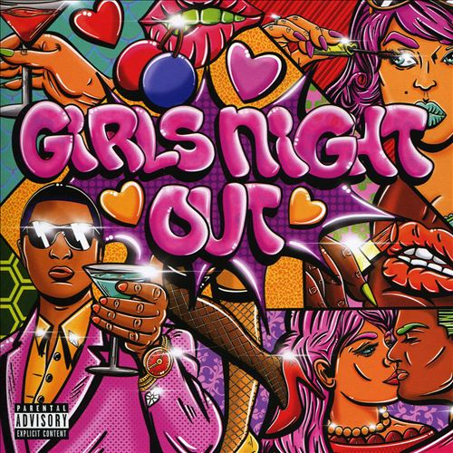

import { Slider, Button } from "@carbon/react";
import { ArrowUpRight } from "@carbon/icons-react";

import SliderJS1 from "../review/slider1";
import SliderJS2 from "../review/slider2";
import SliderJS3 from "../review/slider3";
import SliderJS4 from "../review/slider4";
import AdvJS2 from "../review/adv2";
import AdvJS3 from "../review/adv3";

import { Link } from "gatsby";

Album Review

<h1 className="h1--no--margin">{props.pageContext.frontmatter.title}</h1>

  <Link to="/best50/2022/">2022 Black Music Best No.29</Link>

<Row  className="image-card-group">
	<Column colMd={3} colLg={4} noGutterMdLeft="">
       <ImageCard>

</ImageCard>
	</Column>
	<Column colMd={4} colLg={8} noGutterMdLeft="">
	

	  Babyfaceの7年ぶりのアルバム。女子仲間が夜、お出かけすることをタイトルしているように、全曲、女性Guestをメインボーカルに据えて、自身はフォローに回るような構成になっている。
     メロディは甘くて、聴き易く、いわゆる美メロ曲ばかりで、ミディアム〰スロー中心のTrackは今どきのR&Bという組み合わせとなる。
     今回のコンセプトの中心となる女性Vocalは、若手メインであり、出だしの②③④で一線級が続いた後、⑤からMuni Long以外は、売り出し中Vocalのショーケース的位置づけとなる。透明感のある柔らかい声のGuestを集めたような印象で、この辺は意図的なものか自然とそうなったか判らないが、特に⑪のガーナ出身のAmaaraeは可愛らしい声で引き付けられる。
     それにしても、リリース時で64歳となるBabydaceの声はいつまでも若々しく、枯れた感じは一切しない。

  

  

	  <Button className="button-right-mergin"  href="https://amzn.to/3r47fNu" renderIcon={ArrowUpRight} size='sm' kind='primary'>
      amazon.com
    </Button>
    <Button className="button-right-mergin"  href="https://amzn.to/44iAP0m" renderIcon={ArrowUpRight} size='sm' kind='secondary'>
      amazon.co.jp
    </Button>
    <Button className="button-right-mergin"  href="https://apple.co/3JuPBZY" renderIcon={ArrowUpRight} size='sm' kind='secondary'>
      apple music
    </Button>
    <AdvJS2/>
  

  </Column>
</Row>
<Row >
  <Column colMd={4} colLg={4} noGutterMdLeft="">
    

      <h3>Score card</h3>
	    <SliderJS1 value="5" />
      <SliderJS2 value="2" />
	    <SliderJS3 value="2" />
      <SliderJS4 value="9" />
    

  </Column>
  <Column colMd={4} colLg={8} noGutterMdLeft="">
    

      <h3>Producers</h3>
      

        Babyface and Gabriel Lambirth(2)
         Babyface Khris Riddick-Tynes and Leon Thomas(3)
         Babyface and Dernst "D'Mile" Emile II(4)
         Babyface Khris Riddick-Tynes, Sir Dylan and Robert Clark Bisel(5)
         Babyface and The Collective(6,13)
         Babyface Khris Riddick-Tynes, BLK and Solomonophonic(7)
         Babyface, Dizzy Banko and Drumma(8)
         Babyface, Sahil Datta and Thankyoudish(9)
         Babyface, Khris Riddick-Tynes, Liljumadedabeat Ali Roots A16(10)
         Babyface, Kyu Steed and KZ(11)
         Babyface and Brandon "B.A.M." Hodge(12)
      

      <h3>Guests</h3>
      

        Lala Anthony, Angie Martinez, Ari Lennox, Kehlani, Ella Mai, Queen Naija,Tiana Major9, Tink, Baby Tate, Muni Long, Amaarae, Tkay Maidza, Sevyn Streeter, Doechii
      

    

  </Column>
</Row>

<h3>Tracks</h3>

| No. | Title                     | Composers                                                                                                                            | Performer                                    | Time  |
| --- | ------------------------- | ------------------------------------------------------------------------------------------------------------------------------------ | -------------------------------------------- | ----- |
| 1   | Intro                     |                                                                                                                                      | Babyface feat: Lala Anthony / Angie Martinez | 00:38 |
| 2   | Liquor                    | Kenneth Edmonds / Gabriel Lambirth / Derrick Milano / Courtney Shanade Salter                                                        | Babyface feat: Ari Lennox                    | 03:18 |
| 3   | Seamless                  | Kenneth Edmonds / Kehlani / Khristopher Riddick-Tynes / Leon Thomas                                                                  | Babyface feat: Kehlani                       | 03:15 |
| 4   | Keeps on Fallin'          | Kenneth Edmonds / Ella Mai Howell / Dernst Emile II / Khristopher Riddick-Tynes / Daryl Simmons                                      | Babyface feat: Ella Mai                      | 02:55 |
| 5   | Game Over                 | Robert Bisel / Queen Naija Bulls / Kenneth Edmonds / London Jae / Khristopher Riddick-Tynes / Dylan Wiggins                          | Babyface feat: Queen Naija                   | 03:28 |
| 6   | Simple                    | Kenneth Edmonds / Milton Adams II / Courtney Jones / Kenneth Paryo                                                                   | Babyface feat: Coco Jones                    | 02:31 |
| 7   | Say Less                  | Kenneth Edmonds / Blair Ferguson / Milton Adams II / Tiana Major9 / Khristopher Riddick-Tynes / Jared Solomon                        | Babyface feat: Tiana Major9                  | 02:56 |
| 8   | Whatever                  | Kenneth Edmonds / Perri Reid / Deandre Sumpter / Tink / Javan Wallace                                                                | Babyface feat: Tink                          | 03:19 |
| 9   | Don't Even Think About It | Sahil Datta / Kenneth Edmonds / Tate Farris / Milton Adams II / Nandish Patel                                                        | Babyface feat: Baby Tate                     | 03:12 |
| 10  | The Recipe                | Kenneth Edmonds / Priscilla Hamilton / Julian Mason / Aliandro Prawl / Khristopher Riddick-Tynes                                     | Babyface feat: Muni Long                     | 03:08 |
| 11  | One Good Thing            | Kenneth Edmonds / Ama Serwaa Genfi / Kwami Kweiarmah Jr. / Jephte Steed Valoki Kyu                                                   | Babyface feat: Amaarae                       | 03:34 |
| 12  | G Wagon                   | Kenneth Edmonds / Sheldon Grant / Brandon Hesson / Brandon Hodge / Milton Adams II / Mayila Jones / Takudzwa Maidza / Amber Streeter | Babyface feat: Tkay Maidza / Sevyn Streeter  | 03:32 |
| 13  | Girls Night Out           | Kenneth Edmonds / Jaylah Hickmon / Milton Adams II / Khristopher Riddick-Tynes                                                       | Babyface feat: Doechii                       | 03:21 |

<AdvJS3 />
