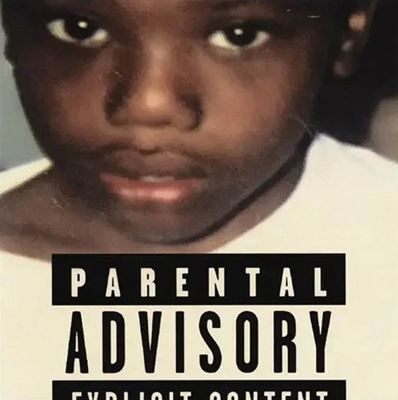

import { Slider, Button } from "@carbon/react";
import { ArrowUpRight } from "@carbon/icons-react";

import SliderJS1 from "../review/slider1";
import SliderJS2 from "../review/slider2";
import SliderJS3 from "../review/slider3";
import SliderJS4 from "../review/slider4";
import AdvJS2 from "../review/adv2";
import AdvJS3 from "../review/adv3";

import { Link } from "gatsby";

Album Review

<h1 className="h1--no--margin">{props.pageContext.frontmatter.title}</h1>

<Row  className="image-card-group">
	<Column colMd={3} colLg={4} noGutterMdLeft="">
       <ImageCard>

</ImageCard>
	</Column>
	<Column colMd={4} colLg={8} noGutterMdLeft="">
		

			グラミー賞を受賞した&quot;Family Ties&quot;を含むデビュー作&quot;The Melodic Blue&quot;から約5年ぶりとなるBaby Keem(25歳)の2ndアルバム。
      アルバムタイトルである『Ca\$ino』は、彼が育ったラスベガスを象徴すると同時に、親の選択すら賭けのようなものである「人生のギャンブル」というメタファーで、最愛の祖母の死、不在の親、自身の精神的葛藤やトラウマを曝け出し、過去と和解することを試みる、極めてパーソナルで自叙伝的なコンセプトとなっている。
			 サウンド面では、スペーシーな質感と重厚なベース、ダスティなサンプルを軸に、ムーディーで一貫性のある響きを持っている。
			 温かみのあるソウル・サンプリングと、先進的なトラップビートが絶妙に融合しており、スロットマシンのベル音やコインが落ちる音といったカジノの環境音が効果的に挿入され、独特な空間へと引き込まれる。
      プロデューサーとして自身に加え、Danja, Scott Bridgeway, Teo Halmなどが中心となり、客演では、いとこのKendrick LamarとMomo Boydがチルな「Good Flirts」で心地よい掛け合いを披露している。
			 Baby KeemのRapは、かつて特徴的だったハイトーンな声を抑え、自然な低い地声であるバリトンを活かしたGrown Voiceへと移行している。
		

		

		  <Button className="button-right-mergin"  href="https://amzn.to/3UCLBPm" renderIcon={ArrowUpRight} size='sm' kind='primary'>
  	    amazon.com
  	  </Button>
  	  <Button className="button-right-mergin"  href="https://amzn.to/4gXehu1" renderIcon={ArrowUpRight} size='sm' kind='secondary'>
  	    amazon.co.jp
  	  </Button>
			<Button className="button-right-mergin"  href="https://apple.co/4qTvZTv" renderIcon={ArrowUpRight} size='sm' kind='tertiary'>
  	    apple music
  	  </Button>
		<AdvJS2/>
		

	</Column>
</Row>
<Row >
	<Column colMd={4} colLg={4} noGutterMdLeft="">
		

		  <h3>Score card</h3>
			<SliderJS1 value="1" />
		  <SliderJS2 value="1" />
			<SliderJS3 value="2" />
		  <SliderJS4 value="8" />
		

	</Column>
	<Column colMd={4} colLg={8} noGutterMdLeft="">
		

			<h3>Producers</h3>
			

				Baby Keem, Scott Bridgeway, FnZ, Danja(1)
				 Baby Keem, Scott Bridgeway, Cardo, Teo Halm, Deats(2)
				 Baby Keem, Danja, Yara Shahidi(3)
				 Baby Keem, Teo Halm, Rascal, Whatssarp(4)
				 Baby Keem, Scott Bridgeway, Teo Halm, Danja(5)
				 Baby Keem, Jahaan Sweet, Rascal(6)
				 Baby Keem, Scott Bridgeway, Ojivolta, Teo Halm, Danja, Jahaan Sweet, Michael Uzowuru(7)
				 Baby Keem, Scott Bridgeway, Ojivolta(8)
				 Baby Keem, Scott Bridgeway, Teo Halm, Danja, Momberger, Yara Shahidi(9)
				 Baby Keem, Ojivolta, Sounwave, Beach Noise, Keanu Beats, Argos(10)
				 Baby Keem, Scott Bridgeway, Ojivolta, Danja(11)
			

			<h3>Guests</h3>
			

				Kendrick Lamar, Momo Boyd, Too $hort, Che Ecru
			

		

	</Column>
</Row>

<h3>Tracks</h3>

| No. | Title                   | Composers                                                                                                                                                                                                   | Performer                                      | Time |
| --- | ----------------------- | ----------------------------------------------------------------------------------------------------------------------------------------------------------------------------------------------------------- | ---------------------------------------------- | ---- |
| 1   | No Security             | Hykeem Carter, Martin McKinney, Ruchaun Akers, Michael Mulé, Isaac De Boni, Floyd Hills, Elliot Bergman, Natalie Bergman                                                                                    | Baby Keem                                      | 1:58 |
| 2   | Ca$ino                  | Hykeem Carter, Ruchaun Akers, Ronald LaTour, Teo Halm, Dominik Patrzek                                                                                                                                      | Baby Keem                                      | 4:20 |
| 3   | Birds &amp; the Bees    | Hykeem Carter, Evan Hood, Floyd Hills, Yara Shahidi, Leslie Feist                                                                                                                                           | Baby Keem                                      | 2:16 |
| 4   | Good Flirts             | Hykeem Carter, Kendrick Duckworth, Kayla Le, Cydel Young, Teo Halm, Tobias Breuer, Teddy Danso Sarpong, Burt Bacharach, Hal David, Lonnie Lynn, James Yancey, Bobby Caldwell, Bruce Malament, Norman Harris | Baby Keem feat. Kendrick Lamar &amp; Momo Boyd | 3:52 |
| 5   | House Money             | Hykeem Carter, Kendrick Duckworth, Evan Hood, Ruchaun Akers, Teo Halm, Floyd Hills, Mark Williams, Raul Cubina, Philip Mueller, Philippe Renaux, Steve Wightman                                             | Baby Keem                                      | 3:15 |
| 6   | I Am Not a Lyricist     | Hykeem Carter, Clarence Greenwood, Cydel Young, Jahaan Sweet, Tobias Breuer, Giorgos Hatzinasios, Giannis Kalamitsis                                                                                        | Baby Keem                                      | 3:25 |
| 7   | $ex Appeal              | Hykeem Carter, Todd Shaw, Evan Hood, Ruchaun Akers, Mark Williams, Raul Cubina, Teo Halm, Floyd Hills, Jahaan Sweet, Michael Uzowuru, Bill Withers                                                          | Baby Keem feat. Too $hort                      | 3:04 |
| 8   | Highway 95 Pt. 2        | Hykeem Carter, Ruchaun Akers, Mark Williams, Raul Cubina, Billy Stewart                                                                                                                                     | Baby Keem                                      | 3:48 |
| 9   | Circus Circus Free$tyle | Hykeem Carter, Daniel Tannenbaum, Ruchaun Akers, Teo Halm, Floyd Hills, Sean Momberger, Don Banks                                                                                                           | Baby Keem                                      | 4:52 |
| 10  | Dramatic Girl           | Hykeem Carter, Michee Lebrun, Samuel Dew, Mark Williams, Raul Cubina, Mark Spears, Matthew Schaeffer, Johnny Kosich, Jake Kosich, Keanu Torres, Nickolas Peristeridis, Steve Lacy                           | Baby Keem feat. Che Ecru                       | 3:19 |
| 11  | No Blame                | Hykeem Carter, Cydel Young, Ruchaun Akers, Mark Williams, Raul Cubina, Floyd Hills, James Litherland                                                                                                        | Baby Keem                                      | 2:46 |

<AdvJS3 />
