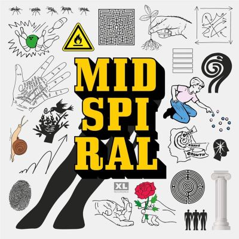

import { Slider, Button } from "@carbon/react";
import { ArrowUpRight } from "@carbon/icons-react";

import SliderJS1 from "../review/slider1";
import SliderJS2 from "../review/slider2";
import SliderJS3 from "../review/slider3";
import SliderJS4 from "../review/slider4";
import AdvJS2 from "../review/adv2";
import AdvJS3 from "../review/adv3";

import { Link } from "gatsby";

Album Review

<h1 className="h1--no--margin">{props.pageContext.frontmatter.title}</h1>

<Row  className="image-card-group">
	<Column colMd={3} colLg={4} noGutterMdLeft="">
       <ImageCard>

</ImageCard>
	</Column>
	<Column colMd={4} colLg={8} noGutterMdLeft="">
		

			Torontoを拠点に活動するJazzユニット、BadBadNotGoodの2024年リリース作。3つのEP(Chaos, Order, Growth)を一枚のアルバムとしてまとめたもので、結果的に17曲、74分強の大作になっている。
			 メンバー3人に主要ななサポーティンングメンバー3人を加えた6人がメインとなっており、ストレートなJazzというより、Jazzバンド編成によるインスト・ミュージック的な印象を受ける。演奏もアドリブよりメロディに重きが置かれている。
			 Vocal曲はコミカルな⑨のみ。Hip-Hopアーティストとの共演が多いユニットではあるが、Hip-Hopよりというわけではなく、逆にLatinなどっぽい曲があったりする。
			 肩ひじ張らず、ゆったりと聴くのが良さそうな作品である。
		

		

		  <Button className="button-right-mergin"  href="https://amzn.to/4qiRL1d" renderIcon={ArrowUpRight} size='sm' kind='primary'>
  	    amazon.com
  	  </Button>
  	  <Button className="button-right-mergin"  href="https://amzn.to/3ZgXrxG" renderIcon={ArrowUpRight} size='sm' kind='secondary'>
  	    amazon.co.jp
  	  </Button>
			<Button className="button-right-mergin"  href="https://apple.co/4qhTpjw" renderIcon={ArrowUpRight} size='sm' kind='tertiary'>
  	    apple music
  	  </Button>
		<AdvJS2/>
		

	</Column>
</Row>
<Row >
	<Column colMd={4} colLg={4} noGutterMdLeft="">
		

		  <h3>Score card</h3>
			<SliderJS1 value="2" />
		  <SliderJS2 value="2" />
			<SliderJS3 value="2" />
		  <SliderJS4 value="8" />
		

	</Column>
	<Column colMd={4} colLg={8} noGutterMdLeft="">
		

			<h3>Producers</h3>
			

				BadBadNotGood(all)
			

			<h3>Guests</h3>
			

				
			

		

	</Column>
</Row>

<h3>Tracks</h3>

| No. | Title                    | Composers                                                          | Performer     | Time |
| --- | ------------------------ | ------------------------------------------------------------------ | ------------- | ---- |
| 1   | Eyes on Me               | BadBadNotGood, Felix Fox-Pappas / Juan Carlos Medrano / Kae Murphy | BadBadNotGood | 4:41 |
| 2   | Take Me With You         | BadBadNotGood, Felix Fox-Pappas / Juan Carlos Medrano / Kae Murphy | BadBadNotGood | 3:18 |
| 3   | Weird &amp; Wonderful    | BadBadNotGood, Felix Fox-Pappas / Juan Carlos Medrano / Kae Murphy | BadBadNotGood | 4:46 |
| 4   | Mid Spiral               | BadBadNotGood, Felix Fox-Pappas / Juan Carlos Medrano / Kae Murphy | BadBadNotGood | 3:51 |
| 5   | Last Laugh               | BadBadNotGood, Felix Fox-Pappas / Juan Carlos Medrano / Kae Murphy | BadBadNotGood | 3:08 |
| 6   | Your Soul &amp; Mine     | BadBadNotGood, Felix Fox-Pappas / Juan Carlos Medrano / Kae Murphy | BadBadNotGood | 4:18 |
| 7   | Playgroup                | BadBadNotGood, Felix Fox-Pappas / Juan Carlos Medrano / Kae Murphy | BadBadNotGood | 6:55 |
| 8   | Juan's World             | BadBadNotGood, Felix Fox-Pappas / Juan Carlos Medrano / Kae Murphy | BadBadNotGood | 4:23 |
| 9   | Taco Taco                | BadBadNotGood, Felix Fox-Pappas / Juan Carlos Medrano / Kae Murphy | BadBadNotGood | 2:13 |
| 10  | S?tima Regra             | BadBadNotGood, Felix Fox-Pappas / Juan Carlos Medrano / Kae Murphy | BadBadNotGood | 5:31 |
| 11  | Sunday Afternoon's Dream | BadBadNotGood, Felix Fox-Pappas / Juan Carlos Medrano / Kae Murphy | BadBadNotGood | 3:36 |
| 12  | Rewind Your Mind         | BadBadNotGood, Felix Fox-Pappas / Juan Carlos Medrano / Kae Murphy | BadBadNotGood | 4:49 |
| 13  | First Love               | BadBadNotGood, Felix Fox-Pappas / Juan Carlos Medrano / Kae Murphy | BadBadNotGood | 4:45 |
| 14  | Audacia                  | BadBadNotGood, Felix Fox-Pappas / Juan Carlos Medrano / Kae Murphy | BadBadNotGood | 3:31 |
| 15  | Celestial Hands          | BadBadNotGood, Felix Fox-Pappas / Juan Carlos Medrano / Kae Murphy | BadBadNotGood | 5:33 |
| 16  | Ways of Seeing           | BadBadNotGood, Felix Fox-Pappas / Juan Carlos Medrano / Kae Murphy | BadBadNotGood | 5:32 |
| 17  | White Light              | BadBadNotGood, Felix Fox-Pappas / Juan Carlos Medrano / Kae Murphy | BadBadNotGood | 3:23 |

<AdvJS3 />
