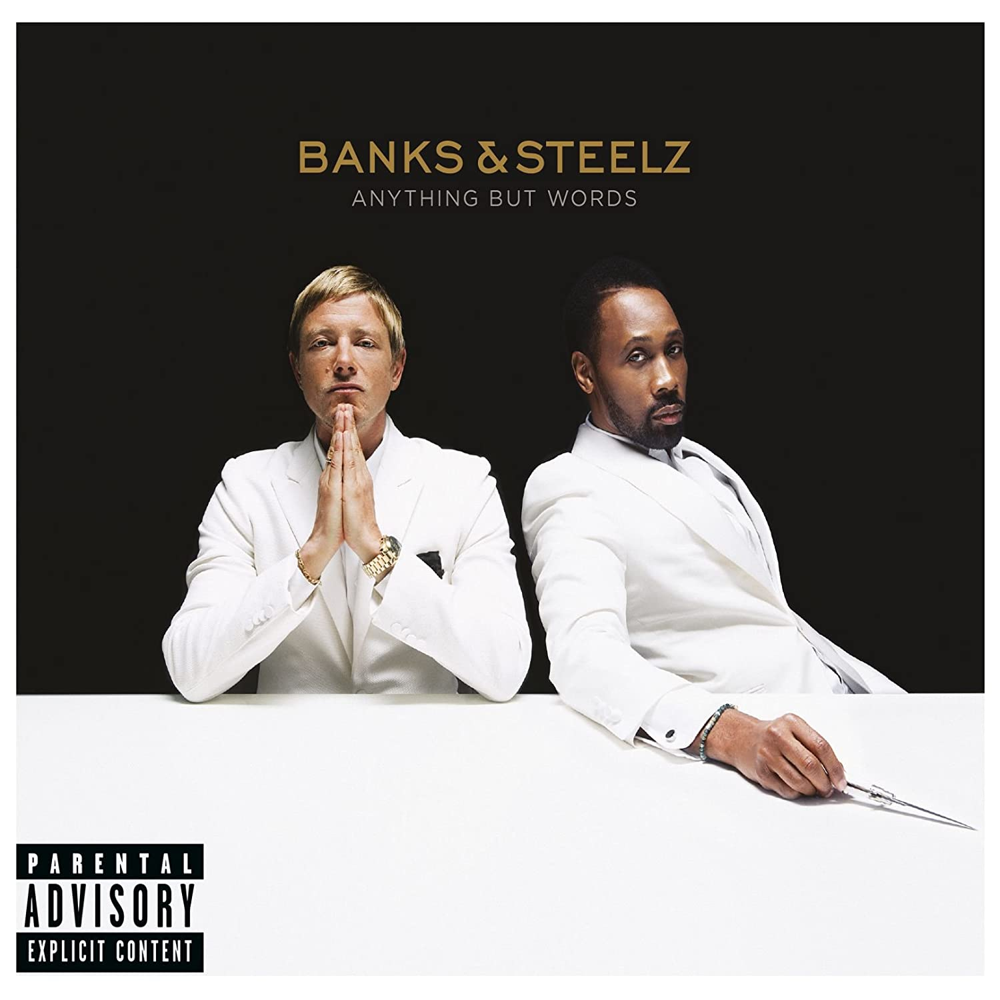

import { Slider, Button } from 'carbon-components-react';
import { ArrowUpRight24  } from '@carbon/icons-react';

import SliderJS1 from "../review/slider1"
import SliderJS2 from "../review/slider2"
import SliderJS3 from "../review/slider3"
import SliderJS4 from "../review/slider4"

import { Link } from "gatsby"

CD review

<h1 className="h1--no--margin">{props.pageContext.frontmatter.title}</h1>

<Row  className="image-card-group">
	<Column colMd={"4"} colLg={"4"} noGutterMdLeft="">
       <ImageCard>

 

</ImageCard>
	</Column>
	<Column colMd={"4"} colLg={"8"} noGutterMdLeft="">
	

	RZAとポストパンクのロックバンドInterpolのフロントマン, Paul Banksによるコレボレーション作。RZAからのオファーによって実現したとのこと。そんなわけなので、全体的印象は、Hip-HopよりのRockという感じで、Rapよりやや唄の比重がやや大きいか。シリアスな曲も多いが、Popなところもあり、意外と聴きやすい。何かが生み出されているというところまでは至っていないが、Guest MC陣のRAPは熱がこもっており、よくまとまっている作品だと思う。
  

  

	  <Button href="https://amzn.to/2GbE1Fb" kind="primary" size="small" renderIcon={ArrowUpRight24}>
      amazon.com
    </Button>
    <Button href="https://amzn.to/3gGtBK8" kind="secondary" size="small" renderIcon={ArrowUpRight24}>
      amazon.co.jp
    </Button>
	

	
  
  </Column>
</Row>
<Row >
  <Column colMd={"4"} colLg={"4"} noGutterMdLeft="">
    

      <h3>Score card</h3>
	    <SliderJS1 value="4" />
      <SliderJS2 value="1" />
	    <SliderJS3 value="1" />
      <SliderJS4 value="8" />
    

  </Column>
  <Column colMd={"4"} colLg={"8"} noGutterMdLeft="">
    

      <h3>Producers</h3>
      

      Banks & Steelz(2,3,4,7,8,9,10,11,12)
       John Hill and Kid Harpoon(1)
       Andrew Wyatt(5)
       Banks & Steelz and Ari Levine(6)
      

      <h3>Guests</h3>
      

        Kool Keith, Florence Welch, Ghostface Killah, Method Man, Masta Killa
      

    

  </Column>
</Row>

<h3>Tracks</h3>

| No. |	 Title             |	 Composers                                                                                                                                                           |	 Performer                                     | Time	 |
| --- |	------------------ | --------------------------------------------------------------------------------------------------------------------------------------------------------------------- | ----------------------------------------------- | ----- |
|	1	  |	Giant              | Paul Banks / Robert Diggs / John Hill / Thomas Edward Percy Hull                                                                                                      | Banks & Steelz                                  | 03:51 |
|	2	  |	Ana Electronic     | Paul Banks / Robert Diggs                                                                                                                                             | Banks & Steelz                                  | 03:44 |
|	3	  |	Sword in the Stone | Paul Banks / Robert Diggs / Nico Fidenco / Keith Thornton                                                                                                             | Banks & Steelz feat. Kool Keith                 | 04:50 |
|	4	  |	Speedway Sonora    | Paul Banks / Robert Diggs                                                                                                                                             | Banks & Steelz                                  | 04:15 |
|	5	  |	Wild Season        | Paul Banks / Robert Diggs / Florence Welch / Andrew Wyatt                                                                                                             | Banks & Steelz feat. Florence Welch             | 04:26 |
|	6	  |	Anything But Words | Paul Banks / Robert Diggs                                                                                                                                             | Banks & Steelz                                  | 04:21 |
|	7	  |	Conceal            | Paul Banks / David Coles / Robert Diggs / Gintas Janusonis / Andrew Kelley / Borahm Lee / Wes Mingus / Arnold Mischkulnig / Kejuan Muchita / Noah Rubin / Josh Werner | Banks & Steelz                                  | 03:59 |
|	8	  |	Love and War       | Paul Banks / Dennis Coles / Robert Diggs                                                                                                                              | Banks & Steelz feat. Ghostface Killah           | 04:09 |
|	9	  |	Can't Hardly Feel  | Paul Banks / Robert Diggs                                                                                                                                             | Banks & Steelz                                  | 04:33 |
|	10	|	One by One         | Paul Banks / Robert Diggs                                                                                                                                             | Banks & Steelz                                  | 04:48 |
|	11	|	Gonna Make It      | Paul Banks / Robert Diggs / John F. Kennedy                                                                                                                           | Banks & Steelz                                  | 05:46 |
|	12	|	Point of View      | Paul Banks / Robert Diggs / Clifford Smith / Elgin Turner                                                                                                             | Banks & Steelz feat. Method Man and Masta Killa | 06:31 |
