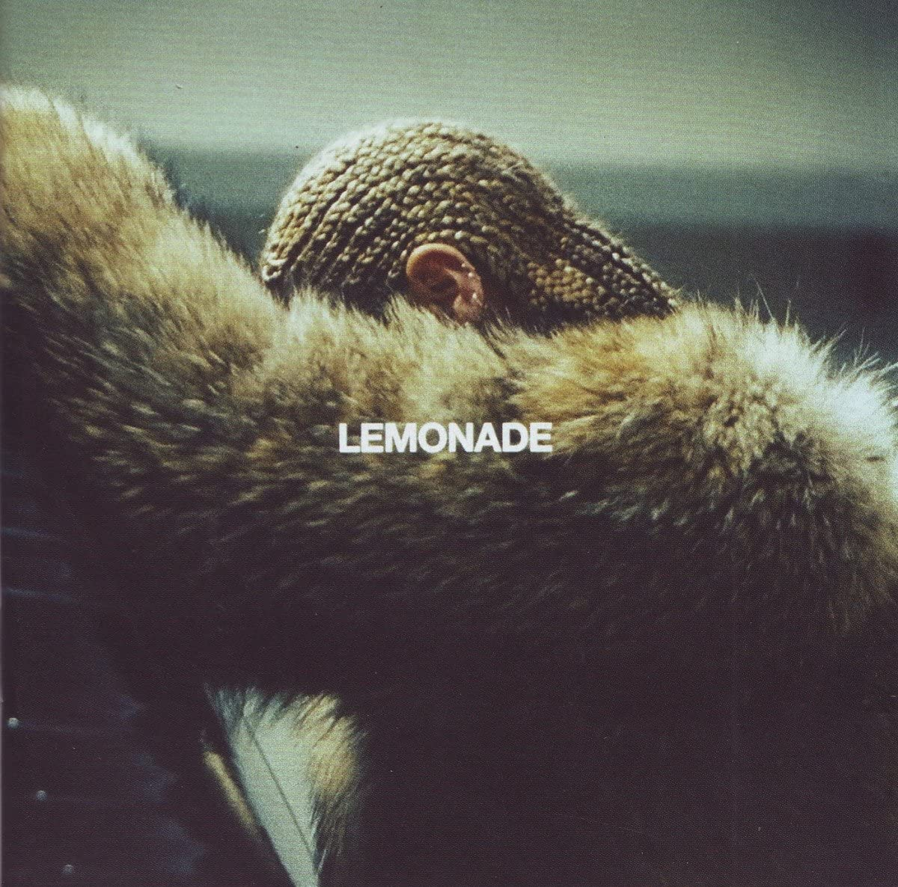

import { Slider, Button } from "@carbon/react";
import { ArrowUpRight } from "@carbon/icons-react";

import SliderJS1 from "../review/slider1";
import SliderJS2 from "../review/slider2";
import SliderJS3 from "../review/slider3";
import SliderJS4 from "../review/slider4";
import AdvJS2 from "../review/adv2";
import AdvJS3 from "../review/adv3";

import { Link } from "gatsby";

import Review1 from "../review/beyonce6.mdx";

Album Review

<h1 className="h1--no--margin">{props.pageContext.frontmatter.title}</h1>

  <Link to="/best50/2016/">2016 Black Music Best No.1</Link>

<Row  className="image-card-group">
	<Column colMd={3} colLg={4} noGutterMdLeft="">
       <ImageCard>

</ImageCard>
	</Column>
	<Column colMd={4} colLg={8} noGutterMdLeft="">
	

	  3年半ぶりとなるBeyonceの6作目は、前作同様のVisual Album。ただ、今作は、Visualがメインで曲はサポート的なものと考えても良い。Visual(DVD)はPV集ではなく、切れ目のない一大叙事詩になっている。
     最初は夫に浮気された女性の話だが、後半から家族、ルーツを遡るアメリカ黒人女性の自己探しの旅みたいな話になっている。
     サウンド面では前半は陰鬱で重苦しく、後半は解き放たれて力強い印象の曲へと変わっていく。また、コンテンポラリーであったり、尖がったり、のりが良かったりしてるところは一切無くて、スロー中心で、ストーリーを体現する様々な曲調のTrackから構成されている。
  

  

	  <Button className="button-right-mergin"  href="https://amzn.to/30Dhnxc" renderIcon={ArrowUpRight} size='sm' kind='primary'>
      amazon.com
    </Button>
    <Button className="button-right-mergin"  href="https://amzn.to/33CvDrY" renderIcon={ArrowUpRight} size='sm' kind='secondary'>
      amazon.co.jp
    </Button>
	

	
  <AdvJS2/>
  </Column>
</Row>
<Row >
  <Column colMd={4} colLg={4} noGutterMdLeft="">
    

      <h3>Score card</h3>
	    <SliderJS1 value="5" />
      <SliderJS2 value="1" />
	    <SliderJS3 value="1" />
      <SliderJS4 value="8" />
    

  </Column>
  <Column colMd={4} colLg={8} noGutterMdLeft="">
    

      <h3>Producers</h3>
      

        Kevin Garrett and Beyonce(1)
         Diplo, Beyone and Ezra Koenig(2)
         Jacj White and Beyonce(3)
         Melo-X, Beyonce and Wynter Gordon(4)
         Donnboystyles, Ben Billions, Beyonce and Boots(5)
         Beyonce(6)
         Mike Dean #MWA and Beyonce(7)
         Beyouce and Vincent Berry II(8)
         James Blake and Beyonce(9)
         Jonny Coffer, Beyounce and Just Blaze(10)
         Diplo and Beyone(11)
         Mike Will Made-It and Beyonce(12)
      

      <h3>Guests</h3>
      

        Jack White, The Weeknd, James Blake, Kendrick Lamar
      

    

  </Column>
</Row>

<h3>Tracks</h3>

| No. | Title               | Composers                                                                                                                                                                                                                                      | Performer                    | Time  |
| --- | ------------------- | ---------------------------------------------------------------------------------------------------------------------------------------------------------------------------------------------------------------------------------------------- | ---------------------------- | ----- |
| 1   | Pray You Catch Me   | James Blake / Kevin Garrett / Beyonce Knowles                                                                                                                                                                                                  | Beyonce                      | 03:15 |
| 2   | Hold Up             | Brian Chase / Uzoechi Emenike / Emile Haynie / Beyonce Knowles / Ezra Koenig / Kelvin McConnell / Karen Orzolek / Thomas Wesley Pentz / Doc Pomus / Antonio Randolph / Sean Rhoden / Mort Schuman / Joshua Tillman / DeAndre Way / Nick Zinner | Beyonce                      | 03:41 |
| 3   | Don't Hurt Yourself | John Bonham / Diana Gordon / John Paul Jones / Beyonce Knowles / James Page / Robert Plant / Jack White                                                                                                                                        | Beyonce feat. Jack White     | 03:53 |
| 4   | Sorry               | Diana Gordon / Beyonce Knowles / Sean Rhoden                                                                                                                                                                                                   | Beyonce                      | 03:52 |
| 5   | 6 Inch              | Jordan Asher / Burt Bacharach / Ahmad Balshe / Hal David / Ben Diehl / Beyonce Knowles / Noah Lennox / Terius Nash / David Portner / Danny Schofield / Abel Tesfaye / Brian Weitz                                                              | Beyonce feat. The Weeknd     | 04:20 |
| 6   | Daddy Lessons       | Kevin Cossum / Alex Delicata / Diana Gordon / Beyonce Knowles                                                                                                                                                                                  | Beyonce                      | 04:47 |
| 7   | Love Drought        | Ingrid Burley / Mike Dean / Beyonce Knowles                                                                                                                                                                                                    | Beyonce                      | 03:57 |
| 8   | Sandcastles         | Vincent Berry / Beyonce Knowles / Midian Mathers / Malik Yusef                                                                                                                                                                                 | Beyonce                      | 03:02 |
| 9   | Forward             | James Blake / Beyonce Knowles                                                                                                                                                                                                                  | Beyonce feat. James Blake    | 01:19 |
| 10  | Freedom             | Arrow Benjamin / Jonathan Coffer / Kendrick Duckworth / Beyonce Knowles / Alan Lomax / John A. Lomax / Frank Tirado / Carla Williams                                                                                                           | Beyonce feat. Kendrick Lamar | 04:49 |
| 11  | All Night           | Henry Allen / Andre Benjamin / Patrick Brown / Jaramye Daniels / Ilsey Juber / Akil King / Beyonce Knowles / Antwan Patton / Thomas Wesley Pentz / Theron Thomas / Timothy Thomas                                                              | Beyonce                      | 05:21 |
| 12  | Formation           | Khalif Brown / Asheton Hogan / Michael L. Williams II / Beyonce Knowles                                                                                                                                                                        | Beyonce                      | 03:26 |

<h3>Other Reviews</h3>

<Row>
  <Column colMd={3} colLg={3} noGutterMdLeft>
    <Review1 />
  </Column>
</Row>

<AdvJS3/>