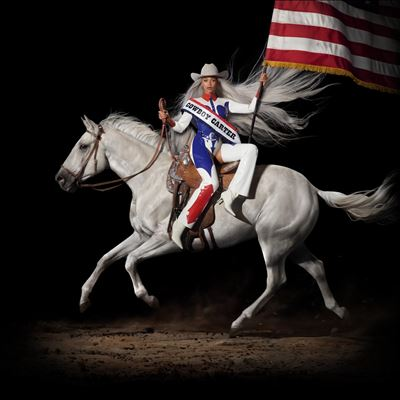

import { Slider, Button } from "@carbon/react";
import { ArrowUpRight } from "@carbon/icons-react";

import SliderJS1 from "../review/slider1";
import SliderJS2 from "../review/slider2";
import SliderJS3 from "../review/slider3";
import SliderJS4 from "../review/slider4";
import AdvJS2 from "../review/adv2";
import AdvJS3 from "../review/adv3";

import { Link } from "gatsby";

import Review1 from "../review/beyonce6.mdx";
import Review2 from "../review/beyonce5.mdx";

Album Review

<h1 className="h1--no--margin">{props.pageContext.frontmatter.title}</h1>

<Link to="/best50/2024/">2018 Black Music Best No.3</Link>

<Row  className="image-card-group">
	<Column colMd={3} colLg={4} noGutterMdLeft="">
       <ImageCard>

</ImageCard>
	</Column>
	<Column colMd={4} colLg={8} noGutterMdLeft="">
	

	  前作より始まったactシリーズ3部作の2作目となるBeyoncé、2年ぶりのアルバム。その前作ではハウスに取り組んでいたが、今回はCDタイトルからも明らかなようにカントリー作品となっている。
     Lil Nas Xやゲスト参加しているShaboozeyなど、黒人が白人音楽の最たるものであるカントリーを志向する兆候はあったが、ついにという感じである。この分野に詳しくないのだが、もろにカントリーな曲もあるし、R&Bやエレクトロとミックスしたものまで、曲風は様々。②⑩㉑がカバーとなっているが、なんと②ではご本人のPaul McCartneyが制作とギターで参加している。
     また、制作にはThe-DreamやRaphael Saadiqといったいつもの仲間も参加している。Willie Nelson, Dolly Parton, Miley Cyrusといったカントリーの大物もグストに招き、そっち方面の人たちに受け入れてもらうための準備を怠っていないのはさすが。
     アメリカ南部の歴史が単なる二項対立だけではなく、複雑に融合してきたことを改めて認識させられた気がする。BeyoncéがR&B Queenから、ついに全能の女神に昇華したことも感じさせる作品でもある。
  

  

	  <Button className="button-right-mergin"  href="https://amzn.to/4cz0q8U" renderIcon={ArrowUpRight} size='sm' kind='primary'>
      amazon.com
    </Button>
    <Button className="button-right-mergin"  href="https://amzn.to/3T32vCW" renderIcon={ArrowUpRight} size='sm' kind='secondary'>
      amazon.co.jp
    </Button>
    <Button className="button-right-mergin"  href="https://apple.co/4cD4bdA" renderIcon={ArrowUpRight} size='sm' kind='secondary'>
      apple music
    </Button>
    <AdvJS2/>
  

  </Column>
</Row>
<Row >
  <Column colMd={4} colLg={4} noGutterMdLeft="">
    

      <h3>Score card</h3>
	    <SliderJS1 value="5" />
      <SliderJS2 value="4" />
	    <SliderJS3 value="1" />
      <SliderJS4 value="8" />
    

  </Column>
  <Column colMd={4} colLg={8} noGutterMdLeft="">
    

      <h3>Producers</h3>
      

        Beyoncé, No ID and Jon Batiste(1)
        <r/>Beyoncé and Paul Mccartney(2)
        <r/>Beyoncé, Dave Hamelin and Ink(3)
        <r/>Beyoncé and Jack Rochon(4,9,10)
        <r/>Beyoncé and Mamii'(5,18)
        <r/>Beyoncé(6,19)
        <r/>Beyoncé, Killah B and Nate Ferraro(7)
        <r/>Raphael Saadiq(8)
        <r/>Beyoncé, Camaron Ochs (Cam) and Simon Maartensson(11)
        <r/>Beyoncé and Swizz Beatz(12)
        <r/>Beyoncé and Terius “The-Dream” Gesteelde-Diamant(13,17,20,21,23)
        <r/>Beyoncé and Dave Hamelin(14,15,24,27)
        <r/>Beyoncé, Shawn Everett, Michael Pollack and Miley Cyrus(16)
        <r/>Beyoncé, Bah and Marcus Reddick(22)
        <r/>Dave Hamelin and D.a. Got That Dope for Guaranteed Millions(25)
        <r/>Beyoncé, Pharrell(26)
      

      <h3>Guests</h3>
      

        Tanner Adell, Tiera Kennedy, Reyna Roberts, Brittney Spencer, Rumi Carter, Willie Nelson, Dolly Parton, Linda Martell, Shaboozey, Willie Jones, Miley Cyrus, Post Malone, Dolly Parton, Stevie Wonder, Paul Mccartney
      

    

  </Column>
</Row>

<h3>Tracks</h3>

| No. | Title                      | Composers                                                                                                                                                                                  | Performer                                                                    | Time  |
| --- | -------------------------- | ------------------------------------------------------------------------------------------------------------------------------------------------------------------------------------------ | ---------------------------------------------------------------------------- | ----- |
| 1   | AMERIICAN REQUIEM          | Beyoncé, Ernest Dion Wilson, Jon Batiste, Raphael Saadiq, Atia Boggs, Camaron Ochs (Cam), Tyler Johnson, Darius Dixson, Derek Dixie, Shawn Carter, Michael Price, Dan Walsh, Stephen Still | Beyoncé                                                                      | 05:25 |
| 2   | BLACKBIIRD                 | Paul McCartney, John Lennon                                                                                                                                                                | Beyoncé feat: Tanner Adell / Tiera Kennedy / Reyna Roberts / Brittney Spence | 02:11 |
| 3   | 16 CARRIAGES               | Beyoncé / Atia Boggs / Dave Hamelin / Raphael Saadiq                                                                                                                                       | Beyoncé                                                                      | 03:47 |
| 4   | PROTECTOR                  | Beyoncé, Ryan Beatty, Camaron Ochs (Cam), Jack Rochon                                                                                                                                      | Beyoncé feat: Rumi Carter                                                    | 03:04 |
| 5   | MY ROSE                    | Beyoncé, Shawntoni Ajanae Nichols                                                                                                                                                          | Beyoncé                                                                      | 00:53 |
| 6   | SMOKE HOUR ★ WILLIE NELSON | Beyoncé, Leah Nardos Takele, Charles Anderson, Son House, Sister Rosetta Tharpe, Chuck Berry, Jesse Stone                                                                                 | Beyoncé feat: Willie Nelson                                                  | 00:50 |
| 7   | TEXAS HOLD 'EM             | Brian Bates / Beyoncé / Elizabeth Lowell Boland / Megan Bulow / Nate Ferraro / Raphael Saadiq                                                                                              | Beyoncé                                                                      | 03:53 |
| 8   | BODYGUARD                  | Beyoncé, Raphael Saadiq, Ryan Beatty, Elizabeth Lowell Boland, Leven Kali, Shawntoni Ajanae Nichols                                                                                        | Beyoncé                                                                      | 04:00 |
| 9   | DOLLY P                    | Dolly Parton, Beyoncé, Leah Nardos Takele                                                                                                                                                  | Beyoncé feat: Dolly Parton                                                   | 00:22 |
| 10  | JOLENE                     | Dolly Parton                                                                                                                                                                               | Beyoncé                                                                      | 03:09 |
| 11  | DAUGHTER                   | Beyoncé, Camaron Ochs (Cam), Simon Maartensson, Terius “The-Dream” Gesteelde-Diamant, S. Carter, Derek Dixie                                                                               | Beyoncé                                                                      | 03:23 |
| 12  | SPAGHETTII                 | Beyoncé, Terius “The-Dream” Gesteelde-Diamant, S. Carter, Collins Chibueze, Khirye Tyler, Dj Dede Mandrake                                                                                 | Beyoncé feat: Linda Martell / Shaboozey                                      | 02:38 |
| 13  | ALLIIGATOR TEARS           | Beyoncé, Terius “The-Dream” Gesteelde-Diamant, Khirye Tyler, Jack Siegel                                                                                                                   | Beyoncé                                                                      | 02:59 |
| 14  | SMOKE HOUR II              | Beyoncé, Leah Nardos Takele, Dave Hamelin, Jeff “Gitty” Gitelman                                                                                                                           | Beyoncé feat: Willie Nelson                                                  | 00:29 |
| 15  | JUST FOR FUN               | Beyoncé, Ryan Beatty, Dave Hamelin, Jeff Gitty                                                                                                                                             | Beyoncé feat: Willie Jones                                                   | 03:24 |
| 16  | II MOST WANTED             | Beyoncé, Miley Cyrus, Michael Pollack, Ryan Tedder                                                                                                                                         | Beyoncé feat: Miley Cyrus                                                    | 03:28 |
| 17  | LEVII'S JEANS              | Beyoncé, Austin Post, Terius “The-Dream” Gesteelde-Diamant, Nile Rodgers, S. Carter                                                                                                        | Beyoncé feat: Post Malone                                                    | 04:17 |
| 18  | FLAMENCO                   | Beyoncé, Shawntoni Ajanae Nichols                                                                                                                                                          | Beyoncé                                                                      | 01:40 |
| 19  | The LINDA MARTELL SHOW     | Beyoncé, Leah Nardos Takele                                                                                                                                                                | Beyoncé feat: Linda Martell                                                  | 00:28 |
| 20  | YA YA                      | Beyoncé, Terius “The-Dream” Gesteelde-Diamant, S. Carter, Oliver Rodigan, Harry Edwards, Klara Mkhatshwa Munk-hansen, Anaïs Marinho, Lee Hazlewood, Brian Wilson, Mike Love                | Beyoncé                                                                      | 04:41 |
| 21  | OH LOUISIANA               | Chuck Berry                                                                                                                                                                                | Beyoncé                                                                      | 00:45 |
| 22  | DESERT EAGLE               | Beyoncé, Jabbar Stevens, Miranda Johnson, Marcus Reddick                                                                                                                                   | Beyoncé                                                                      | 01:12 |
| 23  | RIIVERDANCE                | Beyoncé, Terius “The-Dream” Gesteelde-Diamant, Rachel Keen, Mark Spears                                                                                                                    | Beyoncé                                                                      | 04:12 |
| 24  | II HANDS II HEAVEN         | Beyoncé, Dave Hamelin, Ryan Beatty, Jack Rochon, Terius “The-Dream” Gesteelde-Diamant, Mark Spears                                                                                         | Beyoncé                                                                      | 05:41 |
| 25  | TYRANT                     | Beyoncé, Camaron Ochs (Cam), Terius “The-Dream” Gesteelde-Diamant, David Doman, Dominik Redenczki, Ezemdi Chikwendu                                                                        | Beyoncé feat: Dolly Parton                                                   | 04:10 |
| 26  | SWEET ★ HONEY ★ BUCKIIN'   | Beyoncé, Pharrell Williams, Collins Chibueze, Terius “The-Dream” Gesteelde-Diamant, S. Carter, Hank Cochran, Harlan Howard                                                               | Beyoncé feat: Shaboozey                                                      | 04:56 |
| 27  | AMEN                       | Beyoncé, Dave Hamelin, Danielle Balbuena, Camaron Ochs (Cam), Tyler Johnson, Ian Fitchuk, Darius Dixson, Derek Dixie                                                                       | Beyoncé                                                                      | 02:25 |

<h3>Other Reviews</h3>

<Row>
  <Column colMd={3} colLg={3} noGutterMdLeft>
    <Review1 />
  </Column>
  <Column colMd={3} colLg={3} noGutterMdLeft>
    <Review2 />
  </Column>
</Row>

<AdvJS3 />
