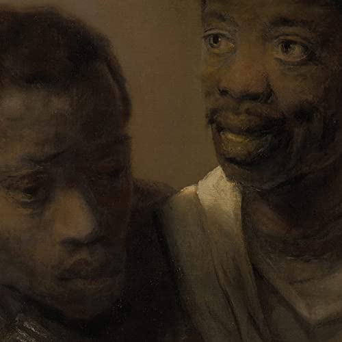

import { Slider, Button } from "@carbon/react";
import { ArrowUpRight } from "@carbon/icons-react";

import SliderJS1 from "../review/slider1";
import SliderJS2 from "../review/slider2";
import SliderJS3 from "../review/slider3";
import SliderJS4 from "../review/slider4";
import AdvJS2 from "../review/adv2";
import AdvJS3 from "../review/adv3";

import { Link } from "gatsby";

import Review1 from "../review/billywoodskennysegal1.mdx";

Album review

<h1 className="h1--no--margin">{props.pageContext.frontmatter.title}</h1>

  <Link to="/best50/2022/">2022 Black Music Best No.18</Link>

<Row  className="image-card-group">
	<Column colMd={3} colLg={4} noGutterMdLeft="">
       <ImageCard>

</ImageCard>
	</Column>
	<Column colMd={4} colLg={8} noGutterMdLeft="">
		

			Armand Hammerなどのユニットメンバーとしても知られるDC出身のRapper、Billy Woodsのソロ作。自身のレーベルからのリリースとなる。
			 ご両親が教授に博士で、本人もハワード大卒と教育レベルの高い一家の出身で、90年代からアーティスト活動を始めていて、多数の作品を生み出している。ちなみにアルバムカバーはレンブラントの絵画から切り取られている。
			 内容はというと、なかなかのExperimentalさであり、TrackはFree Jazzを髣髴させるAbstractなものがベースになっている。⑩以降は、普通?のHip-Hopぽいものが続くが、相当攻めている感じだ。
			Lyricでは社会問題などを扱っており、Billy Woodsが、抑え気味のフローで語りかけてくる。
		

		

		  <Button className="button-right-mergin"  href="https://amzn.to/3Aey5om" renderIcon={ArrowUpRight} size='sm' kind='primary'>
  	    amazon.com
  	  </Button>
  	  <Button className="button-right-mergin"  href="https://amzn.to/3Qfibjl" renderIcon={ArrowUpRight} size='sm' kind='secondary'>
  	    amazon.co.jp
  	  </Button>
			<Button className="button-right-mergin"  href="https://apple.co/3gu1VOr" renderIcon={ArrowUpRight} size='sm' kind='tertiary'>
  	   	apple music
  	  </Button>
			<AdvJS2/>
		

	</Column>
</Row>
<Row >
	<Column colMd={4} colLg={4} noGutterMdLeft="">
		

		  <h3>Score card</h3>
			<SliderJS1 value="1" />
		  <SliderJS2 value="2" />
			<SliderJS3 value="3" />
		  <SliderJS4 value="8" />
		

	</Column>
	<Column colMd={8} colLg={8} noGutterMdLeft="">
		

			<h3>Producers</h3>
			

				Preservation(1,2,3,4,5,7,8,10,11,12,13)
				<b5/>Preservation and Glow in the Dark Flowers(6)
				<b5/>Billy Woods and Preservation(9)
			

			<h3>Guests</h3>
			

				Boldy James, Gabe Nandez, Denmark Vessey, Elucid, Quelle Chris, Mike Ladd, Breezy Brewin, El-P, Fatboi Sharif, Despot, Shinehead
			

		

	</Column>
</Row>

<h3>Tracks</h3>

| No. | Title            | Composers                 | Performer                                              | Time  |
| --- | ---------------- | ------------------------- | ------------------------------------------------------ | ----- |
| 1   | Asylum           | Billy Woods, Preservation | Billy Woods                                            | 02:42 |
| 2   | No Hard Feelings | Billy Woods, Preservation | Billy Woods                                            | 02:15 |
| 3   | Wharves          | Billy Woods, Preservation | Billy Woods                                            | 03:08 |
| 4   | Sauvage          | Billy Woods, Preservation | Billy Woods feat. Boldy James, Gabe Nandez             | 03:07 |
| 5   | The Doldrums     | Billy Woods, Preservation | Billy Woods                                            | 03:40 |
| 6   | NYNEX            | Billy Woods, Preservation | Billy Woods feat. Denmark Vessey, Elucid, Quelle Chris | 04:17 |
| 7   | Christine        | Billy Woods, Preservation | Billy Woods feat. Mike Ladd                            | 03:31 |
| 8   | Heavy Water      | Billy Woods, Preservation | Billy Woods feat. Breezy Brewin, El-P                  | 02:23 |
| 9   | Haarlem          | Billy Woods, Preservation | Billy Woods feat. Fatboi Sharif                        | 03:19 |
| 10  | Versailles       | Billy Woods, Preservation | Billy Woods feat. Despot                               | 03:07 |
| 11  | Protoevangelium  | Billy Woods, Preservation | Billy Woods feat. Shinehead                            | 02:24 |
| 12  | Remorseless      | Billy Woods, Preservation | Billy Woods                                            | 02:50 |
| 13  | Smith + Cross    | Billy Woods, Preservation | Billy Woods                                            | 02:21 |

<Row>
  <Column colMd={3} colLg={3} noGutterMdLeft>
    <Review1 />
  </Column>
</Row>

<AdvJS3 />
