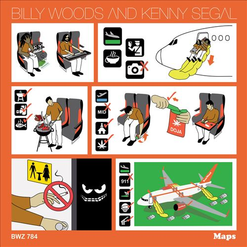

import { Slider, Button } from "@carbon/react";
import { ArrowUpRight } from "@carbon/icons-react";

import SliderJS1 from "../review/slider1";
import SliderJS2 from "../review/slider2";
import SliderJS3 from "../review/slider3";
import SliderJS4 from "../review/slider4";
import AdvJS2 from "../review/adv2";
import AdvJS3 from "../review/adv3";

import { Link } from "gatsby";

import Review1 from "../review/billywoods1.mdx";

Album review

<h1 className="h1--no--margin">{props.pageContext.frontmatter.title}</h1>

  <Link to="/best50/2023/">2023 Black Music Best No.6</Link>

<Row  className="image-card-group">
	<Column colMd={3} colLg={4} noGutterMdLeft="">
       <ImageCard>

</ImageCard>
	</Column>
	<Column colMd={4} colLg={8} noGutterMdLeft="">
		

			通好みながら、近年の活躍が目覚ましいBilly Woodsが4年ぶりにKenny Segalと組んだアルバム。
			 Billy Woodsの作品にしては、大分、聴き易く、Criticの評価も高い。Song WritingはBilly Woods、ProduceはKenny Segalという役割分担となっており。また、Guestでは、Armand Hammerのもう一人、ELUCIDやAesop Rockなどが参加している。
			 全体をややダークなトーンで統一しつつ、MoodyでJazz要素強めのTrackは都会的であり、この上で、Billy Woodsがストーリーテラーぶりを発揮している。
		

		

		  <Button className="button-right-mergin"  href="https://amzn.to/45J6WaB" renderIcon={ArrowUpRight} size='sm' kind='primary'>
  	    amazon.com
  	  </Button>
  	  <Button className="button-right-mergin"  href="https://amzn.to/45J6WaB" renderIcon={ArrowUpRight} size='sm' kind='secondary'>
  	    amazon.co.jp
  	  </Button>
			<Button className="button-right-mergin"  href="https://apple.co/464WSs1" renderIcon={ArrowUpRight} size='sm' kind='tertiary'>
  	   	apple music
  	  </Button>
			<AdvJS2/>
		

	</Column>
</Row>
<Row >
	<Column colMd={4} colLg={4} noGutterMdLeft="">
		

		  <h3>Score card</h3>
			<SliderJS1 value="1" />
		  <SliderJS2 value="2" />
			<SliderJS3 value="3" />
		  <SliderJS4 value="8" />
		

	</Column>
	<Column colMd={8} colLg={8} noGutterMdLeft="">
		

			<h3>Producers</h3>
			

				Kenny Segal(all)
			

			<h3>Guests</h3>
			

				Quelle Chris, ShrapKnel, Danny Brown, Elucid & Benjamin Booker, Sam Herring, Aesop Rock
			

		

	</Column>
</Row>

<h3>Tracks</h3>

| No. | Title                      | Composers   | Performer                                                | Time  |
| --- | -------------------------- | ----------- | -------------------------------------------------------- | ----- |
| 1   | Kenwood Speakers           | Billy Woods | billy woods & Kenny Segal                                | 01:21 |
| 2   | Soft Landing               | Billy Woods | billy woods & Kenny Segal                                | 02:53 |
| 3   | Soundcheck                 | Billy Woods | billy woods & Kenny Segal feat. Quelle Chris             | 02:56 |
| 4   | Rapper Weed                | Billy Woods | billy woods & Kenny Segal                                | 03:14 |
| 5   | Blue Smoke                 | Billy Woods | billy woods & Kenny Segal                                | 01:32 |
| 6   | Bad Dreams Are Only Dreams | Billy Woods | billy woods & Kenny Segal                                | 01:09 |
| 7   | Babylon by Bus             | Billy Woods | billy woods & Kenny Segal feat. ShrapKnel                | 02:08 |
| 8   | Year Zero                  | Billy Woods | billy woods & Kenny Segal feat. Danny Brown              | 03:40 |
| 9   | Hangman                    | Billy Woods | billy woods & Kenny Segal                                | 02:55 |
| 10  | Baby Steps                 | Billy Woods | billy woods & Kenny Segal feat. Elucid & Benjamin Booker | 03:25 |
| 11  | The Layover                | Billy Woods | billy woods & Kenny Segal                                | 02:50 |
| 12  | FaceTime                   | Billy Woods | billy woods & Kenny Segal feat. Sam Herring              | 03:32 |
| 13  | Agriculture                | Billy Woods | billy woods & Kenny Segal                                | 01:40 |
| 14  | Houdini                    | Billy Woods | billy woods & Kenny Segal                                | 02:24 |
| 15  | Waiting Around             | Billy Woods | billy woods & Kenny Segal feat. Aesop Rock               | 03:01 |
| 16  | NYC Tapwater               | Billy Woods | billy woods & Kenny Segal                                | 03:08 |
| 17  | As the Crow Flies          | Billy Woods | billy woods & Kenny Segal feat. Elucid                   | 02:20 |

<h3>Other Reviews</h3>

<Row>
  <Column colMd={3} colLg={3} noGutterMdLeft>
    <Review1 />
  </Column>
</Row>

<AdvJS3 />
