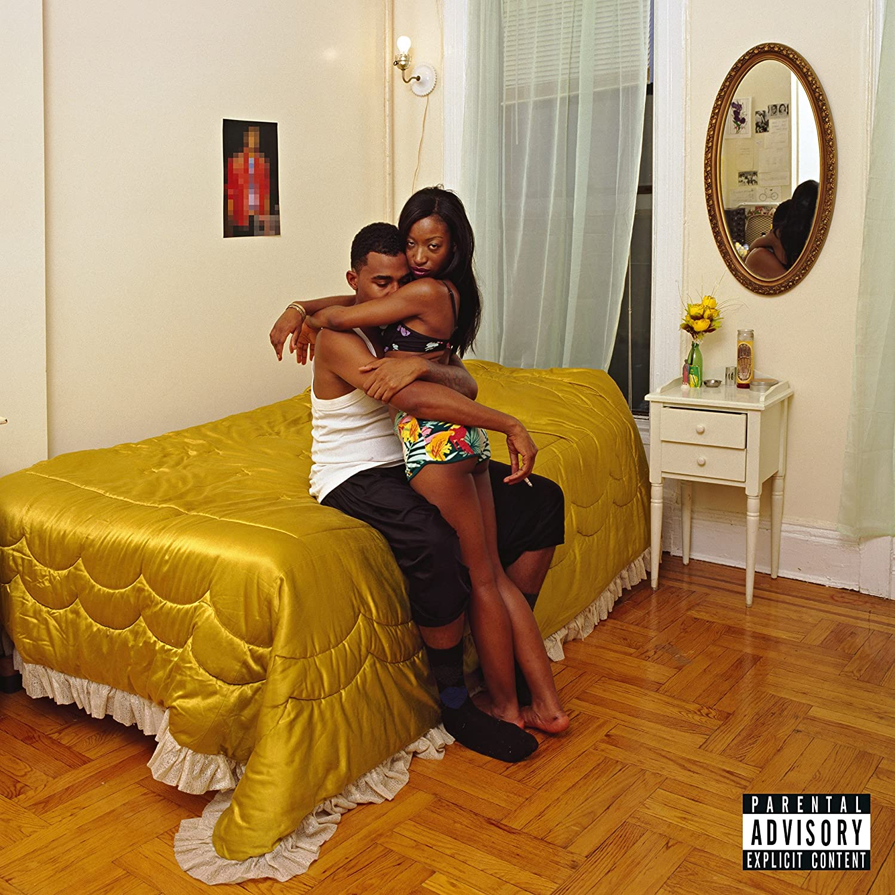

import { Slider, Button } from 'carbon-components-react';
import { ArrowUpRight24  } from '@carbon/icons-react';

import SliderJS1 from "../review/slider1"
import SliderJS2 from "../review/slider2"
import SliderJS3 from "../review/slider3"
import SliderJS4 from "../review/slider4"

import { Link } from "gatsby"

import Review1 from "../review/bloodorange4.mdx"
import Review2 from "../review/bloodorange3.mdx"

CD review

<h1 className="h1--no--margin">{props.pageContext.frontmatter.title}</h1>

<Link to="/best50/2016/">2016 Black Music Best No.11</Link>

<Row  className="image-card-group">
	<Column colMd={"4"} colLg={"4"} noGutterMdLeft="">
       <ImageCard>

 

</ImageCard>
	</Column>
	<Column colMd={"4"} colLg={"8"} noGutterMdLeft="">
	

	Devonte Hynesによるソロプロジェクト, Blood Orangeの3年振りとなる3作目。今回も本人のSong Writing, Produceがメインである。タイトルにあるFreetownは父親の出身地であるSierra Leoneの町の名前だそうで、スラム詩人なども参加し、社会問題などもとりあげたコンセプチャルな作品になっている。サンプリング、打ち込み、楽器を巧みに融合したTrackは、R&Bをベースにアンビエントで美しく、繊細だ。ただ、暗さはなく、PopやLatinぽいところもあって、すっきりと聴くことができる。聴き終えた後、なぜだか敬虔な気持ちになる。BookletのArt Workも凝ってると思う。
	

	

	  <Button href="https://amzn.to/337m82a" kind="primary" size="small" renderIcon={ArrowUpRight24}>
      amazon.com
    </Button>
    <Button href="https://amzn.to/328ZSWf" kind="secondary" size="small" renderIcon={ArrowUpRight24}>
      amazon.co.jp
    </Button>
	

	
	
	</Column>
</Row>
<Row >
	<Column colMd={"4"} colLg={"4"} noGutterMdLeft="">
		

    	<h3>Score card</h3>
			<SliderJS1 value="4" />
    	<SliderJS2 value="1" />
			<SliderJS3 value="2" />
    	<SliderJS4 value="9" />
		

	</Column>
	<Column colMd={"4"} colLg={"8"} noGutterMdLeft="">
		

			<h3>Producers</h3>
			

				Devonte Hynes(all)
			

			<h3>Guests</h3>
			

				Debbie Harry, Zuri Marley, Nelly Furtado, Carly Rae Jepsen
			

		

	</Column>
</Row>

<h3>Tracks</h3>

| No. |	 Title          |	 Composers                                                       |	 Performer  |	 Time	|
| --- |	--------------- | ---------------------------------------------------------------- | ------------ | ----- |
|	1	  |	By Ourselves   	| Devonte Hynes, Adam Bainbridge, Charles Mingus and Ashlee Haze   | Blood Orange	|	02:12 |
|	2	  |	Augustine      	| Devonte Hynes                                                    | Blood Orange	|	03:51 |
|	3	  |	Chance         	| Devonte Hynes                                                    | Blood Orange	|	02:48 |
|	4	  |	Best to You    	| Devonte Hynes, Lorely Rodriguez, Christopher Amoo and Edger Amoo | Blood Orange	|	03:45 |
|	5	  |	With Him       	| Devonte Hynes and Beatriz De Rijke                               | Blood Orange	|	01:25 |
|	6	  |	E.V.P          	| Devonte Hynes, Beatriz De Rijke and Wliou Jacques Badarou        | Blood Orange	|	05:43 |
|	7	  |	Love Ya        	| Eddy Grant                                                       | Blood Orange	|	02:47 |
|	8	  |	But You        	| Devonte Hynes                                                    | Blood Orange	|	03:01 |
|	9	  |	Desiree        	| Devonte Hynes and Patrick Wimberly                               | Blood Orange	|	03:00 |
|	10	|	Hands Up       	| Devonte Hynes                                                    | Blood Orange	|	04:09 |
|	11	|	Hadron Collider	| Devonte Hynes and Nelly Furtado                                  | Blood Orange	|	03:43 |
|	12	|	Squash Squash  	| Devonte Hynes and Beatriz De Rijke                               | Blood Orange	|	03:37 |
|	13	|	Juicy 1-4      	| Devonte Hynes                                                    | Blood Orange	|	04:35 |
|	14	|	Better Than Me 	| Devonte Hynes                                                    | Blood Orange	|	03:16 |
|	15	|	Thank You      	| Devonte Hynes, Adam Bainbridge and Rodney Franklin               | Blood Orange	|	03:03 |
|	16	|	I Know         	| Devonte Hynes                                                    | Blood Orange	|	04:34 |
|	17	|	Better Numb    	| Devonte Hynes                                                    | Blood Orange	|	03:01 |

<h3>Other Reviews</h3>

<Row>
<Column colMd={3} colLg={3} noGutterMdLeft>
<Review1 />
</Column>
<Column colMd={3} colLg={3} noGutterMdLeft>
<Review2 />
</Column>
</Row>