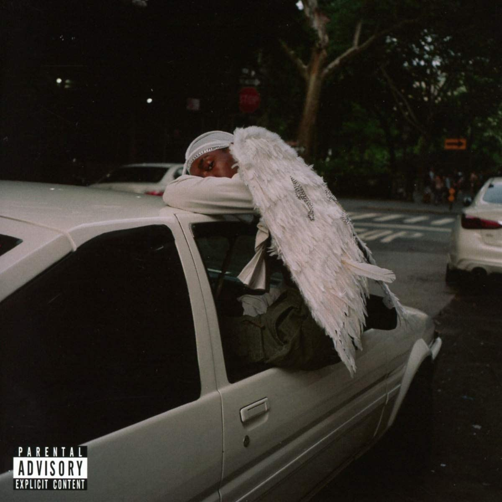

import { Slider, Button } from 'carbon-components-react';
import { ArrowUpRight24  } from '@carbon/icons-react';

import SliderJS1 from "../review/slider1"
import SliderJS2 from "../review/slider2"
import SliderJS3 from "../review/slider3"
import SliderJS4 from "../review/slider4"

import { Link } from "gatsby"

import Review1 from "../review/bloodorange4.mdx"
import Review2 from "../review/bloodorange2.mdx"

Album review

<h1 className="h1--no--margin">{props.pageContext.frontmatter.title}</h1>

<Link to="/best50/2018/">2018 Black Music Best No.10</Link>

<Row  className="image-card-group">
	<Column colMd={"3"} colLg={"4"} noGutterMdLeft="">
       <ImageCard>

 

</ImageCard>
	</Column>
	<Column colMd={"4"} colLg={"8"} noGutterMdLeft="">
	

	前作が高評価を集めたBlood Orangeの2年振りとなる4作目。本業のProducerとしても好調だが、今回も本人のSong Writing, Produceによる、密室的な作品になっている。ちなみにCDジャケットに移っているのは本人ではなく、黒人モデルらしい。Trackは楽器とデジタルをうまく融合していて、全体感はメロウでアーバンなものに統一されている。メロディのクオリティは高く、ファルセットを多用するDev HynesのVocalと相俟って、耽美的だ。Lyricは本人も言っているように、人種的、性的マイノリティをテーマにしつつ、Positiveなところもあって、一層パーソナル感を出している。ところどころの雑踏の音を使ったようなSEが、都会の孤独感をあらわしている気がする。
	

	

	  <Button className="button-right-mergin"  href="https://amzn.to/2NiBsl5" kind="primary" size="small" renderIcon={ArrowUpRight24}>
      amazon.com
    </Button>
    <Button className="button-right-mergin"  href="https://amzn.to/3fPmOxY" kind="secondary" size="small" renderIcon={ArrowUpRight24}>
      amazon.co.jp
    </Button>
	

	
	
	</Column>
</Row>
<Row >
	<Column colMd={"4"} colLg={"4"} noGutterMdLeft="">
		

    	<h3>Score card</h3>
			<SliderJS1 value="4" />
    	<SliderJS2 value="1" />
			<SliderJS3 value="1" />
    	<SliderJS4 value="9" />
		

	</Column>
	<Column colMd={"4"} colLg={"8"} noGutterMdLeft="">
		

			<h3>Producers</h3>
			

				Devonte Hynes(all)
			

			<h3>Guests</h3>
			

				Puff Daddy, Tei Shi, Janet Mock, A$ap Rocky, Projrct Pat, Ian Isiah, Georgia Anne Muldrow, Steve Lacy, Aaron Maine
			

		

	</Column>
</Row>

<h3>Tracks</h3>

| No. |	 Title             |	 Composers                                                       |	 Performer                                |	 Time |
| --- |	------------------ | ------------------------------------------------------------------- | ------------------------------------------ | ----- |
| 1	  |	Orlando            | Devont? Hynes                                                       | Blood Orange                               |	03:02 |
| 2	  |	Saint              | Devont? Hynes                                                       | Blood Orange                               |	03:11 |
| 3	  |	Take Your Time     | Devont? Hynes                                                       | Blood Orange                               |	02:51 |
| 4	  |	Hope               | Mikey Freedom Hart / Devont? Hynes / Valerie Teicher                | Blood Orange feat. Puff Daddy, Tei Shi     |	03:59 |
| 5	  |	Jewelry            | Devont? Hynes                                                       | Blood Orange                               |	04:32 |
| 6	  |	Family             | Devont? Hynes                                                       | Blood Orange feat. Janet Mock              |	00:41 |
| 7	  |	Charcoal Baby      | Devont? Hynes / Aaron Maine                                         | Blood Orange                               |	04:02 |
| 8	  |	Vulture Baby       | Devont? Hynes                                                       | Blood Orange                               |	01:14 |
| 9	  |	Chewing Gum        | Patrick Houston / Devont? Hynes / Rakim Mayers                      | Blood Orange feat. A$ap Rocky, Projrct Pat |	04:23 |
| 10  |	Holy Will          | Devont? Hynes / Elbernita Clark Terrell                             | Blood Orange feat. Ian Isiah               |	04:22 |
| 11  |	Dagenham Dream     | Devont? Hynes                                                       | Blood Orange                               |	02:45 |
| 12  |	Nappy Wonder       | Devont? Hynes                                                       | Blood Orange                               |	02:38 |
| 13  |	Runnin'            | Devont? Hynes / Fai Khadra / Georgia Anne Muldrow / Amandla Stenberg| Blood Orange feat. Georgia Anne Muldrow    |	03:55 |
| 14  |	Out of Your League | Devont? Hynes / Steve Lacy                                          | Blood Orange feat. Steve Lacy              |	02:20 |
| 15  |	Minetta Creek      | Devont? Hynes                                                       | Blood Orange                               |	01:58 |
| 16  |	Smoke              | Andrew Aged / Devont? Hynes                                         | Blood Orange                               |	03:33 |

<h3>Other Reviews</h3>

<Row>
<Column colMd={3} colLg={3} noGutterMdLeft>
<Review1 />
</Column>
<Column colMd={3} colLg={3} noGutterMdLeft>
<Review2 />
</Column>
</Row>