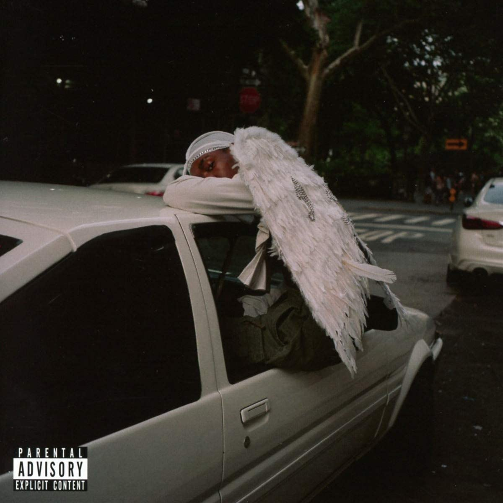

import { Slider, Button } from "@carbon/react";
import { ArrowUpRight } from "@carbon/icons-react";

import SliderJS1 from "../review/slider1";
import SliderJS2 from "../review/slider2";
import SliderJS3 from "../review/slider3";
import SliderJS4 from "../review/slider4";
import AdvJS2 from "../review/adv2";
import AdvJS3 from "../review/adv3";

import { Link } from "gatsby";

import Review1 from "../review/bloodorange5.mdx";
import Review2 from "../review/bloodorange4.mdx";
import Review3 from "../review/bloodorange2.mdx";

Album review

<h1 className="h1--no--margin">{props.pageContext.frontmatter.title}</h1>

	<Link to="/best50/2018/">2018 Black Music Best No.10</Link>

<Row className="image-card-group">
	<Column colMd={3} colLg={4} noGutterMdLeft="">
		<ImageCard>

		</ImageCard>
	</Column>
	<Column colMd={4} colLg={8} noGutterMdLeft="">
		

			前作が高評価を集めたBlood Orangeの2年振りとなる4作目。本業のProducerとしても好調だが、今回も本人のSong Writing, Produceによる、密室的な作品になっている。ちなみにCDジャケットに移っているのは本人ではなく、黒人モデルらしい。
			 Trackは楽器とデジタルをうまく融合していて、全体感はメロウでアーバンなものに統一されている。
			 メロディのクオリティは高く、ファルセットを多用するDev HynesのVocalと相俟って、耽美的だ。
			 Lyricは本人も言っているように、人種的、性的マイノリティをテーマにしつつ、Positiveなところもあって、一層パーソナル感を出している。ところどころの雑踏の音を使ったようなSEが、都会の孤独感をあらわしている気がする。
		

		

			<Button className="button-right-mergin" href="https://amzn.to/2NiBsl5" renderIcon={ArrowUpRight} size='sm' kind='primary'>
				amazon.com
			</Button>
			<Button className="button-right-mergin" href="https://amzn.to/3fPmOxY" renderIcon={ArrowUpRight} size='sm' kind='secondary'>
				amazon.co.jp
			</Button>
			<Button className="button-right-mergin" href="https://apple.co/4bRt1X3" renderIcon={ArrowUpRight} size='sm' kind='tertiary'>
				apple music
			</Button>
			<AdvJS2/>
		

	</Column>
</Row>
<Row>
	<Column colMd={4} colLg={4} noGutterMdLeft="">
		

			<h3>Score card</h3>
			<SliderJS1 value="4" />
			<SliderJS2 value="1" />
			<SliderJS3 value="1" />
			<SliderJS4 value="9" />
		

	</Column>
	<Column colMd={4} colLg={8} noGutterMdLeft="">
		

			<h3>Producers</h3>
			

				Devonte Hynes(all)
			

			<h3>Guests</h3>
			

				Puff Daddy, Tei Shi, Janet Mock, A$ap Rocky, Projrct Pat, Ian Isiah, Georgia Anne Muldrow, Steve Lacy, Aaron Maine
			

		

	</Column>
</Row>

<h3>Tracks</h3>

| No. | Title              | Composers                                                            | Performer                                  | Time  |
| --- | ------------------ | -------------------------------------------------------------------- | ------------------------------------------ | ----- |
| 1   | Orlando            | Devonté Hynes                                                        | Blood Orange                               | 03:02 |
| 2   | Saint              | Devonté Hynes                                                        | Blood Orange                               | 03:11 |
| 3   | Take Your Time     | Devonté Hynes                                                        | Blood Orange                               | 02:51 |
| 4   | Hope               | Mikey Freedom Hart / Devonté Hynes / Valerie Teicher                 | Blood Orange feat. Puff Daddy, Tei Shi     | 03:59 |
| 5   | Jewelry            | Devonté Hynes                                                        | Blood Orange                               | 04:32 |
| 6   | Family             | Devonté Hynes                                                        | Blood Orange feat. Janet Mock              | 00:41 |
| 7   | Charcoal Baby      | Devonté Hynes / Aaron Maine                                          | Blood Orange                               | 04:02 |
| 8   | Vulture Baby       | Devonté Hynes                                                        | Blood Orange                               | 01:14 |
| 9   | Chewing Gum        | Patrick Houston / Devonté Hynes / Rakim Mayers                       | Blood Orange feat. A$ap Rocky, Project Pat | 04:23 |
| 10  | Holy Will          | Devonté Hynes / Elbernita Clark Terrell                              | Blood Orange feat. Ian Isiah               | 04:22 |
| 11  | Dagenham Dream     | Devonté Hynes                                                        | Blood Orange                               | 02:45 |
| 12  | Nappy Wonder       | Devonté Hynes                                                        | Blood Orange                               | 04:32 |
| 13  | Runnin'            | Devonté Hynes / Fai Khadra / Georgia Anne Muldrow / Amandla Stenberg | Blood Orange feat. Georgia Anne Muldrow    | 03:55 |
| 14  | Out of Your League | Devonté Hynes / Steve Lacy                                           | Blood Orange feat. Steve Lacy              | 02:20 |
| 15  | Minetta Creek      | Devonté Hynes                                                        | Blood Orange                               | 01:58 |
| 16  | Smoke              | Andrew Aged / Devonté Hynes                                          | Blood Orange                               | 03:33 |

<h3>Other Reviews</h3>

<Row>
	<Column colMd={3} colLg={3} noGutterMdLeft>
		<Review1 />
	</Column>
	<Column colMd={3} colLg={3} noGutterMdLeft>
		<Review2 />
	</Column>
	<Column colMd={3} colLg={3} noGutterMdLeft>
		<Review3 />
	</Column>
</Row>

<AdvJS3 />
