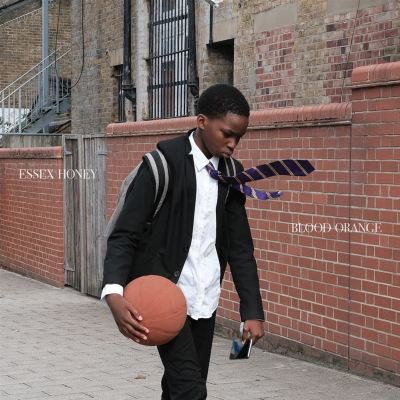

import { Slider, Button } from "@carbon/react";
import { ArrowUpRight } from "@carbon/icons-react";

import SliderJS1 from "../review/slider1";
import SliderJS2 from "../review/slider2";
import SliderJS3 from "../review/slider3";
import SliderJS4 from "../review/slider4";

import { Link } from "gatsby";

import Review1 from "../review/bloodorange4.mdx";
import Review2 from "../review/bloodorange3.mdx";
import Review3 from "../review/bloodorange2.mdx";

Album review

<h1 className="h1--no--margin">{props.pageContext.frontmatter.title}</h1>

<Row  className="image-card-group">
	<Column colMd={3} colLg={4} noGutterMdLeft="">
       <ImageCard>

</ImageCard>
	</Column>
	<Column colMd={8} colLg={8} noGutterMdLeft="">
		

			Blood Orangeのオリジナルアルバムとしては7年ぶりとなる5作目。2023年に母を失った喪失感と幼少期を過ごしたUKのEssexをモチーフにしており、スローかつ静謐で切ない曲が続く。
			 TrackもBlack Musicっぽいところはあまり無く、かつてないほどUKらしい印象だが、ドラムンベース、Jazz、R&Bなどの要素も感じられる。Pianoやアコースティックギターなど生楽器が茫洋としたサウンドの印象を決めているが、ところどころで奏でられるチェロによって物悲しさが押し寄せてくる。これに美しいメロディと柔らかいVocal、ゲストによるコーラスが加わり、よりエモーショナルな作品へと昇華している。
			 最後の⑭では克服していこうという意思が感じられ、次へとつながっていくのだと思う。
		

		

		  <Button className="button-right-mergin"  href="https://amzn.to/4pjkAdx" renderIcon={ArrowUpRight} size='sm' kind='primary'>
  	    amazon.com
  	  </Button>
  	  <Button className="button-right-mergin"  href="https://amzn.to/3LmrAIr" renderIcon={ArrowUpRight} size='sm' kind='secondary'>
  	    amazon.co.jp
  	  </Button>
  	  <Button className="button-right-mergin"  href="https://apple.co/3LhqGgp" renderIcon={ArrowUpRight} size='sm' kind='tertiary'>
  	    apple music
  	  </Button>		
		

	</Column>
</Row>
<Row >
	<Column colMd={4} colLg={4} noGutterMdLeft="">
		

		  <h3>Score card</h3>
			<SliderJS1 value="5" />
		  <SliderJS2 value="1" />
			<SliderJS3 value="1" />
		  <SliderJS4 value="9" />
		

	</Column>
	<Column colMd={8} colLg={8} noGutterMdLeft="">
		

			<h3>Producers</h3>
			

				Devonte Hynes(all)
			

			<h3>Guests</h3>
			

				The Durutti Column, Tariq Al-Sabir, Caroline Polachek, Daniel Caesar, Caroline Polachek, Lorde, Mustafa, Eva Tolkin, Liam Benzvi, Ian Isiah, Brendan Yates, Ben Watt, Mabe Fratti
			

		

	</Column>
</Row>

<h3>Tracks</h3>

| No. | Title                    | Composers                                                                                       | Performer                                                                               | Time  |
| --- | ------------------------ | ----------------------------------------------------------------------------------------------- | --------------------------------------------------------------------------------------- | ----- |
| 1   | Look at You              | Devonté Hynes                                                                                   | Blood Orange                                                                            | 02:59 |
| 2   | Thinking Clean           | Devonté Hynes                                                                                   | Blood Orange                                                                            | 03:34 |
| 3   | Somewhere in Between     | Devonté Hynes                                                                                   | Blood Orange                                                                            | 03:23 |
| 4   | The Field                | Devonté Hynes / Caroline Polachek / Vini Reilly / Ashton Simmonds / Tariq al-Sabir              | Blood Orange feat. The Durutti Column, Tariq Al-Sabir, Caroline Polachek, Daniel Caesar | 03:19 |
| 5   | Mind Loaded              | Mustafa Ahmed / Devonté Hynes / Ella Yelich O'Connor / Caroline Polachek                        | Blood Orange feat. Caroline Polachek, Lorde, Mustafa                                    | 03:37 |
| 6   | Vivid Light              | Devonté Hynes                                                                                   | Blood Orange                                                                            | 04:22 |
| 7   | Countryside              | Liam Benzvi / Georgia Hubley / Devonté Hynes / Ian Isiah / Ira Kaplan / James McNew / Eva Tolki | Blood Orange feat. Eva Tolkin, Liam Benzvi, Ian Isiah                                   | 03:10 |
| 8   | Last of England          | Devonté Hynes                                                                                   | Blood Orange                                                                            | 03:53 |
| 9   | Life                     | Devonté Hynes / Tirzah Mastin / Charlotte Dos Santos                                            | Blood Orange                                                                            | 02:52 |
| 10  | Westerberg               | Liam Benzvi / Devonté Hynes / Chris Mars / Tommy Stinson / Eva Tolkin / Paul Westerberg         | Blood Orange feat. Eva Tolkin, Liam Benzvi                                              | 03:26 |
| 11  | The Train (King's Cross) | Devonté Hynes / Caroline Polachek                                                               | Blood Orange feat. Caroline Polachek                                                    | 02:48 |
| 12  | Scared of It             | Devonté Hynes / Ben Watt / Brendan Yates                                                        | Blood Orange feat. Brendan Yates, Ben Watt                                              | 02:41 |
| 13  | I Listened (Every Night) | Lotti Golden / Devonté Hynes / Richard Scher                                                    | Blood Orange                                                                            | 03:35 |
| 14  | I Can Go                 | Mustafa Ahmed / Devonté Hynes / Maria Belen Fratti Sierra                                       | Blood Orange feat. Mabe Fratti, Mustafa                                                 | 02:51 |

<h3>Other Reviews</h3>

<Row>
  <Column colMd={3} colLg={3} noGutterMdLeft>
    <Review1 />
  </Column>
  <Column colMd={3} colLg={3} noGutterMdLeft>
    <Review2 />
  </Column>
	<Column colMd={3} colLg={3} noGutterMdLeft>
    <Review3 />
  </Column>
</Row>
