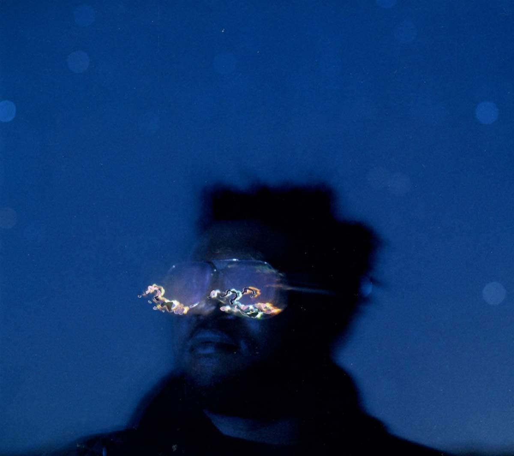

import { Slider, Button } from 'carbon-components-react';
import { ArrowUpRight24  } from '@carbon/icons-react';

import SliderJS1 from "../review/slider1"
import SliderJS2 from "../review/slider2"
import SliderJS3 from "../review/slider3"
import SliderJS4 from "../review/slider4"

import { Link } from "gatsby"

Album Review

<h1 className="h1--no--margin">{props.pageContext.frontmatter.title}</h1>

<Link to="/best50/2018/">2018 Black Music Best No.37</Link>

<Row  className="image-card-group">
	<Column colMd={"3"} colLg={"4"} noGutterMdLeft="">
       <ImageCard>

 

</ImageCard>
	</Column>
	<Column colMd={"8"} colLg={"8"} noGutterMdLeft="">
	

	Brainfeederに移籍したKeyboard奏者、Brandon Colemanの2年振り2作目。Kamasi Washington(数曲にHorn隊として参加)やThundercatとともにLA出身のJazzミュージシャンから成るWest Coast Get Downの仲間でもある。本人も言っているように、Herbie Hancock, JB, Prince, P-Funkなどに影響を受けた賑やかかつ軽快でFunkなR&B作品になっており、Jazzを下敷きにし、Discoな雰囲気も携えている。本人のVocoderによるVocalや女性Voの唄がメインで、⑤などはRogerにささげられており、非常にそれっぽい。難しいことは忘れて、とにかく楽しもうよというアルバム。
	

	

	  <Button href="https://amzn.to/2AnF9D0" kind="primary" size="small" renderIcon={ArrowUpRight24}>
      amazon.com
    </Button>
    <Button href="https://amzn.to/31BsOGr" kind="secondary" size="small" renderIcon={ArrowUpRight24}>
      amazon.co.jp
    </Button>
	

	
	
	</Column>
</Row>
<Row >
	<Column colMd={"4"} colLg={"4"} noGutterMdLeft="">

    <h3>Score card</h3>
		<SliderJS1 value="5" />
    <SliderJS2 value="2" />
		<SliderJS3 value="1" />
    <SliderJS4 value="8" />

</Column>
<Column colMd={"8"} colLg={"8"} noGutterMdLeft="">

<h3>Producers</h3>

Brandon Coleman(all)

<h3>Guests</h3>

	Sheera, N'dambi, Patrice Quinn, Techdizzle

</Column>
</Row>

<h3>Tracks</h3>

|	No. |	 Title                   |	 Composers                                                |	 Performer                                      |	 Time	|
|	--- |	------------------------ | ---------------------------------------------------------- | ----------------------------------------------- | ----- |
|	1	  |	Live for Today           | Sam Brawner / Brandon Coleman                             	|	Brandon Coleman                                	|	04:03	|
|	2	  |	All Around the World     | Brandon Coleman / Corey Mason / Dominic Thiroux           	|	Brandon Coleman                                	|	04:03	|
|	3	  |	A Letter to My Buggers   | Brandon Coleman / Crystal Starr Knighton / Dominic Thiroux	|	Brandon Coleman                                	|	04:25	|
|	4	  |	Addiction                | Brandon Coleman / Sheera Ehrig                            	|	Brandon Coleman feat. Sheera                   	|	03:33	|
|	5	  |	Sexy                     | Brandon Coleman / Robert Miller                           	|	Brandon Coleman                                	|	04:32	|
|	6	  |	There's No Turning Back  | Brandon Coleman / Jasmine Mitchell                        	|	Brandon Coleman                                	|	02:20	|
|	7	  |	Resistance               | Brandon Coleman                                           	|	Brandon Coleman                                	|	01:51	|
|	8	  |	Sundae                   | Brandon Coleman / N'Dambi                                 	|	Brandon Coleman feat. N'Dambi                  	|	03:37	|
|	9	  |	Just Reach for the Stars | Brandon Coleman / Patrice Quinn                           	|	Brandon Coleman                                	|	02:02	|
|	10	|	Love                     | Brandon Coleman / Richie Pena                             	|	Brandon Coleman                                	|	04:06	|
|	11	|	Giant Feelings           | Brandon Coleman                                           	|	Brandon Coleman feat. Patrice Quinn, Techdizzle	|	05:43	|
|	12	|	Walk Free                | Brandon Coleman                                           	|	Brandon Coleman                                	|	03:55	|
