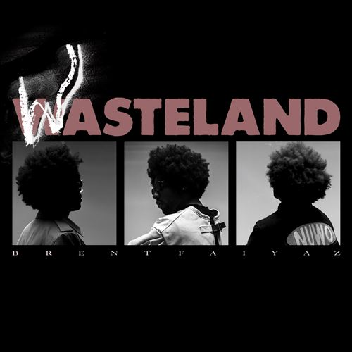

import { Slider, Button } from "@carbon/react";
import { ArrowUpRight } from "@carbon/icons-react";

import SliderJS1 from "../review/slider1";
import SliderJS2 from "../review/slider2";
import SliderJS3 from "../review/slider3";
import SliderJS4 from "../review/slider4";
import AdvJS2 from "../review/adv2";
import AdvJS3 from "../review/adv3";

import { Link } from "gatsby";

Album Review

<h1 className="h1--no--margin">{props.pageContext.frontmatter.title}</h1>

  <Link to="/best50/2022/">2022 Black Music Best No.24</Link>

<Row  className="image-card-group">
	<Column colMd={3} colLg={4} noGutterMdLeft="">
       <ImageCard>

</ImageCard>
	</Column>
	<Column colMd={8} colLg={8} noGutterMdLeft="">
		

			メリーランド州コロンビア出身の27歳、Brent Faiyazの2ndアルバム。デビュー作となる前作で注目を集めたが、当作でも高評価であり、チャートアクションも好調のようだ。
			 サウンドは王道でもネオソウルでもなく、オルタナっぽい感じのR&Bで、ミドル〰スロー中心で落ち着いた曲が揃っている。一聴でSteve Lacy参加と判る③をはじめ、暖かい雰囲気も感じ取れる曲もあるが、全体的にはアンニョイな印象を受ける。
			 本人によると、パンデミック後の混乱した感情を表してるようだ。また、制作陣/GuestではAlicia, Raphael Saadiq, THe-DreamにTylerなどが参加して、盛り立てている。Brentの唄は、やや官能的で抑え気味、音数少なめなTrackに溶け込んでいる。
		

		

		  <Button className="button-right-mergin"  href="https://amzn.to/3ohkx83" renderIcon={ArrowUpRight} size='sm' kind='primary'>
  	    amazon.com
  	  </Button>
  	  <Button className="button-right-mergin"  href="https://amzn.to/3my9rv3" renderIcon={ArrowUpRight} size='sm' kind='secondary'>
  	    amazon.co.jp
  	  </Button>
			<Button className="button-right-mergin"  href="https://amzn.to/3my9rv3" renderIcon={ArrowUpRight} size='sm' kind='tertiary'>
  	    apple music
  	  </Button>
			<AdvJS2/>
		

	</Column>
</Row>
<Row >
	<Column colMd={4} colLg={4} noGutterMdLeft="">
		

		  <h3>Score card</h3>
			<SliderJS1 value="5" />
		  <SliderJS2 value="1" />
			<SliderJS3 value="1" />
		  <SliderJS4 value="8" />
		

	</Column>
	<Column colMd={8} colLg={8} noGutterMdLeft="">
		

			<h3>Producers</h3>
			

				Jordan Ware, and Freeze(1)
				 Jordan Ware, Paperboy Fabe, Raphael Saadiq, No I.D., Brent Faiyaz and Beat Butcha(2)
				 DJ Dah(3)
				 Beat Butcha and Mike Blud(4)
				 Jordan Ware, Mike Blud and Freeze(5)
				 Brent Faiyaz(6)
				 Brent Faiyaz, Lil Rece, Nascent, L3gion and Sam Wish(7)
				 Jordan Ware and Raphael Saadiq(8,19)
				 The Neptunes(9)
				 Coop the Truth, Jake One and Nascent(10)
				 Che Pope and Prep Bijan(11)
				 Freeza(12,18)
				 Brent Faiyaz, Dpat, Jordan Ware and Lil Rece(13)
				 Brent Faiyaz, Jordan Ware and Beat Butcha(14)
				 Brent Faiyaz, Jordan Ware, No I.D. and Paperboy Fabe(15)
				 Brent Faiyaz, L3gion and Jordan Ware(16)
				 Paperboy Fabe, Loshendrix, L3gion, Brent Faiyaz and Jordan Ware(17)
			

			<h3>Guests</h3>
				Tyler, The Creator, Alicia Keys , Drake, The Neptunes, Joony, Tre' Amani, DJ Dahi, Jorja Smith
			

			

		

	</Column>
</Row>

<h3>Tracks</h3>

| No. | Title                       | Composers                                                                                               | Performer                                      | Time  |
| --- | --------------------------- | ------------------------------------------------------------------------------------------------------- | ---------------------------------------------- | ----- |
| 1   | VILLAIN'S THEME             | Christopher Wood, Jordan Ware, Jonathan Wells, Jorja Smith                                              | Brent Faiyaz                                   | 02:21 |
| 2   | LOOSE CHANGE                | Christopher Wood, Jordan Ware, Fabbien Nahounou, Raphael Saadiq, Dion Wilson, Eliot Dubock, Terius Nash | Brent Faiyaz                                   | 03:46 |
| 3   | GRAVITY                     | Christopher Wood, Dacoury Natche, Tyler Okonma, Steve Lacy                                              | Brent Faiyaz feat. Tyler, The Creator, DJ Dahi | 03:34 |
| 4   | HEAL YOUR HEART (INTERLUDE) | Christopher Wood, Eliot Dubock, Michael Bludson                                                         | Brent Faiyaz                                   | 01:15 |
| 5   | EGOMANIAC (SKIT)            | Christopher Wood, Jonathan Wells, Michael Bludson, Jordan Ware                                          | Brent Faiyaz                                   | 01:21 |
| 6   | ALL MINE                    | Christopher Wood                                                                                        | Brent Faiyaz                                   | 03:36 |
| 7   | PRICE OF FAME               | Christopher Wood, Sharif Jenkins, Christopher Ruelas, Jason Avalos, Samuel Wishkoski                    | Brent Faiyaz                                   | 06:19 |
| 8   | GHETTO GATSBY               | Christopher Wood, Alicia Cook, Jordan Ware, Raphael Saadiq, Terius Nash                                 | Brent Faiyaz feat. Alicia Keys                 | 03:18 |
| 9   | WASTING TIME                | Christopher Wood, Aubrey Graham, Pharrell Williams, Chad Hugo                                           | Brent Faiyaz feat. Drake, The Neptunes         | 05:01 |
| 10  | ROLLING STONE               | Christopher Wood, Cooper McGill, Jacob Dutton, Christopher Ruelas, Terius Nash                          | Brent Faiyaz                                   | 02:42 |
| 11  | FYTB                        | Christopher Wood, Jonathan Negero, Che Pope, David Hughes                                               | Brent Faiyaz feat. Joony                       | 03:18 |
| 12  | OBLIVION (SKIT)             | Christopher Wood, Jonathan Wells                                                                        | Brent Faiyaz                                   | 02:46 |
| 13  | DEAD MAN WALKING            | Christopher Wood, David Patino, Jordan Ware, Sharif Jenkins, Maurice Willis                             | Brent Faiyaz                                   | 04:07 |
| 14  | ADDICTIONS                  | Christopher Wood, Trey Miller, Jordan Ware, Eliot Dubock,                                               | Brent Faiyaz feat. Tre' Amani                  | 03:12 |
| 15  | ROLE MODEL                  | Christopher Wood, Jordan Ware, Dion Wilson, Fabbien Nahounou, Malcolm Mays                              | Brent Faiyaz                                   | 03:14 |
| 16  | JACKIE BROWN                | Christopher Wood, Jason Avalos, Jordan Ware, Stephen Garrett, Timothy Mosley                            | Brent Faiyaz                                   | 02:49 |
| 17  | BAD LUCK                    | Christopher Wood, Fabbien Nahounou, Carlos Muñoz, Jason Avalos, Jordan Ware, Terius Nash,               | Brent Faiyaz                                   | 02:42 |
| 18  | WAKE UP CALL (SKIT)         | Christopher Wood, Jonathan Wells                                                                        | Brent Faiyaz                                   | 05:05 |
| 19  | ANGEL                       | Christopher Wood, Jordan Ware, Raphael Saadiq                                                           | Brent Faiyaz                                   | 03:39 |

<AdvJS3 />
