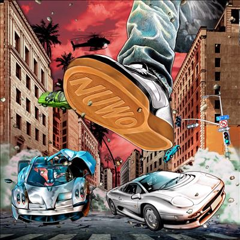

import { Slider, Button } from "@carbon/react";
import { ArrowUpRight } from "@carbon/icons-react";

import SliderJS1 from "./slider1";
import SliderJS2 from "./slider2";
import SliderJS3 from "./slider3";
import SliderJS4 from "./slider4";
import AdvJS2 from "./adv2";
import AdvJS3 from "./adv3";

import { Link } from "gatsby";

import Review1 from "../review/brentfaiyaz1.mdx";

Album Review

<h1 className="h1--no--margin">{props.pageContext.frontmatter.title}</h1>

  <Link to="/best50/2023/">2023 Black Music Best No.34</Link>

<Row  className="image-card-group">
	<Column colMd={3} colLg={4} noGutterMdLeft="">
       <ImageCard>

</ImageCard>
	</Column>
	<Column colMd={8} colLg={8} noGutterMdLeft="">
		

			Brent Faiyazの1年ぶりとなる作品はMix Tapeでのリリースとなった。ネオソウル寄りのスロー作品がメインとなるが、2000年前後へのオマージュがたっぷりで、MissyやTimbalandまでもがGuest参加しており、サンプリングにも使われたりしている。他にもCoco Jonesや、A$AP RockyをはじめとするRapper陣も加わり、平坦になりがちなスロー集に良い味付けとなっている。
			 Brentの唄は、アンニョイで甘く、曲調に溶け込んでいる。ちなみに2024/1/24のライブに参戦したが、オーディエンスは若い女子ばかりで、嬌声をあげてました。
		

		

		  <Button className="button-right-mergin"  href="https://amzn.to/3ohkx83" renderIcon={ArrowUpRight} size='sm' kind='primary'>
  	    amazon.com
  	  </Button>
  	  <Button className="button-right-mergin"  href="https://amzn.to/3my9rv3" renderIcon={ArrowUpRight} size='sm' kind='secondary'>
  	    amazon.co.jp
  	  </Button>
			<Button className="button-right-mergin"  href="https://amzn.to/3my9rv3" renderIcon={ArrowUpRight} size='sm' kind='tertiary'>
  	    apple music
  	  </Button>
			<AdvJS2/>
		

	</Column>
</Row>
<Row >
	<Column colMd={4} colLg={4} noGutterMdLeft="">
		

		  <h3>Score card</h3>
			<SliderJS1 value="4" />
		  <SliderJS2 value="1" />
			<SliderJS3 value="1" />
		  <SliderJS4 value="8" />
		

	</Column>
	<Column colMd={8} colLg={8} noGutterMdLeft="">
		

			<h3>Producers</h3>
			

				Dpat, Mannyvelli & Sparkheem(1)
				Dpat(2,12)
				Jonah Roy(3)
				Dpat, Mannyvelli and Sparkheem(6)
				Jonah Roy(7)
				1stFrom92, AR, SpizzleDoe, Jamie McLaughlin, Williskeating(8)
				Mannyvelli and Tommy Richman(9)
				Mannyvelli, SpizzleDoe and Sparkheem(10)
				Anthoine Walters, Dpat, Otxhello, Jonathan Wells and Berg (13)
				Dpat, yeeshy and MW(14)
			

			<h3>Guests</h3>
			

				Lil Gray, Missy Elliott, Coco Jones, A$AP Rocky, N3WYRKLA, ommy Richman, FELIX, Cruddy Murda, A$AP ANT, Babyface Ray
			

		

	</Column>
</Row>

<h3>Tracks</h3>

| No. | Title               | Composers                                                                                                               | Performer                                  | Time  |
| --- | ------------------- | ----------------------------------------------------------------------------------------------------------------------- | ------------------------------------------ | ----- |
| 1   | Tim's Intro         | Brent Faiyaz, Dpat, L.3.G.I.O.N., Terrence Davis, Timbaland                                                             | Brent Faiyaz                               | 02:04 |
| 2   | Last One Left       | Brent Faiyaz, Dpat, Missy Elliott, Khalil Wright                                                                        | Brent Faiyaz feat. Lil Gray, Missy Elliott | 03:44 |
| 3   | Forever Yours       | Brent Faiyaz, Jonah Roy, Rich Paul                                                                                      | Brent Faiyaz                               | 01:36 |
| 4   | Best Time           | Brent Faiyaz, Dpat, Kelis, Tommy Richman                                                                                | Brent Faiyaz                               | 01:22 |
| 5   | Big Mad Skit        | Aheko Shorter, Chidozie Michael Arah, Emmanuel Arah, Juan Wood II, Terrance Davis, Flee                                 | Brent Faiyaz                               | 01:18 |
| 6   | Moment of Your Life | Brent Faiyaz, Coco Jones, Dpat, Donald Holmes, Emmanuel Arah, Gerard Thomas, Missy Elliott, Terrance Davis              | Brent Faiyaz feat. Coco Jones              | 03:14 |
| 7   | Outside All Night   | Brent Faiyaz, Jonah Roy, A$AP Rocky, N3WYRKLA                                                                           | Brent Faiyaz feat. A$AP Rocky, N3WYRKLA    | 03:22 |
| 8   | Wherever I Go       | AR, Chidozie Michael Arah, Brent Faiyaz, Elliot Davy, Jamie McLaughlin, Williskeating                                   | Brent Faiyaz                               | 03:01 |
| 9   | Upset               | Brent Faiyaz, Emmanuel Arah, FELIX, Tommy Richman                                                                       | Brent Faiyaz feat. Tommy Richman, FELIX    | 02:57 |
| 10  | On This Side        | Brent Faiyaz, A$AP ANT, Cruddy Murda, Johnathan Buck, Chidozie Michael Arah, N.A.R.D., Terrence Davis, Belo Zero, AK-47 | Brent Faiyaz feat. Cruddy Murda, A$AP ANT  | 02:58 |
| 11  | Dawged Em Skit      | Dpat , Jamal Harris                                                                                                     | Brent Faiyaz                               | 01:04 |
| 12  | Belong to You       | Brent Faiyaz, Babyface Ray, Dpat, Jerome Woods                                                                          | Brent Faiyaz feat. Babyface Ray            | 02:57 |
| 13  | WY@                 | Otxhello, Anthoine Walters, Brent Faiyaz, Dpat, Jonathan Wells, Berg                                                    | Brent Faiyaz                               | 03:27 |
| 14  | Pistachios          | Brent Faiyaz, Isaac Hayes, William Young, Cat Daddy Ro, Adina Howard, Curtis ‘Sauce’ Wilson                             | Brent Faiyaz                               | 03:09 |

<h3>Other Reviews</h3>

<Row>
  <Column colMd={3} colLg={3} noGutterMdLeft>
    <Review1 />
  </Column>
</Row>

<AdvJS3 />
