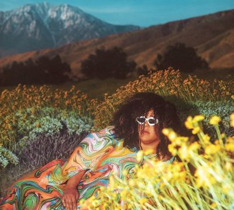

import { Slider, Button } from "@carbon/react";
import { ArrowUpRight } from "@carbon/icons-react";

import SliderJS1 from "./slider1";
import SliderJS2 from "./slider2";
import SliderJS3 from "./slider3";
import SliderJS4 from "./slider4";
import AdvJS2 from "./adv2";
import AdvJS3 from "./adv3";

import { Link } from "gatsby";

Album Review

<h1 className="h1--no--margin">{props.pageContext.frontmatter.title}</h1>

  <Link to="/best50/2024/">2024 Black Music Best No.23</Link>

<Row  className="image-card-group">
	<Column colMd={3} colLg={4} noGutterMdLeft="">
       <ImageCard>

</ImageCard>
	</Column>
	<Column colMd={8} colLg={8} noGutterMdLeft="">
		

			現在活動休止中のAlabama Shakesを率いるBrittany Howardのソロ2作目。2024年春リリース時は35歳だったが、貫禄はそれ以上に感じる。
			 骨太なギターロックがベースにはなるが、唄を聴かせるバラードも多く、ドリーミーな曲、ハウス風、プリンスっぽい曲など、予想以上に多彩で濃密な作品になっている。
			 自宅スタジオでつくったデモをもとに仕上げたということで、サウンドはラウドでローファイな印象を受ける。BrittanyはVocalだけでなく、全曲Produceに、ギターなど楽器もこなし、マルチな才能を見せつけている。
		

		

		  <Button className="button-right-mergin"  href="https://amzn.to/4cmjs3T" renderIcon={ArrowUpRight} size='sm' kind='primary'>
  	    amazon.com
  	  </Button>
  	  <Button className="button-right-mergin"  href="https://amzn.to/4coVtAX" renderIcon={ArrowUpRight} size='sm' kind='secondary'>
  	    amazon.co.jp
  	  </Button>
			<Button className="button-right-mergin"  href="https://apple.co/4j2cwvl" renderIcon={ArrowUpRight} size='sm' kind='tertiary'>
  	    apple music
  	  </Button>
			<AdvJS2/>
		

	</Column>
</Row>
<Row >
	<Column colMd={4} colLg={4} noGutterMdLeft="">
		

		  <h3>Score card</h3>
			<SliderJS1 value="5" />
		  <SliderJS2 value="3" />
			<SliderJS3 value="1" />
		  <SliderJS4 value="9" />
		

	</Column>
	<Column colMd={8} colLg={8} noGutterMdLeft="">
		

			<h3>Producers</h3>
			

				Brittany Howard(all)
			

			<h3>Guests</h3>
			

			

		

	</Column>
</Row>

<h3>Tracks</h3>

| No. | Title               | Composers                                | Performer       | Time  |
| --- | ------------------- | ---------------------------------------- | --------------- | ----- |
| 1   | Earth Sign          | Brittany Howard                          | Brittany Howard | 03:38 |
| 2   | I Don’t             | Brittany Howard                          | Brittany Howard | 03:22 |
| 3   | What Now            | Taylor Ann Avis Bogner / Brittany Howard | Brittany Howard | 03:46 |
| 4   | Red Flags           | Brittany Howard                          | Brittany Howard | 04:27 |
| 5   | To Be Still         | Brittany Howard / Brad Allen Williams    | Brittany Howard | 02:27 |
| 6   | Interlude           | Brittany Howard                          | Brittany Howard | 00:38 |
| 7   | Another Day         | Brittany Howard                          | Brittany Howard | 02:14 |
| 8   | Prove It to You     | Brittany Howard                          | Brittany Howard | 03:20 |
| 9   | Samson              | Brittany Howard                          | Brittany Howard | 05:17 |
| 10  | Patience            | Brittany Howard                          | Brittany Howard | 03:15 |
| 11  | Power to Undo       | Brittany Howard                          | Brittany Howard | 02:50 |
| 12  | Every Color in Blue | Brittany Howard                          | Brittany Howard | 03:06 |

<AdvJS3 />
