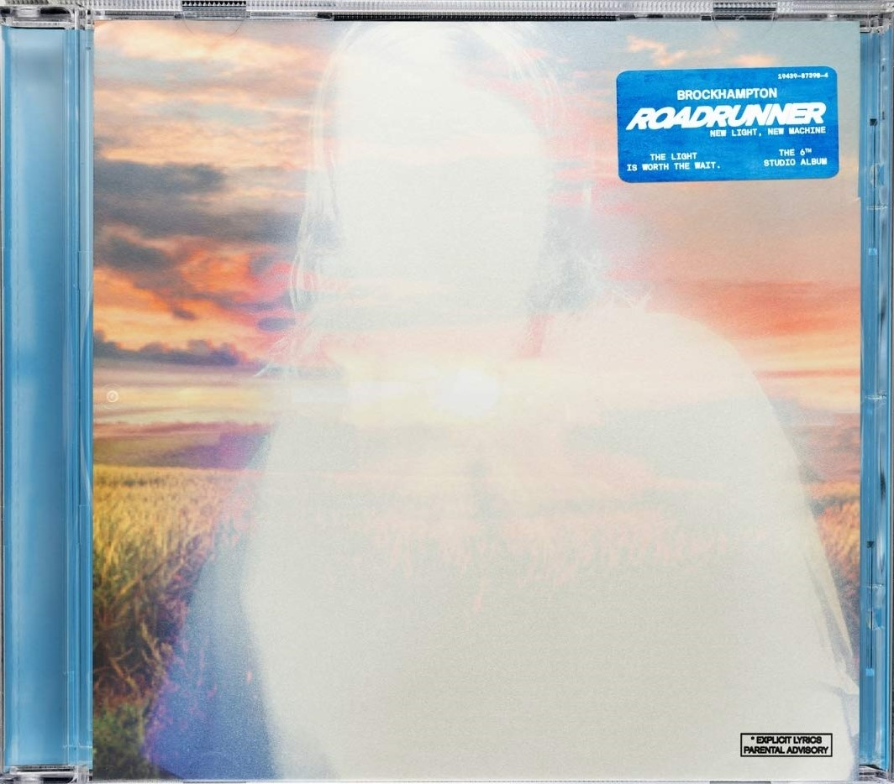

import { Slider, Button } from "carbon-components-react";
import { ArrowUpRight24 } from "@carbon/icons-react";

import SliderJS1 from "../review/slider1";
import SliderJS2 from "../review/slider2";
import SliderJS3 from "../review/slider3";
import SliderJS4 from "../review/slider4";
import AdvJS2 from "../review/adv2";
import AdvJS3 from "../review/adv3";

import Review1 from "../review/brockhampton1.mdx";

import { Link } from "gatsby";

Album Review

<h1 className="h1--no--margin">{props.pageContext.frontmatter.title}</h1>

<Row  className="image-card-group">
	<Column colMd={"3"} colLg={"4"} noGutterMdLeft="">
       <ImageCard>

</ImageCard>
	</Column>
	<Column colMd={"4"} colLg={"8"} noGutterMdLeft="">
	

		自称Boys BandのBrockhampton、2年ぶりの6作目。Netでリリースしてきた曲を中心にまとめたものらしい。
		 Danny Brown, JPEGMAFIA, A$ap Rockyなどをゲストに迎えたこともあり、今までよりHip-Hop色が濃くなっている。それだけでなく、Rockを前面に押し出した曲もあるし、Charile Wilsonをフィーチャーしたファンクな⑦など、曲調は様々で、相変わらずの賑やかさである。また、穏やかなヒーリング曲の⑩では久々にChad Hugoの名前をクレジットに見かけた。
		 全般的には明るくてPopではあるが、乱射事件を取り上げた⑪、もろゴスペルでほぼアカペラな⑫、メランコリックな⑬とつづくあたりで、それだけではないところも示している。
	

	

	  <Button className="button-right-mergin"  href="https://amzn.to/3nU4tH1" kind="primary" size="small" renderIcon={ArrowUpRight24}>
      amazon.com
    </Button>
    <Button className="button-right-mergin"  href="https://amzn.to/2ZfVENr" kind="secondary" size="small" renderIcon={ArrowUpRight24}>
      amazon.co.jp
    </Button>
		<Button className="button-right-mergin"  href="https://geo.music.apple.com/us/album/roadrunner-new-light-new-machine-plus-pack/1569675412?itsct=music_box_link&itscg=30200&at=11lcug&ls=1&app=music" kind="tertidary" size="small" renderIcon={ArrowUpRight24}>
      ampple music
    </Button>
		<AdvJS2/>
	

	</Column>
</Row>
<Row >
	<Column colMd={"4"} colLg={"4"} noGutterMdLeft="">

  <h3>Score card</h3>
	<SliderJS1 value="2" />
  <SliderJS2 value="2" />
	<SliderJS3 value="1" />
  <SliderJS4 value="8" />

</Column>
<Column colMd={"8"} colLg={"8"} noGutterMdLeft="">

	<h3>Producers</h3>
	

		Video Store, Jabari Manwa and Queen Sixties(1,3)
		 Video Store(2)
		 Video Store, Jabari Manwa and Baird(4,17)
		 Video Store, Jabari Manwa and Goldwash(5)
		 Kiko Merley, Video Store and Jabari Manwa(6)
		 Jabari Manwa, Chuks Chiejine, Video Store and Federico Vindver(7)
		 Baird, Jabari Manwa, Russell “Joba” Boring, Williamvanzandt and Video Store(8)
		 Video Store, Baird, Russell “Joba” Boring and Christian Alexander(9)
		 Chad Hugo(10)
		 Russell “Joba” Boring, Video Store, Jabari Manwa and Baird(11,16)
		 bearface, Nick Velez AND Boylife(12)
		 Video Store, Baird Federico Vindver and Williamvanzandt(13)
		 bearface, Nick Velez(14)
		 Jabari Manwa(15))
	

	<h3>Guests</h3>
	

		Danny Brown, Johan Lenox, Jpegmafia, A$ap Rocky, Shawn Mendes, SoGone SoFlexy, A$ap Ferg, Christian Alexander , Charlie Wilson, Baird, Ssgkobe
	

</Column>
</Row>

<h3>Tracks</h3>

| No. | Title                    | Composers                                                                                                                                                                                                            | Performer                                | Time  |
| --- | ------------------------ | -------------------------------------------------------------------------------------------------------------------------------------------------------------------------------------------------------------------- | ---------------------------------------- | ----- |
| 1   | Buzzcut                  | I. Simpson, I. Goss, D. Sewell, R. Boring, R. Hemnani, J. Manwarring, J. Scharff, J. Ruzumna, J. Karnes, S. Feigenbaum, V. Sundaresan                                                                                | BROCKHAMPTON feat. Danny Brown           | 03:20 |
| 2   | Chain On                 | I. Simpson, B. Hendricks, D. Simpson, R. Hemnani, I. Hayes, D. Porter, G. Grice, C. Smith, R. Jones, R. Diggs, D. Coles, J. Hunter, C. WoodS, L. Hawkins                                                             | BROCKHAMPTON feat. Jpegmafia             | 03:21 |
| 3   | Count on Me              | R. Mayers, J. Manwarring, R. Beatty, I. Simpson, M. Champion, R. Boring, D. Serino, R. Hemnani, J. Scharff, J. Ruzumna, J. Karnes                                                                                    | BROCKHAMPTON                             | 02:35 |
| 4   | Bankroll                 | R. Mayers, D. Ferguson, JR., W. Wood, M. Champion, R. Hemnani, J. Manwarring, I. Simpson, B. Achson, I. Merriweather, V. Sundaresan                                                                                  | BROCKHAMPTON feat. A$ap Rocky, A$ap Ferg | 03:22 |
| 5   | The Light                | I. Simpson, R. Boring, J. Nunes, R. Hemnani, J. Manwarring, I. Merriweather, B. Achson, G. Achson                                                                                                                    | BROCKHAMPTON                             | 03:42 |
| 6   | Windows                  | D. Serino, W. Wood, M. Champion, D. Simpson, R. Boring, I. Simpson, R. Beatty, I. Goss, C. McDonald, I. Merriweather, R. Hemnani, J. Manwarring, A. Raju, D. Gibbs, D. Painter, H. Chapman, M. Jacobs JR., S. Wright | BROCKHAMPTON feat. SoGone SoFlexy        | 06:11 |
| 7   | I'll Take You On         | I. Simpson, C. McDonald, R. Boring, M. Champion, C. Wilson, O. Emerson, S. Newsome, J. Manwarring, C. Chiejine, R. Hemnani, I. Merriweather, F. Vindver, B. Achson                                                   | BROCKHAMPTON feat. Charlie Wilson        | 04:14 |
| 8   | Old News                 | J. Manwarring, M. Champion, B. Achson, W. Wood, R. Boring, D. Simpson, R. Hemnani, W. Van Zandt, N. Johnson                                                                                                          | BROCKHAMPTON feat. Baird                 | 03:13 |
| 9   | What's the Occasion?     | M. Champion, R. Boring, R. Hemnani, I. Simpson, B. Achson, C. Alexander, J. Manwarring, G. Achson                                                                                                                    | BROCKHAMPTON                             | 03:45 |
| 10  | When I Ball              | D. Simpson, J. Cobra, M. Champion, R. Boring, I. Simpson, C. Hugo, B. Achson, A. O'Connor                                                                                                                            | BROCKHAMPTON                             | 03:23 |
| 11  | Don't Shoot Up the Party | I. Simpson, M. Champion, R. Boring, C. McDonald, R. Hemnani, J. Manwarring, I. Merriweather, B. Achson, G. Achson                                                                                                    | BROCKHAMPTON                             | 03:07 |
| 12  | Dear Lord                | C. McDonald, N. Velez, R. YOO                                                                                                                                                                                        | BROCKHAMPTON                             | 02:02 |
| 13  | The Light, Pt. 2         | I. Simpson, R. Boring, R. Hemnani, B. Achson, F. Vindver, W. Van Zandt, H. Solomon, E. Molonari                                                                                                                      | BROCKHAMPTON                             | 04:18 |
| 14  | Roberto's Interlude      | R. Ontenient, N. Velez, C. McDonald                                                                                                                                                                                  | BROCKHAMPTON                             | 00:53 |
| 15  | Jeremiah                 | I. Simpson, M. Champion, W. Wood, R. Beatty, J. Manwarring, I. Merriweather                                                                                                                                          | BROCKHAMPTON                             | 02:59 |
| 16  | Sex                      | I. Simpson, D. Simpson, M. Champion, R. Boring, C. McDonald, W. Wood, J. Manwarring, R. Hemnani, I. Merriweather, B. Achson                                                                                          | BROCKHAMPTON                             | 03:36 |
| 17  | Pressure/Bow Wow         | W. Wood, D. Simpson, R. Hemnani, B. Achson, J. Manwarring                                                                                                                                                            | BROCKHAMPTON feat.Ssgkobe                | 02:45 |

<AdvJS3 />

<Row>
  <Column colMd={3} colLg={3} noGutterMdLeft>
    <Review1 />
  </Column>
</Row>
