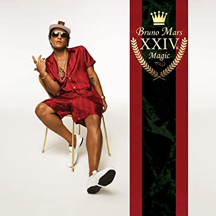

import { Slider, Button } from "carbon-components-react";
import { ArrowUpRight24 } from "@carbon/icons-react";

import SliderJS1 from "../review/slider1";
import SliderJS2 from "../review/slider2";
import SliderJS3 from "../review/slider3";
import SliderJS4 from "../review/slider4";
import AdvJS2 from "../review/adv2";
import AdvJS3 from "../review/adv3";

import { Link } from "gatsby";

import Review11 from "../review/silksonic1.mdx";

Album Review

<h1 className="h1--no--margin">{props.pageContext.frontmatter.title}</h1>

  <Link to="/best50/2016/">2016 Black Music Best No.23</Link>

<Row  className="image-card-group">
	<Column colMd={"3"} colLg={"4"} noGutterMdLeft="">
       <ImageCard>

</ImageCard>
	</Column>
	<Column colMd={"8"} colLg={"8"} noGutterMdLeft="">
		

			Bruno Marsの約4年ぶりとなる3作目。その間にMark RonsonとのUptown Funkを成功させていたが、その流れを汲んだゴージャスでノリノリのアルバムになっている。
			 80年代後半から90年代前半の、いわゆるブラコンと呼ばれていたFunkでDicsoな音楽へのオマージュがたっぷりで、Zapp, Michael Jackson, New Jack Swing, JBなどを思わせる曲が散りばめられている。
			 それだけでなく、スローはメロディアスで、アップはキャッチーで判りやすくと曲自体の出来が素晴らしい。ちなみにProducer TeamのShampoo Press & Curlというのは、Brunoにthe Smeezingtons時代からの盟友Philip Lawrence、新たにBrody Brownによる3人組のようだ。
			 Bruno MarsのVocalも絶品で、オリジナリティはさておいて、単純に楽しめる作品だと思う。
		

		

		  <Button href="https://amzn.to/3gVwKGU" kind="primary" size="small" renderIcon={ArrowUpRight24}>
  	    amazon.com
  	  </Button>
  	  <Button href="https://amzn.to/3h8Mg28" kind="secondary" size="small" renderIcon={ArrowUpRight24}>
  	    amazon.co.jp
  	  </Button>
		

		
		<AdvJS2 />
	</Column>
</Row>
<Row >
	<Column colMd={"4"} colLg={"4"} noGutterMdLeft="">

  <h3>Score card</h3>
	<SliderJS1 value="5" />
  <SliderJS2 value="2" />
	<SliderJS3 value="1" />
  <SliderJS4 value="9" />

</Column>
<Column colMd={"8"} colLg={"8"} noGutterMdLeft="">

<h3>Producers</h3>

	Shampoo Press & Curl(1,2,3,4,5,9)
	 Shampoo Press & Curl and Emile Haynie(6)
	 Shampoo Press & Curl, Emile Haynie and Jeff Bhasker(7)
	 Shampoo Press & Curl and The Stereotypes(8)

<h3>Guests</h3>

</Column>
</Row>

<h3>Tracks</h3>

| No. | Title                   | Composers                                                                                                                                          | Performer  | Time  |
| --- | ----------------------- | -------------------------------------------------------------------------------------------------------------------------------------------------- | ---------- | ----- |
| 1   | 24K Magic               | Christopher Brody Brown / Philip Lawrence / Bruno Mars                                                                                             | Bruno Mars | 03:46 |
| 2   | Chunky                  | Christopher Brody Brown / James Fauntleroy / Philip Lawrence / Bruno Mars                                                                          | Bruno Mars | 03:06 |
| 3   | Perm                    | Christopher Brody Brown / James Fauntleroy / Trevor Lawrence Jr. / Philip Lawrence / Bruno Mars / Homer Steinweiss                                 | Bruno Mars | 03:30 |
| 4   | That's What I Like      | Christopher Brody Brown / James Fauntleroy / Ray Charles McCullough II / Philip Lawrence / Bruno Mars / Jeremy Reeves / Ray Romulus / Jonathan Yip | Bruno Mars | 03:26 |
| 5   | Versace on the Floor    | Christopher Brody Brown / James Fauntleroy / Philip Lawrence / Bruno Mars                                                                          | Bruno Mars | 04:21 |
| 6   | Straight Up & Down      | Christopher Brody Brown / James Fauntleroy / Marc Gay / Philip Lawrence / Bruno Mars / Carl Martin / Faheem Najm                                   | Bruno Mars | 03:18 |
| 7   | Calling All My Lovelies | Jeff Bhasker / Christopher Brody Brown / James Fauntleroy / Emile Haynie / Philip Lawrence / Bruno Mars                                            | Bruno Mars | 04:10 |
| 8   | Finesse                 | Christopher Brody Brown / James Fauntleroy / Ray Charles McCullough II / Philip Lawrence / Bruno Mars / Jeremy Reeves / Ray Romulus / Jonathan Yip | Bruno Mars | 03:10 |
| 9   | Too Good to Say Goodbye | Jeff Bhasker / Christopher Brody Brown / Kenneth Edmonds / Philip Lawrence / Bruno Mars                                                            | Bruno Mars | 04:41 |

<h3>Other Reviews</h3>

<Row>
  <Column colMd={3} colLg={3} noGutterMdLeft>
    <Review11 />
  </Column>
</Row>

<AdvJS3 />