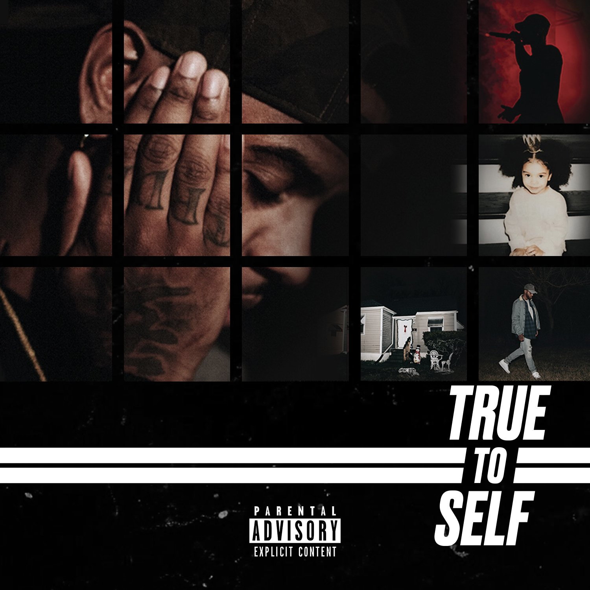

import { Slider, Button } from 'carbon-components-react';
import { ArrowUpRight24  } from '@carbon/icons-react';

import SliderJS1 from "../review/slider1"
import SliderJS2 from "../review/slider2"
import SliderJS3 from "../review/slider3"
import SliderJS4 from "../review/slider4"

import { Link } from "gatsby"

Album Review

<h1 className="h1--no--margin">{props.pageContext.frontmatter.title}</h1>

<Row  className="image-card-group">
	<Column colMd={"3"} colLg={"4"} noGutterMdLeft="">
       <ImageCard>

 

</ImageCard>
	</Column>
	<Column colMd={"8"} colLg={"8"} noGutterMdLeft="">
	

	デビュー作のTrapsoulがミリオンヒットになった、ケンタッキー出身のSinger / Song Writer, Bryson Tillerの2年振りの2作目。第一印象では、DrakeやFrank Oceanのようなアンビエントでダウナーで浮遊感のあるサウンドが特徴的。ただ、本人がAlbum Noteでインスピレーションを受けたとしているArtistの多くは女性R&B Singerで、ちょっとした違和感はあるのだが、多くのTrackで90年代R&Bを引用しており、アプローチとしては新しい。ところどころでUpな曲はあるがスロー中心の構成で、Brysonの静かで切ない唄が、マッチしている。
	

	

	  <Button href="https://amzn.to/2EpKKdB" kind="primary" size="small" renderIcon={ArrowUpRight24}>
      amazon.com
      </Button>
      <Button href="https://amzn.to/3hNh88s" kind="secondary" size="small" renderIcon={ArrowUpRight24}>
      amazon.co.jp
      </Button>
	

	
	
	</Column>
</Row>
<Row >
	<Column colMd={"4"} colLg={"4"} noGutterMdLeft="">

    <h3>Score card</h3>
	<SliderJS1 value="5" />
    <SliderJS2 value="1" />
	<SliderJS3 value="2" />
    <SliderJS4 value="8" />

</Column>
<Column colMd={"8"} colLg={"8"} noGutterMdLeft="">

<h3>Producers</h3>

NES and Teddy Walton(1,11)
 Swiff D(2)
 NES(3,5,8,10,13,17,19)
 Wandagurl and Francisco Heat(4)
 Hollywood Horsauce(6)
 J-Louis(7)
 Boi-1da(9)
 Ayo(12)
 Boi-1da, Illmino and Prologic(14)
 Teddy Walton and Iamnobodi(15)
 S O U N D Z(16)
 T-Minus(18)

<h3>Guests</h3>

</Column>
</Row>

<h3>Tracks</h3>

| No. |	 Title                     |	 Composers |	 Performer | Time  |
| --- |	-------------------------- | ------------- | ------------- | ----- |
| 1	  |	Rain on Me (Intro)         | Bryson Tiller | Bryson Tiller | 02:25 |
| 2	  |	No Longer Friends          | Bryson Tiller | Bryson Tiller | 02:14 |
| 3	  |	Don't Get Too High         | Bryson Tiller | Bryson Tiller | 03:29 |
| 4	  |	Blowing Smoke              | Bryson Tiller | Bryson Tiller | 03:00 |
| 5	  |	We Both Know               | Bryson Tiller | Bryson Tiller | 02:40 |
| 6	  |	You Got It                 | Bryson Tiller | Bryson Tiller | 02:56 |
| 7	  |	In Check                   | Bryson Tiller | Bryson Tiller | 03:18 |
| 8	  |	Self-Made                  | Bryson Tiller | Bryson Tiller | 02:48 |
| 9	  |	Run Me Dry                 | Bryson Tiller | Bryson Tiller | 02:49 |
| 10  |	High Stakes                | Bryson Tiller | Bryson Tiller | 03:02 |
| 11  |	Rain (Interlude)           | Bryson Tiller | Bryson Tiller | 00:46 |
| 12  |	Teach Me a Lesson          | Bryson Tiller | Bryson Tiller | 03:27 |
| 13  |	Stay Blessed               | Bryson Tiller | Bryson Tiller | 04:06 |
| 14  |	Money Problems/Benz Truck  | Bryson Tiller | Bryson Tiller | 04:59 |
| 15  |	Set It Off                 | Bryson Tiller | Bryson Tiller | 03:37 |
| 16  |	Nevermind This (Interlude) | Bryson Tiller | Bryson Tiller | 02:14 |
| 17  |	Before You Judge           | Bryson Tiller | Bryson Tiller | 04:46 |
| 18  |	Somethin Tells Me          | Bryson Tiller | Bryson Tiller | 03:14 |
| 19  |	Always (Outro)             | Bryson Tiller | Bryson Tiller | 02:30 |
