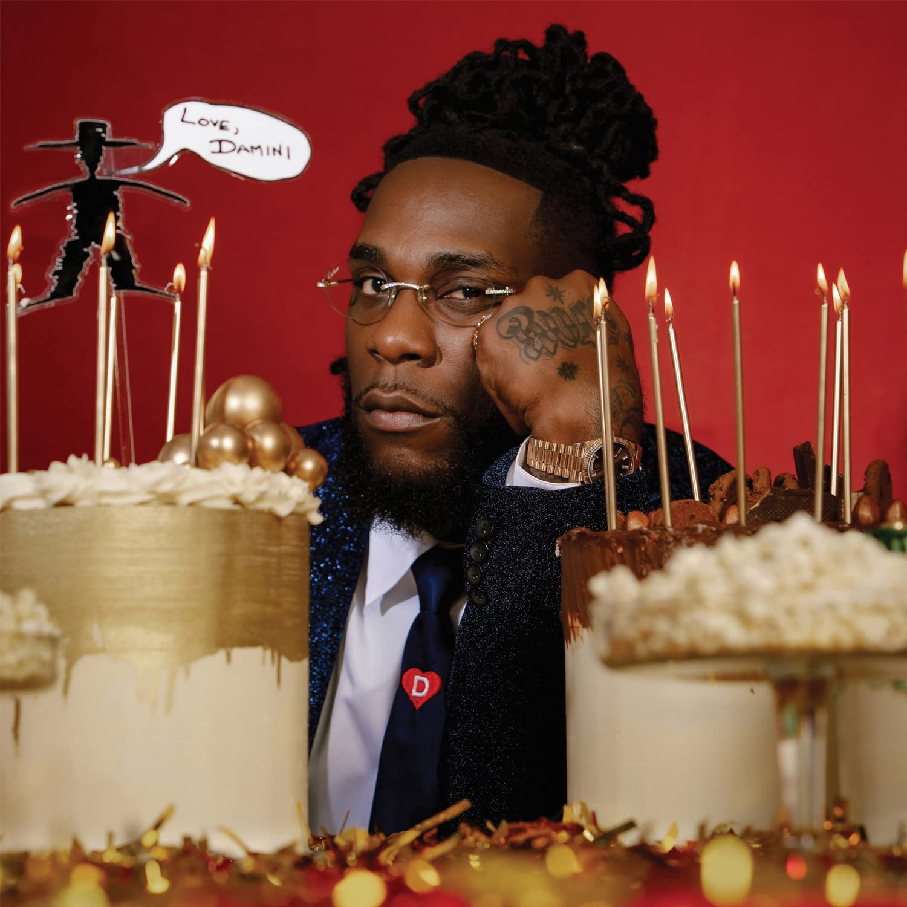

import { Slider, Button } from "@carbon/react";
import { ArrowUpRight } from "@carbon/icons-react";

import SliderJS1 from "../review/slider1";
import SliderJS2 from "../review/slider2";
import SliderJS3 from "../review/slider3";
import SliderJS4 from "../review/slider4";
import AdvJS2 from "../review/adv2";
import AdvJS3 from "../review/adv3";

import { Link } from "gatsby";

Album Review

<h1 className="h1--no--margin">{props.pageContext.frontmatter.title}</h1>

<Row  className="image-card-group">
	<Column colMd={3} colLg={4} noGutterMdLeft="">
       <ImageCard>

</ImageCard>
	</Column>
	<Column colMd={8} colLg={8} noGutterMdLeft="">
	

		Nigeria出身のSinger, Burna Boyの6枚目のアルバム。2021年のGrammyでBest Global Music Albumを受賞し、波に乗ってのリリースとなる。ちなみにタイトルのDaminiは本人の1st nameとのこと。
		 出自であるAfrican Beatをベースに、Reggae, R&B, Hip-Hopを塗したようなサウンド(本人はAfro Fusionと呼んでいる)は、アーシーな雰囲気を残しつつ、適度に洗練されている。
		 TrackはAfrican Popなゆるめのノリのミディアム曲が多く、他には穏やかで懐かしい感じの曲など様々。曲調に合わせ、Burna Boyの唄もスムースなものとなっている。
		 ただ、19曲は多すぎな気がする。
	

	

	  <Button className="button-right-mergin"  href="https://amzn.to/3FVupJV" renderIcon={ArrowUpRight} size='sm' kind='primary'>
      amazon.com
    </Button>
    <Button className="button-right-mergin"  href="https://amzn.to/3hR563u" renderIcon={ArrowUpRight} size='sm' kind='secondary'>
      amazon.co.jp
    </Button>
		<Button className="button-right-mergin"  href="https://apple.co/3HWxqfH" renderIcon={ArrowUpRight} size='sm' kind='tertiary'>
      apple music
    </Button>
		<AdvJS2/>
	

	</Column>
</Row>
<Row >
	<Column colMd={4} colLg={4} noGutterMdLeft="">

  <h3>Score card</h3>
	<SliderJS1 value="5" />
  <SliderJS2 value="3" />
	<SliderJS3 value="1" />
  <SliderJS4 value="9" />

</Column>
<Column colMd={8} colLg={8} noGutterMdLeft="">

<h3>Producers</h3>

	The Elements(1)
	 P2J and Kailum Harrison(2)
	 Telz(3,16)
	 Chopstix(4,7)
	 Kel-P(5)
	 P2J(6,10,13)
	 Kvng Vinci(8)
	 JAE5 and The Elements(9)
	 Anju Blaxx and Amilcar Smith(11)
	 Blxst(12)
	 Matthieu Le Carpentier(14)
	 ATG(15)
	 Jordan K Johnson, Stefan Johnson, Michael Pollack and Alli Odunayo(17)
	 Michael Mule, Isaac Deboni, Rory Noble and Alli Odunayo(18)
	 Michael Uzowuru, Jeff Kleinman(19)

<h3>Guests</h3>
	Ladysmith Black Mambazo, J Hus, Victony, Popcaan, BLXST, Ed Sheeran, Kehlani, J Balvin, Khalid

</Column>
</Row>

<h3>Tracks</h3>

| No. | Title               | Composers                                                                                                                                                                                                             | Performer                               | Time  |
| --- | ------------------- | --------------------------------------------------------------------------------------------------------------------------------------------------------------------------------------------------------------------- | --------------------------------------- | ----- |
| 1   | Glory               | Paul Bogumil Goller / James McMillan Emanuel Johnson / Damini Ebunoluwa Ogulu / Mike Stokes / Keven Wolfshon                                                                                                          | Burna Boy feat. Ladysmith Black Mambazo | 03:51 |
| 2   | Science             | Richard Isong / Damini Ebunoluwa Ogulu                                                                                                                                                                                | Burna Boy                               | 03:21 |
| 3   | Cloak & Dagger      | Momodou Jallow / Alli Odunayo / Damini Ebunoluwa Ogulu                                                                                                                                                                | Burna Boy feat. J Hus                   | 03:31 |
| 4   | Kilometre           | Burna Boy / James Michael Olugundoye                                                                                                                                                                                  | Burna Boy                               | 02:32 |
| 5   | Jagele              | Damini Ebunoluwa Ogulu / Kelvin Peters                                                                                                                                                                                | Burna Boy                               | 03:02 |
| 6   | Whiskey             | Marco Bernardis / Richard Isong / Gaetan Judd / Damini Ebunoluwa Ogulu                                                                                                                                                | Burna Boy                               | 03:23 |
| 7   | Last Last           | LaShawn Daniels / Matti Mikael Haataja / Simo Samuel Haataja / Fred Jerkins III / Harvey Mason, Jr. / Santeri Kauppinen / Robert Laukkanen / Damini Ebunoluwa Ogulu / Malcolm Olagundoye / Rodney "Darkchild" Jerkins | Burna Boy                               | 02:52 |
| 8   | Different Size      | Adedotun Oludayo Adedeji / Damini Ebunoluwa Ogulu / Anthony Ebuka Victor                                                                                                                                              | Burna Boy feat. Victony                 | 03:29 |
| 9   | It's Plenty         | Paul Bogumil Goller / Jonathan Mensah / Damini Ebunoluwa Ogulu / Keven Wolfshon                                                                                                                                       | Burna Boy                               | 03:36 |
| 10  | Dirty Secrets       | Richard Isong / Gaetan Judd / Damini Ebunoluwa Ogulu                                                                                                                                                                  | Burna Boy                               | 02:31 |
| 11  | Toni-Ann Singh      | Andrew Myrie / Damini Ebunoluwa Ogulu / Amilcar Smith / Andrae Sutherland                                                                                                                                             | Burna Boy feat. Popcaan                 | 02:55 |
| 12  | Solid               | Matthew Burdette / Damini Ebunoluwa Ogulu / Ashton Sellars                                                                                                                                                            | Burna Boy feat. BLXST, Kehlani          | 03:15 |
| 13  | For My Hand         | Richard Isong / Damini Ebunoluwa Ogulu / Ed Sheeran                                                                                                                                                                   | Burna Boy feat. Ed Sheeran              | 02:39 |
| 14  | Rollercoaster       | Jose Alvaro Osorio Balvin / Matthieu Le Carpentier / Damini Ebunoluwa Ogulu                                                                                                                                           | Burna Boy feat. J Balvin                | 03:07 |
| 15  | Vanilla             | Damini Ogulu, Alexander Ogunmokun                                                                                                                                                                                     | Burna Boy                               | 02:35 |
| 16  | Common Person       | Damini Ebunoluwa Ogulu, Alli Odunayo                                                                                                                                                                                  | Burna Boy                               | 03:30 |
| 17  | Wild Dreams         | Damini Ebunoluwa Ogulu, Jonathan Bellion, Jordan K Johnson, Stefan Johnson, Michael Pollack, Alli Odunayo                                                                                                             | Burna Boy feat. Khalid                  | 03:06 |
| 18  | How Bad Could It Be | Damini Ebunoluwa Ogulu, Michael Mule, Isaac Deboni, Rory Noble, Alli Odunayo                                                                                                                                          | Burna Boy                               | 04:57 |
| 19  | Love, Damini        | Damini Ebunoluwa Ogulu, Thulani Shabalala, Thamsanqa Shabalala, Sibongiseni Shabalala,, Michael Uzowuru, Jeff Kleinman                                                                                                | Burna Boy eat. Ladysmith Black Mambazo  | 02:22 |

<AdvJS3 />
