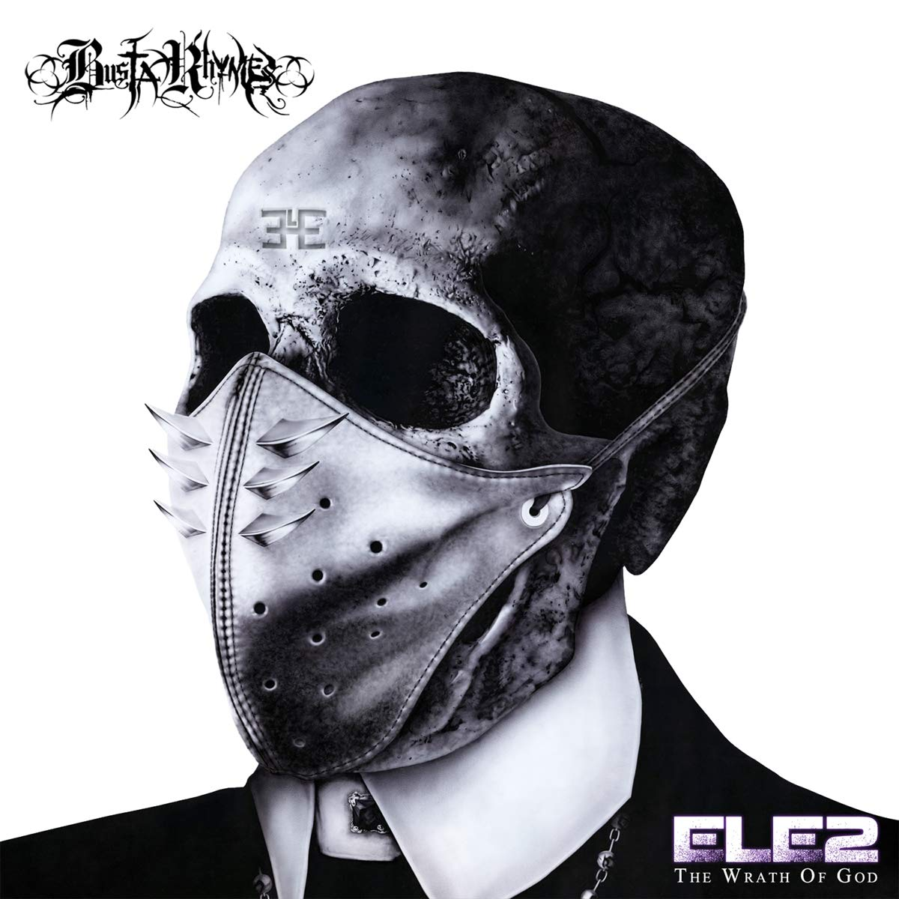

import { Slider, Button } from "carbon-components-react";
import { ArrowUpRight24 } from "@carbon/icons-react";

import SliderJS1 from "../review/slider1";
import SliderJS2 from "../review/slider2";
import SliderJS3 from "../review/slider3";
import SliderJS4 from "../review/slider4";

import { Link } from "gatsby";

Album Review

<h1 className="h1--no--margin">{props.pageContext.frontmatter.title}</h1>

  <Link to="/best50/2020/">2020 Black Music Best No.29</Link>

<Row  className="image-card-group">
	<Column colMd={"3"} colLg={"4"} noGutterMdLeft="">
       <ImageCard>

</ImageCard>
	</Column>
	<Column colMd={"8"} colLg={"8"} noGutterMdLeft="">
	

		2020年暮れにリリースされたBusta Rhymesの11年ぶりのアルバム。E.L.Eシリーズとしてはなんと22年ぶりとなる。まさにそのExtinction Level Eventが起こってしまった2020年に言いたいことを詰め込んだ77分を越える大作になっている。
		 以前と同様のハードコアなところをベースにしつつ、コンシャスな曲や、より耳にやさしい曲も加えて、長くても最後まで飽きない構成になっている。
		 自費で制作したらしく、Guestも新旧とりまぜて超豪華であり、特に後半になるにつれて、女性GuestのRapsody, Mariah, Mary参加のTrackに代表されるPopな雰囲気の曲が増えてくる。
		 本人のRapもゴリゴリしたものだけでなく、穏やかなものも多く、このへんは既にアラフィフということを感じさせる。それでも以前と同様の力強さを感じさせるアルバムである。
	

	

	  <Button className="button-right-mergin"  href="https://amzn.to/2R3f18V" kind="primary" size="small" renderIcon={ArrowUpRight24}>
      amazon.com
    </Button>
    <Button className="button-right-mergin"  href="https://amzn.to/3p1GGDx" kind="secondary" size="small" renderIcon={ArrowUpRight24}>
      amazon.co.jp
    </Button>
		<Button className="button-right-mergin"  href="https://geo.music.apple.com/us/album/extinction-level-event-2-the-wrath-of-god/1534955238?itsct=music_box_link&itscg=30200&at=11lcug&ct=albums_extinction_level_event_2%3A_the_wra&ls=1&app=music" kind="tertiary" size="small" renderIcon={ArrowUpRight24}>
      apple music
    </Button>
	

	</Column>
</Row>
<Row >
	<Column colMd={"4"} colLg={"4"} noGutterMdLeft="">

  <h3>Score card</h3>
	<SliderJS1 value="2" />
  <SliderJS2 value="2" />
	<SliderJS3 value="2" />
  <SliderJS4 value="8" />

</Column>
<Column colMd={"8"} colLg={"8"} noGutterMdLeft="">

<h3>Producers</h3>

	Nottz and Busta Rhymes(1,6)
	 Swizz Beatz and Avenue Beatz(2)
	 Pete Rock and J DIlls(3)
	 Rockwilder(4,22)
	 Dready and Busta Rhymes(5)
	 Nottz(7,19,21)
	 Focus The A.R.M.(8)
	 DJ Scratch(9)
	 DJ Premier(10)
	 Terrace Martin and Hi-Tek(11)
	 Anderson.Paak(12)
	 Dready(13)
	 Schife(14)
	 9th Wonder(15)
	 Rick Rock(16)
	 Busta Rhymes(17,20)

<h3>Guests</h3>
	Chris Rock, Rakim, Pete Rock, M.O.P., Belle Biv Devoe, Minister Luis Farrakhan, Old Dirty Bustard, Q-Tip, Rick Ross, Anderson.Paak, Vybez Kartel, Rapsody, Mariah Carrey, Kendrick Lamar, Mary J, Blige, Nikki Grier

</Column>
</Row>

<h3>Tracks</h3>

| No. | Title                          | Composers                           | Performer                                       | Time  |
| --- | ------------------------------ | ----------------------------------- | ----------------------------------------------- | ----- |
| 1   | E.L.E. 2 (Intro)               | Chris Rock / Trevor Smith / WARD    | Busta Rhymes feat. Chris Rock, Rakim, Pete Rock | 07:12 |
| 2   | The Purge                      | Avery Chambliss / Trevor Smith      | Busta Rhymes                                    | 01:10 |
| 3   | Strap Yourself Down            | Trevor Smith                        | Busta Rhymes                                    | 02:57 |
| 4   | Czar                           | Trevor Smith                        | Busta Rhymes feat. M.O.P.                       | 03:01 |
| 5   | Outta My Mind                  | Trevor Smith                        | Busta Rhymes feat. Belle Biv Devoe              | 03:20 |
| 6   | E.L.E. 2 the Wrath of God      | Trevor Smith                        | Busta Rhymes feat/ Minister Luis Farrakhan      | 04:43 |
| 7   | Slow Flow                      | Trevor Smith                        | Busta Rhymes feat. Old Dirty Bustard            | 03:12 |
| 8   | Don't Go                       | Bernard Edwards, Jr. / Trevor Smith | Busta Rhymes faet. Q-Tip                        | 03:49 |
| 9   | Boomp!                         | Trevor Smith                        | Busta Rhymes                                    | 03:01 |
| 10  | True Indeed                    | Trevor Smith                        | Busta Rhymes                                    | 01:53 |
| 11  | Master Fard Muhammad           | Tony Cottrell / Trevor Smith        | Busta Rhymes feat. Rick Ross                    | 03:59 |
| 12  | Yuuuu                          | Bonjo Iyabinghi Noah / Trevor Smith | Busta Rhymes deat. Anderson.Paak                | 03:30 |
| 13  | Oh No                          | Trevor Smith                        | Busta Rhymes                                    | 03:26 |
| 14  | The Don and the Boss           | Adidja Palmer / Trevor Smith        | Busta Rhymes feat, Vybez Kartel                 | 03:42 |
| 15  | Best I Can                     | Trevor Smith                        | Busta Rhymes feat. Rapsody                      | 03:39 |
| 16  | Where I Belong                 | James "J-Doe" Smith / Trevor Smith  | Busta Rhymes feat. Mariah Carrey                | 04:12 |
| 17  | Deep Thought                   | Trevor Smith                        | Busta Rhymes                                    | 03:10 |
| 18  | The Young God Speaks           | Look Over Your Shoulder             | Busta Rhymes                                    | 00:40 |
| 19  | Look Over Your Shoulder        | Trevor Smith                        | Busta Rhymes feat. Kendrick Lamar               | 04:08 |
| 20  | You Will Never Find Another Me | Trevor Smith                        | Busta Rhymes feat. Mary J, Blige                | 03:50 |
| 21  | Freedom?                       | Trevor Smith                        | Busta Rhymes feat. Nikki Grier                  | 03:48 |
| 22  | Satanic                        | Trevor Smith                        | Busta Rhymes                                    | 05:14 |
