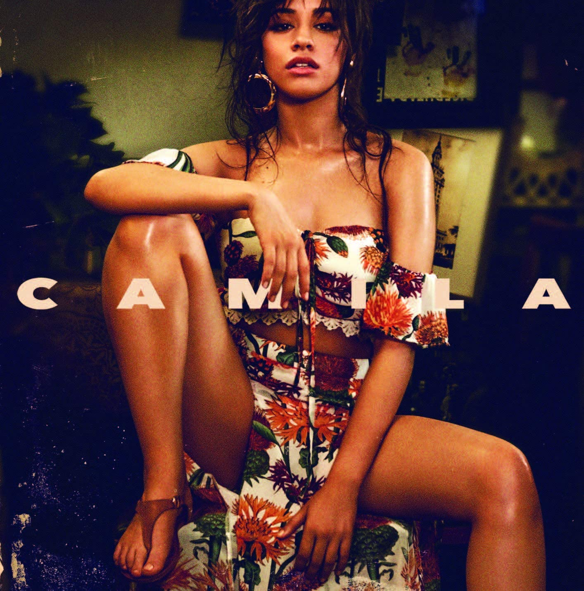

import { Slider, Button } from 'carbon-components-react';
import { ArrowUpRight24  } from '@carbon/icons-react';

import SliderJS1 from "../review/slider1"
import SliderJS2 from "../review/slider2"
import SliderJS3 from "../review/slider3"
import SliderJS4 from "../review/slider4"

import Review1 from "../review/camilacabello2.mdx"

import { Link } from "gatsby"

Album Review

<h1 className="h1--no--margin">{props.pageContext.frontmatter.title}</h1>

<Link to="/best50/2018/">2018 Black Music Best No.26</Link>

<Row  className="image-card-group">
	<Column colMd={"3"} colLg={"4"} noGutterMdLeft="">
       <ImageCard>

 

</ImageCard>
	</Column>
	<Column colMd={"4"} colLg={"8"} noGutterMdLeft="">
	

	Cuba出身、Florida育ちの21歳、Camila Cabelloのデビュー作。Song Writingも手がけている。Fifth Harmonyというガールズグループのメンバーでもあったとのこと。そんな出自からも明らかなように、R&B, Hip-HopとLatin Popがミックスされた作品になっている。Latin志向の派手で尖がった曲もあるが、Accoustic 
	

	

	  <Button className="button-right-mergin"  href="https://amzn.to/3ePRHBX" kind="primary" size="small" renderIcon={ArrowUpRight24}>
      amazon.com
      </Button>
      <Button className="button-right-mergin"  href="https://amzn.to/2NHUul1" kind="secondary" size="small" renderIcon={ArrowUpRight24}>
      amazon.co.jp
      </Button>
	

	
	
	</Column>
</Row>
<Row >
	<Column colMd={"4"} colLg={"4"} noGutterMdLeft="">

    <h3>Score card</h3>
	<SliderJS1 value="5" />
    <SliderJS2 value="2" />
	<SliderJS3 value="1" />
    <SliderJS4 value="8" />

</Column>
<Column colMd={"8"} colLg={"8"} noGutterMdLeft="">

<h3>Producers</h3>

Frank Dukes(1,2,4,7,9,10)
 Skrillex(3)
 Frank Dukes and T-Minus(5)
 Bart Schoudel(6)
 The Futuristics(8)

<h3>Guests</h3>

Young Thug, Pharrell Williams

</Column>
</Row>

<h3>Tracks</h3>

| No. |	 Title                         |	 Composers                                                                                                                                                |	 Performer                      | Time	|
| --- |	------------------------------ | ------------------------------------------------------------------------------------------------------------------------------------------------------------ | ------------------------------- | ----- |
| 1	  |	Never Be the Same              | Noonie Bao / Camila Cabello / Rami Dawod / Adam Feeney / Jacob Olofsson / Sasha Yatchenko                                                                    |	Camila Cabello                 	| 03:46 |
| 2	  |	All These Years                | Mustafa Ahmed / Camila Cabello / Adam Feeney / Jeff Gitelman / Kaan Gunesberk                                                                                |	Camila Cabello                 	| 02:44 |
| 3	  |	She Loves Control              | Mustafa Ahmed / Louis Bell / Camila Cabello / Adam Feeney / Ilsey Juber / Sonny Moore                                                                        |	Camila Cabello                 	| 02:57 |
| 4	  |	Havana                         | Louis Bell / Camila Cabello / Adam Feeney / Kaan Gunesberk / Brittany Hazzard / Brian Lee / Ali Tamposi / Andrew Watt / Jeffery Williams / Pharrell Williams |	Camila Cabello feat. Young Thug	| 03:37 |
| 5	  |	Inside Out                     | Camila Cabello / Adam Feeney / Kaan Gunesberk / Brittany Hazzard / Tyler Williams                                                                            |	Camila Cabello                 	| 03:02 |
| 6	  |	Consequences                   | Camila Cabello / Nicolle Galyon / Amy Wadge / Emily Weisband                                                                                                 |	Camila Cabello                 	| 02:58 |
| 7	  |	Real Friends                   | Louis Bell / Camila Cabello / Adam Feeney / Brian Lee / William Walsh                                                                                        |	Camila Cabello                 	| 03:34 |
| 8	  |	Something's Gotta Give         | James Abrahart / Camila Cabello / Sarah Hudson / Jesse St. John / Joe Khajadourian / Alex Schwartz                                                           |	Camila Cabello                 	| 03:56 |
| 9	  |	In the Dark                    | James Abrahart / Camila Cabello / Adam Feeney / Madison Love / Te Whiti Warbrick / Simon Wilcox                                                              |	Camila Cabello                 	| 03:39 |
| 10  |	Into It                        | Louis Bell / Camila Cabello / Adam Feeney / Kaan Gunesberk / Ryan Tedder / Justin Tranter                                                                    |	Camila Cabello                 	| 02:55 |
| 11  |	Never Be the Same [Radio Edit] |                                                                                                                                                              |	Camila Cabello                 	| 03:47	|

<h3>Other Reviews</h3>

<Row>
<Column colMd={3} colLg={3} noGutterMdLeft>
<Review1 />
</Column>
</Row>