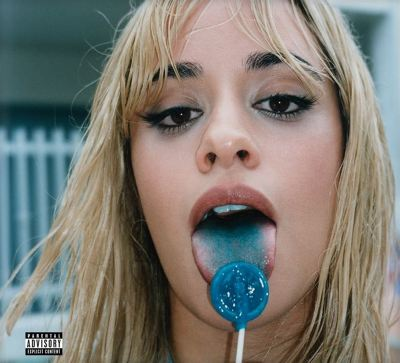

import { Slider, Button } from "@carbon/react";
import { ArrowUpRight } from "@carbon/icons-react";

import SliderJS1 from "../review/slider1";
import SliderJS2 from "../review/slider2";
import SliderJS3 from "../review/slider3";
import SliderJS4 from "../review/slider4";
import AdvJS2 from "../review/adv2";
import AdvJS3 from "../review/adv3";

import Review1 from "../review/camilacabello3.mdx";
import Review2 from "../review/camilacabello2.mdx";
import Review3 from "../review/camilacabello1.mdx";

import { Link } from "gatsby";

Album Review

<h1 className="h1--no--margin">{props.pageContext.frontmatter.title}</h1>

  <Link to="/best50/2024/">2024 Black Music Best No.36</Link>

<Row  className="image-card-group">
	<Column colMd={3} colLg={4} noGutterMdLeft="">
       <ImageCard>

</ImageCard>
	</Column>
	<Column colMd={4} colLg={8} noGutterMdLeft="">
		

			Camila Cabelloの約3年ぶりの3作目。ロックダウン中の制作となるが、家族や自身を見つめなおすことが多く、このようなタイトルの作品につながったとのこと。なので、メキシコ系キューバ人としてのアイデンティティが今まで以上に投影されたラテン色の濃い作品になっている。
			 フラメンゴやキューバ音楽など、様々なラテン要素がとりいれられているようで、曲調もPopで明るいものから哀愁を帯びたスローまでと様々。スペイン語の曲も3曲ほどある。Camilaのキュートで甘い声が心地よい。
		

		

		  <Button className="button-right-mergin"  href="https://amzn.to/4m30iEo" renderIcon={ArrowUpRight} size='sm' kind='primary'>
  	    amazon.com
  	  </Button>
  	  <Button className="button-right-mergin"  href="https://amzn.to/3ESWmpi" renderIcon={ArrowUpRight} size='sm' kind='secondary'>
  	    amazon.co.jp
  	  </Button>
			<Button className="button-right-mergin"  href="https://apple.co/3EPCJ1i" renderIcon={ArrowUpRight} size='sm' kind='tertiary'>
  	    apple music
  	  </Button>
			<AdvJS2/>
		

	</Column>
</Row>
<Row >
	<Column colMd={4} colLg={4} noGutterMdLeft="">
		

			<h3>Score card</h3>
			<SliderJS1 value="5" />
			<SliderJS2 value="2" />
			<SliderJS3 value="1" />
			<SliderJS4 value="8" />
		

	</Column>
	<Column colMd={8} colLg={8} noGutterMdLeft="">
		

			<h3>Producers</h3>
			

				El Guincho and Jasper Harris(1,2,3,6,7,11
				 El Guincho, Jasper Harris and Daniel Aged(4
				 Aaron Shadrow, El Guincho and Jasper Harri(5,13
				 YogiTheProducer, Boi-1da, El Guincho and Jasper Harris(8)
				 Kid Masterpiece, El Guincho and Jasper Harris(9)
				 El Guincho, Jasper Harris and Hidde(10)
				 Daniel Aged, El Guincho and Jasper Harris(12)
				 El Guincho, Jasper Harris and FNZ(14)
			

			<h3>Guests</h3>
			

				Playboi Carti, Lil Nas X, Young Miami, JT, BLP KOSHER, Drake,
			

		

	</Column>
</Row>

<h3>Tracks</h3>

| No. | Title                | Composers                                                                                                                                                       | Performer                            | Time  |
| --- | -------------------- | --------------------------------------------------------------------------------------------------------------------------------------------------------------- | ------------------------------------ | ----- |
| 1   | I LUV IT             | Beninu Abolemiau, Camila Cabello, Jasper Harris, El Guincho, Playboi Carti, Gucci Mane, Bangladesh, Howard Kaylan, Mark Volman, Rihanna                         | Camila Cabello feat. Playboi Carti   | 02:54 |
| 2   | Chanel No. 5         | Camila Cabello, El Guincho, Jasper Harris, Carlos Dashawn Moore, Southside, Future                                                                              | Camila Cabello                       | 02:40 |
| 3   | pink xoxo            | Camila Cabello, PinkPantheress, Jasper Harris, El Guincho                                                                                                       | Camila Cabello                       | 00:55 |
| 4   | HE KNOWS             | Camila Cabello, El Guincho, Jasper Harris, Daniel Aged, Lil Nas X, Ojerime                                                                                      | Camila Cabello feat. Lil Nas X       | 03:01 |
| 5   | Twentysomethings     | El Guincho, Camila Cabello, Aaron Shadrow ,Jasper Harris                                                                                                        | Camila Cabello                       | 02:42 |
| 6   | Dade County Dreaming | Camila Cabello, Yung Miami, Jasper Harris, JT, Lasana Smith, Trinidad James, El Guincho, Salvador Majail                                                        | Camila Cabello feat. Young Miami, JT | 02:39 |
| 7   | koshi xoxo           | BLP KOSHER, Yanacona, Jasper Harris, Camila Cabello, El Guincho                                                                                                 | Camila Cabello feat. BLP KOSHER      | 00:46 |
| 8   | HOT UPTOWN           | Camila Cabello, Drake, YogiTheProducer, El Guincho, Jasper Harris                                                                                               | Camila Cabello                       | 02:30 |
| 9   | Uuugly               | Drake                                                                                                                                                           | Camila Cabello                       | 01:55 |
| 10  | DREAM-GIRLS          | Jasper Harris, El Guincho, The-Dream, Los Da Mystro, Camila Cabello, Hidde                                                                                      | Camila Cabello                       | 02:51 |
| 11  | 305tilidie           | El Guincho, Jasper Harris, Camila Cabello                                                                                                                       | Camila Cabello                       | 00:49 |
| 12  | B.O.A.T.             | Daniel Aged, Jasper Harris, El Guincho, Pitbull, Bernard Edwards, Daniel McKay, Graham Wilson, Hugh Brankin, John Reid, Nile Rodgers, Ray Davies, Ross Campbell | Camila Cabello                       | 02:56 |
| 13  | pretty when i cry    | Aaron Shadrow, El Guincho, Jasper Harris, Camila Cabello                                                                                                        | Camila Cabello                       | 02:34 |
| 14  | June Gloom           | Camila Cabello, Jasper Harris, Zac, Finatik, El Guincho                                                                                                         | Camila Cabello                       | 03:00 |

<h3>Other Reviews</h3>

<Row>
  <Column colMd={3} colLg={3} noGutterMdLeft>
    <Review1 />
  </Column>
  <Column colMd={3} colLg={3} noGutterMdLeft>
    <Review2 />
  </Column>
	<Column colMd={3} colLg={3} noGutterMdLeft>
    <Review3 />
  </Column>
</Row>

<AdvJS3 />
