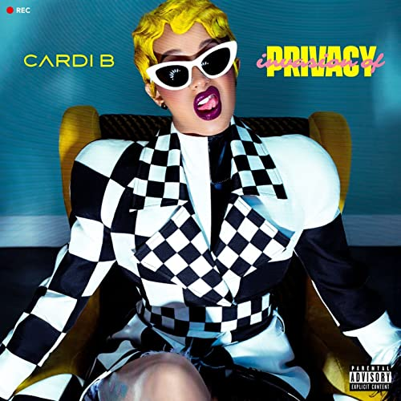

import { Slider, Button } from "carbon-components-react";
import { ArrowUpRight24 } from "@carbon/icons-react";

import SliderJS1 from "../review/slider1";
import SliderJS2 from "../review/slider2";
import SliderJS3 from "../review/slider3";
import SliderJS4 from "../review/slider4";

import { Link } from "gatsby";

Album Review

<h1 className="h1--no--margin">{props.pageContext.frontmatter.title}</h1>

  <Link to="/best50/2018/">2018 Black Music Best No.3</Link>

<Row  className="image-card-group">
	<Column colMd={"3"} colLg={"4"} noGutterMdLeft="">
       <ImageCard>

</ImageCard>
	</Column>
	<Column colMd={"4"} colLg={"8"} noGutterMdLeft="">
	

	2018年に大ブレークを果たし、既にQueenの風格も漂うCardi Bのメジャーデビュー作。2019年にはやっとCDもリリースされそうだ。ストリップクラブで働いていた過去を持ち、非DV経験やバイっぽいことを告白したりと、スキャンダラスなPrivacyを持つ人だが、それらをネタに成り上がりで威勢のいい、赤裸々LyricのRapを披露し、これが受けて、ヒットにつながっている。Bronx出身ということだが、そこまでハードコアなものではなくて、自身の出自であるLatin乗りの曲やTrap、Chanceと共演したそれらしいゆるめの曲、Kehlaniとのメローなスローなど、曲調は様々でTrackのほうも十分に楽しめる。
	

	

	  <Button className="button-right-mergin"  href="https://amzn.to/2zwae73" kind="primary" size="small" renderIcon={ArrowUpRight24}>
      amazon.com
    </Button>
    <Button className="button-right-mergin"  href="https://amzn.to/3e5D7WM" kind="secondary" size="small" renderIcon={ArrowUpRight24}>
      amazon.co.jp
    </Button>
	

	
	</Column>
</Row>
<Row >
	<Column colMd={"4"} colLg={"4"} noGutterMdLeft="">

  <h3>Score card</h3>
	<SliderJS1 value="2" />
  <SliderJS2 value="1" />
	<SliderJS3 value="1" />
  <SliderJS4 value="9" />

</Column>
<Column colMd={"8"} colLg={"8"} noGutterMdLeft="">

<h3>Producers</h3>

	DJ SwanQo and Matt Allen(1)
	 Cassius Jay(2)
	 Ayo The Producer and Keyz(3)
	 JWhite(4,9)
	 Boi-1da and VinylZ(5)
	 Boi-1da and Allen Ritter(6)
	 Craig Kallman, JWhite and Tainy(7)
	 @williedonut and Needlz(8)
	 30 Roc and Cheeze Beatz(10)
	 DJ Mustard(11)
	 Andrew Watt and Benny Blanco(12)
	 Murda Beatz(13)

<h3>Guests</h3>

	Migos, Chacne The Rapper, Bad Bunny, J. Balvin, Kehlani, 21 Savage, YG, SZA

</Column>
</Row>

<h3>Tracks</h3>

| No. | Title           | Composers                                                                                                                                                                                                                                                                                 | Performer                          | Time  |
| --- | --------------- | ----------------------------------------------------------------------------------------------------------------------------------------------------------------------------------------------------------------------------------------------------------------------------------------- | ---------------------------------- | ----- |
| 1   | Get Up 10       | Sean Allen / Belcalis Almanzar / Maurice Jordan / Jermaine Preyan / James SwanQo / Anthony Tucker / Robert Williams                                                                                                                                                                       | Cardi B feat. Migos                | 03:51 |
| 2   | Drip            | Belcalis Almanzar / Kirsnick Ball / Kiari Cephus / Joshua Cross / Quavious Marshall                                                                                                                                                                                                       | Cardi B                            | 04:23 |
| 3   | Bickenhead      | Belcalis Almanzar / James Foye III / Philip Coleman, Jr. / Austin Owens / Jordan Thorpe                                                                                                                                                                                                   | Cardi B                            | 03:01 |
| 4   | Bodak Yellow    | Belcalis Almanzar / Laquan Green / J. White Did It / Dieuson Octave / Klenord Raphael / Jordan Thorpe / Jermaine White                                                                                                                                                                    | Cardi B                            | 03:43 |
| 5   | Be Careful      | Belcalis Almanzar / Alan Bergman / Marilyn Bergman / Dennis Coles / Robert Diggs / Adam Feeney / Gary Grice / Marvin Hamlisch / Lamont Hawkins / Anderson Hernandez / Lauryn Hill / Jason Hunter / Russell Jones / Matthew Samuels / Clifford Smith / Jordan Thorpe / U-God / Corey Woods | Cardi B                            | 03:30 |
| 6   | Best Life       | Belcalis Almanzar / Chancelor Bennett / Allen Ritter / Matthew Samuels                                                                                                                                                                                                                    | Cardi B feat. Chacne The Rapper    | 04:44 |
| 7   | I Like It       | Belcalis Almanzar / Jos? ?lvaro Osorio Balvin / Benito Antonio Martinez Ocasio / Tony Pabon / Manny Rodriguez                                                                                                                                                                             | Cardi B feat. Bad Bunny, J. Balvin | 04:13 |
| 8   | Ring            | Belcalis Almanzar / Khari Cain / Nija Charles / Kehlani Parrish / Mike Riley                                                                                                                                                                                                              | Cardi B feat. Kehlani              | 02:57 |
| 9   | Money Bag       | Belcalis Almanzar / Jordan Thorpe / Jermaine White                                                                                                                                                                                                                                        | Cardi B                            | 03:49 |
| 10  | Bartier Cardi   | Shayaa Bin Abraham-Joseph / Belcalis Almanzar / Samuel Gloade / Darryl McCorkell                                                                                                                                                                                                          | Cardi B feat, 21 Savage            | 03:44 |
| 11  | She Bad         | Belcalis Almanzar / Keenon Jackson / Leslie Andre Wakefield Jr. / Dijon McFarlane                                                                                                                                                                                                         | Cardi B feat, YG                   | 03:50 |
| 12  | Thru Your Phone | Belcalis Almanzar / Benjamin Levin / Alexandra Tamposi / Justin Tranter / Andrew Wotman                                                                                                                                                                                                   | Cardi B                            | 03:08 |
| 13  | I Do            | Belcalis Almanzar / Nija Charles / Kevin Gomringer / Tim Gomringer / Shane Lindstrom / Solana Rowe                                                                                                                                                                                        | Cardi B feat. SZA                  | 03:20 |
