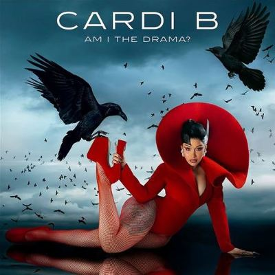

import { Slider, Button } from "@carbon/react";
import { ArrowUpRight } from "@carbon/icons-react";

import SliderJS1 from "../review/slider1";
import SliderJS2 from "../review/slider2";
import SliderJS3 from "../review/slider3";
import SliderJS4 from "../review/slider4";
import AdvJS2 from "../review/adv2";
import AdvJS3 from "../review/adv3";

import { Link } from "gatsby";

import Review1 from "../review/cardib1.mdx";

Album Review

<h1 className="h1--no--margin">{props.pageContext.frontmatter.title}</h1>

	<Link to="/best50/2025/">2025 Black Music Best No.24</Link>

<Row  className="image-card-group">
	<Column colMd={3} colLg={4} noGutterMdLeft="">
		<ImageCard>

		</ImageCard>
	</Column>
	<Column colMd={4} colLg={8} noGutterMdLeft="">
		

			Cardi Bのなんと7年ぶりの2作目。前作での成功からのプレッシャーにより延期を重ねたということだが、これを埋めて余りある23曲70分強の大作になっている。(Ultimate Editionはさらに10曲追加)。
			 曲数多めではあるが、聴きどころも多く、特に女性Vocal GuestのSummer Walker, Selena Gomez, Kehlani, Tylaが可憐な唄声を聴かせてくれる。そんなPopな曲もあり、Cardi BのRapが主役のHip-Hop曲やラテンぽい⑥もありと、バラエティに富んだ作品になっている。
			 タイトルにあるように裁判、出産、離婚を経験したドラマティックな7年と攻撃的な姿勢を詰め込んだLyricは刺激的で、終始ハイテンションなアルバムになっている。
		

		

			<Button className="button-right-mergin"  href="https://amzn.to/3Nh26wL" renderIcon={ArrowUpRight} size='sm' kind='primary'>
				amazon.com
			</Button>
			<Button className="button-right-mergin"  href="https://amzn.to/49OO3qZ" renderIcon={ArrowUpRight} size='sm' kind='secondary'>
				amazon.co.jp
			</Button>
			<Button className="button-right-mergin"  href="https://apple.co/4szjuNx" renderIcon={ArrowUpRight} size='sm' kind='tertiary'>
				apple music
			</Button>
			<AdvJS2/>
		

	</Column>
</Row>
<Row >
	<Column colMd={4} colLg={4} noGutterMdLeft="">
		

			<h3>Score card</h3>
			<SliderJS1 value="2" />
			<SliderJS2 value="1" />
			<SliderJS3 value="1" />
			<SliderJS4 value="9" />
		

	</Column>
	<Column colMd={8} colLg={8} noGutterMdLeft="">
		

			<h3>Producers</h3>
			

				Argel Beatz, Hide Miyabi, DJ SwanQo, Sean Island, Smash David, Lateef the Truthspeaker, Octane and Ronan Decierdo(1)
				 Cardi B, DJ SwanQo, Sean Island and Pardison Fontaine(2)
				 Pooh Beatz, DJ SwanQo, Go Grizzly and B100(3)
				 DJ Hardwerk and Kuk Harrell(4)
				 DJ SwanQo, Sean Island and OctaneThisThatGas(5)
				 Ponzoo(6)
				 TM88, TooDope, Sensei Kuppe and Daan(7)
				 DJ SwanQo and Sean Island(8)
				 Jeff Kleinman(9)
				 DJ Hardwerk(10)
				 Triangle Park(11)
				 HeyMicki and Charlie Heat(12)
				 DJ SwanQo and Sean Island(13,16,17)
				 FNZ & Vinylz(14)
				 Shae Jacobs and B Ham(15)
				 Dizzy Banko and Omar Grand(18)
				 DJ SwanQo, Sean Island and Lateef the Truthspeaker(19)
				 London on da Track, Synthetic and Venny(20)
				 DJ SwanQo, Smash David and Don Alfonso(21)
				 DJ SwanQo, Sean Island, Pardison Fontaine and Yung Dza(22)
				 Ayo & Keyz(23)
			

			<h3>Guests</h3>
			

				Summer Walker, Selena Gomez, Kehlani, Dougie F, Lizzo, Cash Cobain, Lourdiz, Janet Jackson, Tyla
			

		

	</Column>
</Row>

<h3>Tracks</h3>

| No. | Title             | Composers                                                                                                                                                          | Performer                   | Time  |
| --- | ----------------- | ------------------------------------------------------------------------------------------------------------------------------------------------------------------ | --------------------------- | ----- |
| 1   | Dead              | Belcalis Almanzar, Jorden Thorpe, James Steed, Matthew Allen, Samuel Jiménez, Argel Lara, Saleem Allen, Omar Thorpe, Hide Miyabi                                   | Cardi B feat. Summer Walker | 04:06 |
| 2   | Hello             | Belcalis Almanzar, Jorden Thorpe, James Steed, Matthew Allen                                                                                                       | Cardi B                     | 02:35 |
| 3   | Magnet            | Belcalis Almanzar, Jorden Thorpe, Julius Rivera II, ILloyd McKenzie, Morris Jones, Maurice Washington, James Steed, Darryl Clemons, Kevin Price, Timothy McKibbins | Cardi B                     | 02:58 |
| 4   | Pick It Up        | Belcalis Almanzar, Jorden Thorpe, Roosevelt Jean, Adrienne Ben Haim, Lewis Shoates, Philip Constable                                                               | Cardi B feat. Selena Gomez  | 02:40 |
| 5   | Imaginary Playerz | Belcalis Almanzar, Jorden Thorpe, James Steed, Matthew Allen, Saleem Allen                                                                                         | Cardi B                     | 03:27 |
| 6   | Bodega Baddie     | Belcalis Almanzar, Roosevelt Jean, Fourtee Crawford, Kofi Amponsah, Gilbert Baba, Juan de los Santos                                                               | Cardi B                     | 01:44 |
| 7   | Salute            | Belcalis Almanzar, Jorden Thorpe, Bryan Simmons, Lesidney Ragland, Daan Huljbregts, Casey Millan, Quentin Shemwell, Gary Terrell Jr., Tauheed Epps                 | Cardi B                     | 02:34 |
| 8   | Safe              | Belcalis Almanzar, Kehlani Parrish, Jorden Thorpe, James Steed, Matthew Allen                                                                                      | Cardi B feat. Kehlani       | 02:57 |
| 9   | Man of Your Word  | Belcalis Almanzar, Douglas Ford, Javaan Anderson, Jeff Kleinman                                                                                                    | Cardi B feat. Dougie F      | 03:27 |
| 10  | What's Goin On    | Belcalis Almanzar, Melissa Jefferson, Roosevelt Jean, Javaan Anderson, Ben Haim, Shoates, Duwayne Mills, Constable, Ricky Reed, Linda Perry                        | Cardi B feat. Lizzo         | 03:26 |
| 11  | Shower Tears      | Belcalis Almanzar, Nija Charles, Torae Carr, Roosevelt Jean, Jonathan Descartes, Avery Earl, Donnie Meadows, Scott Carter, Vanessa Wood, Ali Prawl                 | Cardi B feat. Summer Walker | 03:03 |
| 12  | Outside           | Belcalis Almanzar, Jorden Thorpe, Roosevelt Jean, Yakki Davis, Ernest Brown III, Micaela Moore, James Steed                                                        | Cardi B                     | 03:04 |
| 13  | Pretty & Petty    | Belcalis Almanzar, Jorden Thorpe, James Steed, Matthew Allen                                                                                                       | Cardi B                     | 02:29 |
| 14  | Better Than You   | Belcalis Almanzar, Cashmere Small, Jordan Thorpe, Javaan Anderson, Michael Mulé, Isaac De Boni, Norman Ingram                           | Cardi B feat. Cash Cobain   | 02:01 |
| 15  | On My Back        | Belcalis Almanzar, Alyssa Cantu, Jorden Thorpe, Brandon Hamlin, Shae Jacobs, James Harris, Terry Lewis                                                             | Cardi B feat. Lourdiz       | 02:43 |
| 16  | Errtime           | Belcalis Almanzar, Jorden Thorpe, Javaan Anderson, James Steed, Matthew Allen                                                                                      | Cardi B                     | 03:02 |
| 17  | Check Please      | Belcalis Almanzar, Jorden Thorpe, James Steed, Matthew Allen                                                                                                       | Cardi B                     | 03:16 |
| 18  | Principal         | Belcalis Almanzar, Jorden Thorpe, Monte Moir, Omar Perrin, Deandre Sumpter                                                                                         | Cardi B feat. Janet Jackson | 03:50 |
| 19  | Trophies          | Belcalis Almanzar, James Steed, Matthew Allen, Omar Thorpe                                                                                                         | Cardi B                     | 02:36 |
| 20  | Nice Guy          | Belcalis Almanzar, Tyla Seethal, Almando Cresso, Hailey Rusch, London Holmes, Javier Mercado, Steven Giron, Kevin Price                                            | Cardi B feat. Tyla          | 03:07 |
| 21  | Killin You Hoes   | Belcalis Almanzar, Jorden Thorpe, Edward Davadi, James Steed, Samuel Jiménez, Katrina Laverne Kearse                                                               | Cardi B                     | 03:49 |
| 22  | Up                | Belcalis Almanzar, Jorden Thorpe, James Steed, Matthew Allen, Joshua Baker, Edis Selmani                                                                           | Cardi B                     | 02:36 |
| 23  | WAP               | Belcalis Almanzar, Jorden Thorpe, Megan Pete, Austin Owens, James Foye III                                                                                         | Cardi B                     | 03:07 |

<h3>Other Reviews</h3>

<Row>
	<Column colMd={3} colLg={3} noGutterMdLeft>
		<Review1 />
	</Column>
</Row>

<AdvJS3 />