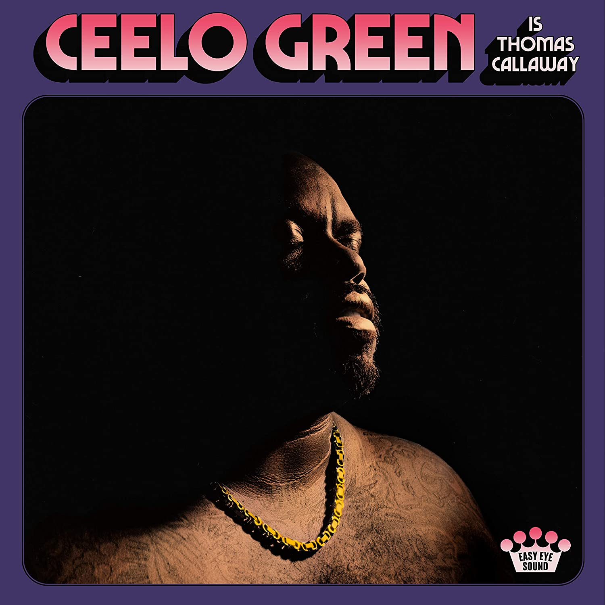

import { Slider, Button } from "carbon-components-react";
import { ArrowUpRight24 } from "@carbon/icons-react";

import SliderJS1 from "../review/slider1";
import SliderJS2 from "../review/slider2";
import SliderJS3 from "../review/slider3";
import SliderJS4 from "../review/slider4";
import AdvJS2 from "../review/adv2";
import AdvJS3 from "../review/adv3";

import { Link } from "gatsby";

Album review

<h1 className="h1--no--margin">{props.pageContext.frontmatter.title}</h1>

<Row  className="image-card-group">
	<Column colMd={"3"} colLg={"4"} noGutterMdLeft="">
       <ImageCard>

</ImageCard>
	</Column>
	<Column colMd={"4"} colLg={"8"} noGutterMdLeft="">
	

		Cee-Loの2020年秋リリースの6作目。5年ぶりのアルバムとなる。ちなみにThomas CallawayはCeeLoの本名。全曲、オーセンティックなOld Soulで曲調はスロー中心となる。
		 Danger MouseとのレコーディングもあるBlack KeysのDan Auerbachが全曲Produceし、コンテンポラリーな要素一切無しの70年代ソウルを紡ぎだしている。演奏も彼の馴染みのNashvilleやMemphisからメンバーによって行われている。なのでフレンドリーで暖かな印象を受ける。
		 もはやアラフィフのCeeLoの唄は堂々としたもので、低音は太くどっしりと、高音のファルセットも繊細で、曲との一体感も高い。
	

	

	  <Button className="button-right-mergin"  href="https://amzn.to/3AKbxJM" kind="primary" size="small" renderIcon={ArrowUpRight24}>
      amazon.com
    </Button>
    <Button className="button-right-mergin"  href="https://amzn.to/3yOwlir" kind="secondary" size="small" renderIcon={ArrowUpRight24}>
      amazon.co.jp
    </Button>
		<Button className="button-right-mergin"  href="https://geo.music.apple.com/us/album/ceelo-green-is-thomas-callaway/1511722886?itsct=music_box_link&itscg=30200&at=11lcug&ct=albums_cee_lo_green_is_thomas_callaway&ls=1&app=music" kind="tertiary" size="small" renderIcon={ArrowUpRight24}>
      apple music
    </Button>
		<AdvJS2/>
	

	</Column>
</Row>
<Row >
	<Column colMd={"4"} colLg={"4"} noGutterMdLeft="">
		

    	<h3>Score card</h3>
			<SliderJS1 value="5" />
    	<SliderJS2 value="4" />
			<SliderJS3 value="1" />
    	<SliderJS4 value="8" />
		

	</Column>
	<Column colMd={"8"} colLg={"8"} noGutterMdLeft="">
		

			<h3>Producers</h3>
			

				Dan Auerbach(all)
			

			<h3>Guests</h3>
			

			

		

	</Column>
</Row>

<h3>Tracks</h3>

| No. | Title                   | Composers                                                      | Performer   | Time  |
| --- | ----------------------- | -------------------------------------------------------------- | ----------- | ----- |
| 1   | For You                 | Dan Auerbach / Thomas Callaway / Roger Cook                    | CeeLo Green | 03:21 |
| 2   | Lead Me                 | Dan Auerbach / Thomas Callaway / Bobby Wood                    | CeeLo Green | 03:39 |
| 3   | Little Mama             | Dan Auerbach / Thomas Callaway / CeeLo Green / Paul Overstreet | CeeLo Green | 02:50 |
| 4   | Don't Lie               | Dan Auerbach / Thomas Callaway / Bobby Wood                    | CeeLo Green | 03:13 |
| 5   | I Wonder How Love Feels | Dan Auerbach / Thomas Callaway / Bobby Wood                    | CeeLo Green | 03:02 |
| 6   | People Watching         | Dan Auerbach / Thomas Callaway / CeeLo Green / Paul Overstreet | CeeLo Green | 03:51 |
| 7   | You Gotta Do It All     | Dan Auerbach / Thomas Callaway / Bobby Wood                    | CeeLo Green | 04:05 |
| 8   | Doing It All Together   | Dan Auerbach / Thomas Callaway / Bobby Wood                    | CeeLo Green | 02:35 |
| 9   | Slow Down               | Dan Auerbach / Thomas Callaway / Bobby Wood                    | CeeLo Green | 03:29 |
| 10  | Down With the Sun       | Dan Auerbach / Thomas Callaway / David Ferguson                | CeeLo Green | 03:20 |
| 11  | Thinking Out Loud       | Dan Auerbach / Thomas Callaway / Roger Cook                    | CeeLo Green | 03:03 |
| 12  | The Way                 | Dan Auerbach / Thomas Callaway / David Ferguson                | CeeLo Green | 03:21 |

<AdvJS3 />
