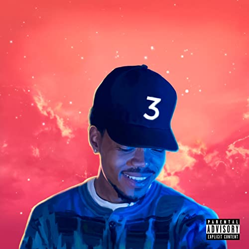

import { Slider, Button } from 'carbon-components-react';
import { ArrowUpRight24  } from '@carbon/icons-react';

import SliderJS1 from "../review/slider1"
import SliderJS2 from "../review/slider2"
import SliderJS3 from "../review/slider3"
import SliderJS4 from "../review/slider4"

import { Link } from "gatsby"

import Review1 from "../review/chancetherapper3.mdx"

CD review

<h1 className="h1--no--margin">{props.pageContext.frontmatter.title}</h1>

<Link to="/best50/2016/">2016 Black Music Best No.3</Link>

<Row  className="image-card-group">
	<Column colMd={"4"} colLg={"4"} noGutterMdLeft="">
       <ImageCard>

 

</ImageCard>
	</Column>
	<Column colMd={"8"} colLg={"8"} noGutterMdLeft="">
	

	Chance the Rapperの3年振り、3作目となるMixtape。現時点では各種ストリーミングサービスでの視聴、Datpiffなどからのオフィシャルダウンロードが可能になっている。前作のAcid Rapも話題になったが、今回はそれ以上で、ストリーミングのみでのBillboard 初Top10ランクイン(8位)を記録している。前作と印象はあまり変わらないが、今回は地元にヒーロー,Kanye WestやJunstin Bieberに著名Rapper陣をGuestに迎え、自身も所属するThe Social Experimentが 中心となってProduceしていて、その分、相対的にクオリティが上がっているし、メジャーな存在になったことを証明している。ソウルをベースによれ気味の唄/Rapに加え、何故だか親しみやすい雰囲気なのがChanceの特徴だが、ゴスペルを多用しているのは新たな試みといえる。また、ところどころアンビエントところもあったりする。⑩のクラブ風のTrackもカッコよい。2015年はKendrick Lamarの年だったが、2016年はChanceの年になると予感させる。
	

	

	  <Button href="https://amzn.to/3acP6k9" kind="primary" size="small" renderIcon={ArrowUpRight24}>
      amazon.com
      </Button>
      <Button href="https://amzn.to/3ktAemj" kind="secondary" size="small" renderIcon={ArrowUpRight24}>
      amazon.co.jp
      </Button>
	

	
	
	</Column>
</Row>
<Row >
	<Column colMd={"4"} colLg={"4"} noGutterMdLeft="">

    <h3>Score card</h3>
	<SliderJS1 value="4" />
    <SliderJS2 value="2" />
	<SliderJS3 value="2" />
    <SliderJS4 value="9" />

</Column>
<Column colMd={"8"} colLg={"8"} noGutterMdLeft="">

<h3>Producers</h3>

The Social Experiment and Kanye West(1)
 Brasstracks(2)
 Francis and the Lights(3)
 The Social Experiment and Jordan Ware(4)
 The Social Experiment(5,11,13,14)
 The Social Experiment and Lido(6,8)
 Stix and CBMIX(7)
 Rascal and Peter Cottontale(9)
 Kaytranada(10)
 The Social Experiment
 GARREN(12)

<h3>Guests</h3>

Kanye West, Chicago Children's Choir, Lil Wayne, 2 Chainz, Jeremih, Francis and the Lights, Young Thug,& Lil Yachty, Saba, Justin Bieber, Towkio, Knox Fortune, Jay Electronica, My cousin Nicole, Future, T-Pain, Kirk Franklin, Eryn Allen Kane, Noname, Ty Dolla $ign

</Column>
</Row>

<h3>Tracks</h3>

| No. |	 Title                                                                           |	 Composers                                                                                                                                                                                 	               |	 Performer     | Time  |
| --- |	-------------------------------------------------------------------------------- | ----------------------------------------------------------------------------------------------------------------------------------------------------------------------------------------------------------- | ----------------- | ----- |
| 1	  |	All We Got (featuring Kanye West & Chicago Children's Choir)                     | Chancelor J. Bennett, Kanye West, Grace Weber, Nate Fox, Nico Segal, Peter Wilkins, Francis Farewell Starlite, Vasil Garnanliever, Teddy Jackson, Sima Cunningham, Josephine Lee, Jack Red, Isaiah Robinson | Chance The Rapper | 03:23 |
| 2	  |	No Problem (featuring Lil Wayne & 2 Chainz)                                      | Chancelor J. Bennett, Ivan Rosenburg, Conor Szymanski, Dwayne Carter, Jr.Tauheed Epps, Peter Wilkins, Cameron Osteen, Jaime Woods, Jonathan Hoard, Lakeitsha Williams, Rachel Cato                      	   | Chance The Rapper | 05:05 |
| 3	  |	Summer Friends (featuring Jeremih & Francis and the Lights)                      | Chancelor J. Bennett, Aaron Lammer, Rostam Batmanglij, Francis Farewell Starlite, Justin Vernon, Brandon Burton                                                                                             | Chance The Rapper | 04:50 |
| 4	  |	D.R.A.M. Sings Special                                                           | Chancelor J. Bennett, Shelley Massenburg-Smith, Karl Rubin, Jordan Ware, FoxSegal                                                                                                                           | Chance The Rapper | 01:41 |
| 5	  |	Blessings                                                                        | Chancelor J. Bennett, Peter Wilkins, Nico Segal, Nate Fox, Fred Hammond, Byron Cage                                                                                                                         | Chance The Rapper | 03:41 |
| 6	  |	Same Drugs                                                                       | Chancelor J. Bennett, Peder Losnegård, Nate Fox, Peter Wilkins, Nico Segal, Francis Farewell Starlite                                                                                                       | Chance The Rapper | 04:17 |
| 7	  |	Mixtape (featuring Young Thug & Lil Yachty)                                      | Chris Barnett, Chancelor J. Bennett, Greg Landfair, Jr., Miles McCollum, Jeffrey Williams                                                                                                 	               | Chance The Rapper | 04:52 |
| 8	  |	Angels (featuring Saba)                                                          | Chancelor J. Bennett, LosnegårdNate Fox, Peter Wilkins, Nico Segal, Tahj Chandler                                                                                                                           | Chance The Rapper | 03:26 |
| 9	  |	Juke Jam (featuring Justin Bieber & Towkio)                                      | Chancelor J. Bennett, Justin Bieber, Tobi Breuer, Kai Campos, Dominic Maker, Preston Oshita                                                                                              	               | Chance The Rapper | 03:39 |
| 10  |	All Night (featuring Knox Fortune)                                               | Chancelor J. Bennett, Kevin Rhomberg, Louis Kevin Celestin, Nico Segal                                                                                                                                      | Chance The Rapper | 02:21 |
| 11  |	How Great (featuring Jay Electronica & My cousin Nicole)                         | Chancelor J. Bennett, Timothy Tedford, Nate Fox, Peter Wilkins, Carter Lang, Jesse Reeves, Ed Cash, Chris Tomlin                                                                                            | Chance The Rapper | 05:37 |
| 12  |	Smoke Break (featuring Future)                                                   | Chancelor J. Bennett, Garren Sean Langford, Nayvadius Wilburn                                                                                                                                               | Chance The Rapper | 03:46 |
| 13  |	Finish Line / Drown" (featuring T-Pain, Kirk Franklin, Eryn Allen Kane & Noname) | Chancelor J. Bennett, Greg Landfair, Rajiv Halim, Peter Wilkins, Nico Segal, Nate Fox, Kirk Franklin, Eryn Allen Kane, Faheem Rasheed Najm, Fatimah Nyeema Warner                                           | Chance The Rapper | 06:46 |
| 14  |	Blessings (Reprise) (featuring Ty Dolla $ign)                                    | Chancelor J. Bennett, Peter Wilkins, Nate Fox, Cameron Osteen, Nico Segal, Fred Hammond                                                                                                                     | Chance The Rapper | 03:50 |

<Row>
<Column colMd={3} colLg={3} noGutterMdLeft>
<Review1 />
</Column>
</Row>