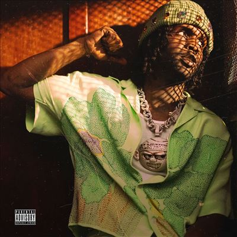

import { Slider, Button } from "@carbon/react";
import { ArrowUpRight } from "@carbon/icons-react";

import SliderJS1 from "../review/slider1";
import SliderJS2 from "../review/slider2";
import SliderJS3 from "../review/slider3";
import SliderJS4 from "../review/slider4";

import { Link } from "gatsby";

Album Review

<h1 className="h1--no--margin">{props.pageContext.frontmatter.title}</h1>

<Row  className="image-card-group">
	<Column colMd={3} colLg={4} noGutterMdLeft="">
       <ImageCard>

</ImageCard>
	</Column>
	<Column colMd={4} colLg={8} noGutterMdLeft="">
		

			2010年代前半、いまだ10代の時に(シカゴ)ドリルを生んだといわれ、当時、武器の使用容疑で逮捕されたりと、かなり早熟だったChief Keefの2024年最新作。年齢は28歳になったが、まだまだ落ち着きは見せず、勢いがあって、音がぎっしりと詰まった作品となっている。
			 サウンドはミディアム〰スロー中心でTrap色が濃い曲が多く、ベースの音圧もやや強め。本人も全曲の制作に携わっているが、荘厳な曲やメロディアスな曲など様々。
			 Guest陣ではTierra WhackやSexyy Redなどが華をそえているが、Tierraの高速ラップ?はかなり意外だった。
		

		

		  <Button className="button-right-mergin"  href="https://amzn.to/3Nx5lNn" renderIcon={ArrowUpRight} size='sm' kind='primary'>
  	    amazon.com
  	  </Button>
  	  <Button className="button-right-mergin"  href="https://amzn.to/3Yt0qmS" renderIcon={ArrowUpRight} size='sm' kind='secondary'>
  	    amazon.co.jp
  	  </Button>
  	  <Button className="button-right-mergin"  href="https://apple.co/3Uh1zM5" renderIcon={ArrowUpRight} size='sm' kind='tertiary'>
  	    apple music
  	  </Button>
		

	</Column>
</Row>
<Row >
	<Column colMd={4} colLg={4} noGutterMdLeft="">
		

		  <h3>Score card</h3>
			<SliderJS1 value="5" />
		  <SliderJS2 value="2" />
			<SliderJS3 value="3" />
		  <SliderJS4 value="8" />
		

	</Column>
	<Column colMd={8} colLg={8} noGutterMdLeft="">
		

		<h3>Producers</h3>
		

			DP Beats, Chief Keef and The Legendary Traxster(1)
			 Chief Keef(2,3,9,10,13,16)
			 Slowburnz, Chief Keef and Money Beats(4)
			 Mike WiLL Made-It, Chief Keef and Shawn Ferrari(5)
			 Chief Keef and Young Malcolm(6)
			 Chief Keef and DP Beats(7)
			 Chief Keef, SantanaStar Beats, Kreestabape and Blackghxst(8)
			 Chief Keef and Johnny Juliano(11)
			 Thaibxbbi, 3lifrvr and Chief Keef(12)
			 Chief Keef and Bobby Raps(14)
			 Chief Keef, ProdKyle & Akachi(15)
		

		<h3>Guests</h3>
		

			Ballout, G Herbo, Lil Gnar, Tierra Whack, Sexyy Red
		

		

	</Column>
</Row>

<h3>Tracks</h3>

| No. | Title             | Composers                                                                  | Performer                         | Time  |
| --- | ----------------- | -------------------------------------------------------------------------- | --------------------------------- | ----- |
| 1   | Almighty (Intro)  | Keith Cozart, DP Beats, The Legendary Traxster                             | Chief Keef                        | 02:53 |
| 2   | Neph Nem          | Keith Cozart, Ballout, G Herbo                                             | Chief Keef feat. Ballout, G Herbo | 02:38 |
| 3   | Treat Myself      | Keith Cozart                                                               | Chief Keef                        | 04:29 |
| 4   | Jesus Skit        | Keith Cozart, Michael Blackson, Money Beats, Slowburnz                     | Chief Keef                        | 02:18 |
| 5   | Jesus             | Keith Cozart, Lil Gnar, Michael Blackson, Mike WiLL Made-It, Shawn Ferrari | Chief Keef feat: Lil Gnar         | 04:39 |
| 6   | Too Trim          | Keith Cozart, Gene Page, Billy Page                                        | Chief Keef                        | 04:29 |
| 7   | Runner            | Keith Cozart                                                               | Chief Keef                        | 02:55 |
| 8   | Banded Up         | Keith Cozart, Tierra Whack, SantanaStar Beats                              | Chief Keef feat: Tierra Whack     | 04:26 |
| 9   | Grape Trees       | Keith Cozart, Sexyy Red                                                    | Chief Keef feat: Sexyy Red        | 05:03 |
| 10  | 1,2,3             | Keith Cozart, Chris Kenner                                                 | Chief Keef                        | 05:29 |
| 11  | Drifting Away     | Keith Cozart                                                               | Chief Keef                        | 04:02 |
| 12  | Never Fly Here    | Keith Cozart, Quavo, Thaibxbbi and 3lifrvr                                 | Chief Keef feat: Quavo            | 04:31 |
| 13  | Prince Charming   | Keith Cozart                                                               | Chief Keef                        | 05:30 |
| 14  | Believe           | Keith Cozart                                                               | Chief Keef                        | 06:45 |
| 15  | Tony Montana Flow | Hunter Brown, Keith Cozart, ProdKyle                                       | Chief Keef                        | 02:22 |
| 16  | I'm Tryna Sleep   | Keith Cozart                                                               | Chief Keef                        | 03:16 |

<h3>Other Reviews</h3>
