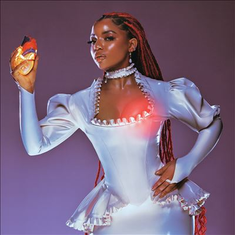

import { Slider, Button } from "@carbon/react";
import { ArrowUpRight } from "@carbon/icons-react";

import SliderJS1 from "../review/slider1";
import SliderJS2 from "../review/slider2";
import SliderJS3 from "../review/slider3";
import SliderJS4 from "../review/slider4";
import AdvJS2 from "../review/adv2";
import AdvJS3 from "../review/adv3";

import { Link } from "gatsby";

import Review1 from "../review/chloexhalle1.mdx";

Album Review

<h1 className="h1--no--margin">{props.pageContext.frontmatter.title}</h1>

<Row  className="image-card-group">
	<Column colMd={3} colLg={4} noGutterMdLeft="">
       <ImageCard>

</ImageCard>
	</Column>
	<Column colMd={4} colLg={8} noGutterMdLeft="">
	  

	    1st album、2nd albumとも高評価を得ている姉妹Duo, Chloe x Halleの姉のほう、Chlöeのソロデビュー作。彼女たちをHook UpしたBeyonceのLabelからのリリースである。
       1, 2曲目はクラシックなソウルで始まるが、3曲目以降、今どきのトレンドを押さえたHip-Hop Soulに転じていく。また、後半にかけて、Chris BrownとのDuoや、Rapper(MissyとFuture)をゲストに迎えた曲などで変化をつけているが、どれも的を得た起用となっている。
       まだ、24歳のChlöeではあるが、唄には年相応以上の落ち着きが感じられ、特にスロー曲での中音域の表現力は見事。ソロデビュー作としては十分、成功と言えそうだ。
    

	  

	    <Button className="button-right-mergin"  href="https://amzn.to/3KiUQvW" renderIcon={ArrowUpRight} size='sm' kind='primary'>
        amazon.com
      </Button>
      <Button className="button-right-mergin"  href="https://amzn.to/452h6SQ" renderIcon={ArrowUpRight} size='sm' kind='secondary'>
        amazon.co.jp
      </Button>
	  	<Button className="button-right-mergin"  href="https://apple.co/3OAtjZG" renderIcon={ArrowUpRight} size='sm' kind='tertiary'>
        apple music
      </Button>
      <AdvJS2/>
	  

	</Column>
</Row>
<Row >
	<Column colMd={4} colLg={4} noGutterMdLeft="">
    

      <h3>Score card</h3>
    	<SliderJS1 value="5" />
      <SliderJS2 value="2" />
    	<SliderJS3 value="1" />
      <SliderJS4 value="9" />
    

  </Column>
  <Column colMd={8} colLg={8} noGutterMdLeft="">
    

      <h3>Producers</h3>
      

      	Chlöe(1,9)
         Chlöe, Ecasssh, Pitt Tha Kid, puredandyy and ThankGod4Cody(2)
         2300 and Chlöe(3)
         Chlöeand P2J(4)
         David x Eli and Metro Boomin(5)
         Jakikand Scott Bridgeway (6)
         Cardiak and Hitmaka(7)
         Chlöe and John Ho(8)
         Chlöe and The‐Dream(10)
         BoogzDaBeast, Chlöe and FnZ(11)
         Chlöe and Gitty(12)
         Chlöe, Linden Jay and Josh Taffel(13)
         Chlöe, Mikky Ekko and Alex Hope (14)
      

      <h3>Guests</h3>
      

      	Swae Lee, Mike WiLL Made‐It
      

    

  </Column>
</Row>

<h3>Tracks</h3>

| No. | Title                        | Composers                                                                                      | Performer                                        | Time  |
| --- | ---------------------------- | ---------------------------------------------------------------------------------------------- | ------------------------------------------------ | ----- |
| 1   | Intro                        | Chloe Bailey, Halle Bailey, Nija Charles, Mark Spears                                          | Chloe x Halle                                    | 00:28 |
| 2   | Forgive Me                   | Chloe Bailey, Halle Bailey, Nija Charles, Mark Spears                                          | Chloe x Halle                                    | 02:38 |
| 3   | Baby Girl                    | Chloe Bailey, Halle Bailey                                                                     | Chloe x Halle                                    | 03:32 |
| 4   | Do It                        | Chloe Bailey, Halle Bailey, Anton Kuhl, Scott Storch, Vincent van den Ende, Victoria Mon?t     | Chloe x Halle                                    | 02:57 |
| 5   | Tipsy                        | Chloe Bailey, Halle Bailey                                                                     | Chloe x Halle                                    | 02:33 |
| 6   | Ungodly Hour                 | Chloe Bailey, Halle Bailey, Guy Lawrence, Howard Lawrence                                      | Chloe x Halle                                    | 04:16 |
| 7   | Busy Boy                     | Chloe Bailey, Halle Bailey, Jeff Gitelman, Nasri Atweh                                         | Chloe x Halle                                    | 03:10 |
| 8   | Catch Up                     | Chloe Bailey, Halle Bailey, Khalif Brown, Michael Len Williams II, Asheton Hogan, Adam Waldman | Chloe x Halle & Swae Lee feat. Mike WiLL Made‐It | 03:04 |
| 9   | Overwhelmed                  | Chloe Bailey, Halle Bailey                                                                     | Chloe x Halle                                    | 00:52 |
| 10  | Lonely                       | Chloe Bailey, Halle Bailey, Felicia Ferraro, Scott Storch, Vincent van den Ende, Wallis Lane   | Chloe x Halle                                    | 03:15 |
| 11  | Don’t Make It Harder on Me   | Chloe Bailey, Halle Bailey, Jeff Gitelman, Nasri Atweh                                         | Chloe x Halle                                    | 03:35 |
| 12  | Wonder What She Thinks of Me | Chloe Bailey, Halle Bailey                                                                     | Chloe x Halle                                    | 03:32 |
| 13  | ROYL                         | Chloe Bailey, Halle Bailey, Matthew Jehu Samuels, ANDERSON HERNANDEZ, Jahaan Sweet             | Chloe x Halle                                    | 03:25 |

<h3>Other Reviews</h3>

<Row>
  <Column colMd={3} colLg={3} noGutterMdLeft>
    <Review1 />
  </Column>
</Row>

<AdvJS3/>