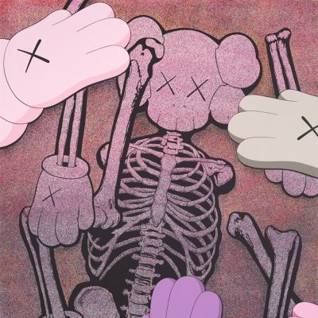

import { Slider, Button } from "@carbon/react";
import { ArrowUpRight } from "@carbon/icons-react";

import SliderJS1 from "../review/slider1";
import SliderJS2 from "../review/slider2";
import SliderJS3 from "../review/slider3";
import SliderJS4 from "../review/slider4";
import AdvJS2 from "../review/adv2";
import AdvJS3 from "../review/adv3";

import { Link } from "gatsby";

import Review2_1 from "../review/pushat4.mdx";
import Review2_2 from "../review/pushat3.mdx";

Album Review

<h1 className="h1--no--margin">{props.pageContext.frontmatter.title}</h1>

  <Link to="/best50/2025/">2025 Black Music Best No.1</Link>

<Row  className="image-card-group">
	<Column colMd={3} colLg={4} noGutterMdLeft="">
       <ImageCard>

</ImageCard>
	</Column>
	<Column colMd={4} colLg={8} noGutterMdLeft="">
		

			Pusha T(弟)、Malice(兄)による兄弟Duoのなんと19年ぶりの3rdアルバム。Def Jamによる②でのKendrick LamarのLyricに検閲を嫌って自主制作によるリリースとなっている。
			 二人の地元仲間Pharrellが全曲Produceし、相性の良さを示しているが、残念なことにChadは裁判の関係ではずれている。Trackは比較的シンプルでドラム、ベースを効かしたものが多く、Hip-Hopとしてのコアをはずしていないが、バラエティさには富んでいる。多くの曲でキャッチーなVocalが加わって、急にカラフルになるのはPharrellの真骨頂と言えそう。
			 ゲストも豪華で前出のKendrickに加え、兄弟が母を失ったことを唄う①でのJohn LegendやThe-Dream, Nas, Tyler, The Cretor(自分が購入したCDでは除外されていた。)など豪華で、①ではStevie Wonderによるモノローグも聴ける。
			 36分強のアルバムによくぞここまで詰め込めたといえる濃厚なアルバムになっている。
		

		

		  <Button className="button-right-mergin"  href="https://amzn.to/3L3pjls" renderIcon={ArrowUpRight} size='sm' kind='primary'>
  	    amazon.com
  	  </Button>
  	  <Button className="button-right-mergin"  href="https://amzn.to/4sbjza5" renderIcon={ArrowUpRight} size='sm' kind='secondary'>
  	    amazon.co.jp
  	  </Button>
  	  <Button className="button-right-mergin"  href="https://apple.co/44JTBQK" renderIcon={ArrowUpRight} size='sm' kind='tertiary'>
  	    apple music
  	  </Button>
			<AdvJS2/>
		

	</Column>
</Row>
<Row >
	<Column colMd={4} colLg={4} noGutterMdLeft="">
		

		  <h3>Score card</h3>
			<SliderJS1 value="1" />
		  <SliderJS2 value="1" />
			<SliderJS3 value="2" />
		  <SliderJS4 value="9" />
		

	</Column>
	<Column colMd={8} colLg={8} noGutterMdLeft="">
		

			<h3>Producers</h3>
			

				Pharrell Williams(all)
			

			<h3>Guests</h3>
			

				John Legend, Voices of Fire, Stevie Wonder, Kendrick Lamar, Tyler, The Creator, Pharrell Williams, The‐Dream, Stove God Cooks, Ab‐Liva, Nas, Lenny Kravitz
			

		

	</Column>
</Row>

<h3>Tracks</h3>

| No. | Title                           | Composers                                                               | Performer                                 | Time  |
| --- | ------------------------------- | ----------------------------------------------------------------------- | ----------------------------------------- | ----- |
| 1   | The Birds Don’t Sing            | Gene Thornton, Terrence Thornton, Pharrell Williams, Stevie Wonder      | Clipse feat. John Legend, Voices of Fire  | 04:01 |
| 2   | Chains & Whips                  | Gene Thornton, Terrence Thornton, Pharrell Williams, Kendrick Duckworth | Clipse feat. Kendrick Lamar               | 04:04 |
| 3   | P.O.V                           | Gene Thornton, Terrence Thornton, Pharrell Williams, Tyler Okonma       | Clipse feat. Tyler, The Creator           | 03:06 |
| 4   | Ace Trumpets                    | Gene Thornton, Terrence Thornton, Pharrell Williams                     | Clipse                                    | 02:34 |
| 5   | All Things Considered           | Gene Thornton, Terrence Thornton, Pharrell Williams                     | Clipse feat. Pharrell Williams, The‐Dream | 03:09 |
| 6   | MTBTTF                          | Gene Thornton, Terrence Thornton, Pharrell Williams                     | Clipse                                    | 02:36 |
| 7   | E.B.I.T.D.A.                    | Gene Thornton, Terrence Thornton, Pharrell Williams                     | Clipse feat. Pharrell Williams            | 02:00 |
| 8   | F.I.C.O.                        | Gene Thornton, Terrence Thornton, Pharrell Williams                     | Clipse feat. Stove God Cooks              | 03:22 |
| 9   | Inglorious Bastards             | Gene Thornton, Terrence Thornton, Pharrell Williams                     | Clipse feat. Ab‐Liva                      | 02:33 |
| 10  | So Far Ahead                    | Gene Thornton, Terrence Thornton, Pharrell Williams                     | Clipse feat. Pharrell Williams            | 03:22 |
| 11  | Let God Sort Em Out/Chandeliers | Gene Thornton, Terrence Thornton, Nasir Jones, Pharrell Williams        | Clipse feat. Nas                          | 02:33 |
| 12  | By the Grace of God             | Gene Thornton, Terrence Thornton, Pharrell Williams                     | Clipse feat. Pharrell Williams            | 03:06 |

<h3>Other Reviews</h3>

<Row>
  <Column colMd={3} colLg={3} noGutterMdLeft>
    <Review2_1 />
  </Column>
	<Column colMd={3} colLg={3} noGutterMdLeft>
    <Review2_2 />
  </Column>
</Row>

<AdvJS3 />
