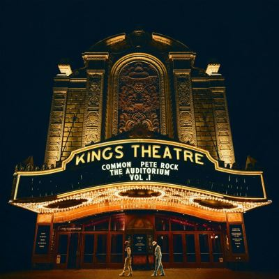

import { Slider, Button } from "@carbon/react";
import { ArrowUpRight } from "@carbon/icons-react";

import SliderJS1 from "../review/slider1";
import SliderJS2 from "../review/slider2";
import SliderJS3 from "../review/slider3";
import SliderJS4 from "../review/slider4";
import AdvJS2 from "../review/adv2";
import AdvJS3 from "../review/adv3";

import { Link } from "gatsby";

import Review2_1 from "../review/common9.mdx";
import Review2_2 from "../review/common8.mdx";

Album Review

<h1 className="h1--no--margin">{props.pageContext.frontmatter.title}</h1>

  <Link to="/best50/2024/">2024 Black Music Best No.11</Link>

<Row  className="image-card-group">
	<Column colMd={3} colLg={4} noGutterMdLeft="">
       <ImageCard>

</ImageCard>
	</Column>
	<Column colMd={4} colLg={8} noGutterMdLeft="">
		

			Hip-Hop界のLegendによるコラボレーション作。Commonとしては3年ぶりとなる。単一曲での共作は過去にもあったが、アルバム全体としては初となる。
			 良質なTrackに良質なRapが組み合わされば、高品質な作品が生まれるのは当然といえば当然だが、それにしても素晴らしい。的を得たサンプリングに、ソウルフルでJazzyなTrackは、ゆったりとして、ファンクで心地よく、Commonが気持ちよくRapしているのが良く判る。
			 派手さは無いが、Hip-Hop本来の魅力を思い出させてくれるアルバムだ。
		

		

		  <Button className="button-right-mergin"  href="https://amzn.to/3CoPYEU" renderIcon={ArrowUpRight} size='sm' kind='primary'>
  	    amazon.com
  	  </Button>
  	  <Button className="button-right-mergin"  href="https://amzn.to/40P6yHz" renderIcon={ArrowUpRight} size='sm' kind='secondary'>
  	    amazon.co.jp
  	  </Button>
  	  <Button className="button-right-mergin"  href="https://apple.co/3Ekt8Pb" renderIcon={ArrowUpRight} size='sm' kind='tertiary'>
  	    apple music
  	  </Button>
			<AdvJS2/>
		

	</Column>
</Row>
<Row >
	<Column colMd={4} colLg={4} noGutterMdLeft="">
		

		  <h3>Score card</h3>
			<SliderJS1 value="2" />
		  <SliderJS2 value="1" />
			<SliderJS3 value="1" />
		  <SliderJS4 value="9" />
		

	</Column>
	<Column colMd={8} colLg={8} noGutterMdLeft="">
		

			<h3>Producers</h3>
			

				Pete Rock(all)
			

			<h3>Guests</h3>
			

				Bilal,, Jennifer Hudson, Posdnous, PJ,J Rocc
			

		

	</Column>
</Row>

<h3>Tracks</h3>

| No. | Title                     | Composers                                                                                             | Performer                                | Time  |
| --- | ------------------------- | ----------------------------------------------------------------------------------------------------- | ---------------------------------------- | ----- |
| 1   | Dreamin'                  | Lonnie Rashid Lynn, Peter Phillips, Aretha Franklin, Ernest Straughter, Ray Straughter, Luther Waters | Common / Pete Rock                       | 04:00 |
| 2   | Chi-Town Do It            | Lonnie Rashid Lynn, Peter Phillips, Lauryn Hill                                                       | Common / Pete Rock                       | 04:26 |
| 3   | This Man                  | Lonnie Rashid Lynn, Peter Phillips, Loleatta Holloway                                                 | Common / Pete Rock                       | 04:02 |
| 4   | We're on Our Way          | Lonnie Rashid Lynn, Peter Phillips, Roger Nichols, Paul Williams                                      | Common / Pete Rock                       | 04:16 |
| 5   | Fortunate                 | Lonnie Rashid Lynn, Peter Phillips                                                                    | Common / Pete Rock                       | 04:14 |
| 6   | So Many People            | Lonnie Rashid Lynn, Peter Phillips, James Poyser                                                      | Common / Pete Rock feat. Bilal           | 05:14 |
| 7   | Wise Up                   | Lonnie Rashid Lynn, Peter Phillips                                                                    | Common / Pete Rock                       | 03:47 |
| 8   | A God (There Is)          | Lonnie Rashid Lynn, Peter Phillips, Paris A Jones, Andrew Cooper                                      | Common / Pete Rock feat/ Jennifer Hudson | 03:47 |
| 9   | Stellar                   | Lonnie Rashid Lynn, Peter Phillips, Giovanni Tommaso                                                  | Common / Pete Rock                       | 04:23 |
| 10  | Lonesome                  | Lonnie Rashid Lynn, Peter Phillips, Mindy Dalton                                                      | Common / Pete Rock                       | 04:36 |
| 11  | All Kind of Ideas         | Lonnie Rashid Lynn, Peter Phillips, Joe Wheeler                                                       | Common / Pete Rock                       | 03:48 |
| 12  | When the Sun Shines Again | Lonnie Rashid Lynn, Peter Phillips, Kelvin Mercer, Tuametef "TUAMIE" Ani, Joe Sample                  | Common / Pete Rock feat. Posdnous        | 04:45 |
| 13  | Everything's So Grand     | Lonnie Rashid Lynn, Peter Phillips, Francisco Buarque De Hollanda                                     | Common / Pete Rock feat. PJ              | 06:04 |
| 14  | Now and Then              | Lonnie Rashid Lynn, Peter Phillips, Jorge Amiden, Martin Luther King Jr.                              | Common / Pete Rock                       | 04:30 |
| 15  | Outro                     | Lonnie Rashid Lynn, Peter Phillips,                                                                   | Common / Pete Rock                       | 00:55 |

<h3>Other Reviews</h3>

<Row>
  <Column colMd={3} colLg={3} noGutterMdLeft>
    <Review2_1 />
  </Column>
	<Column colMd={3} colLg={3} noGutterMdLeft>
    <Review2_2 />
  </Column>
</Row>

<AdvJS3 />
