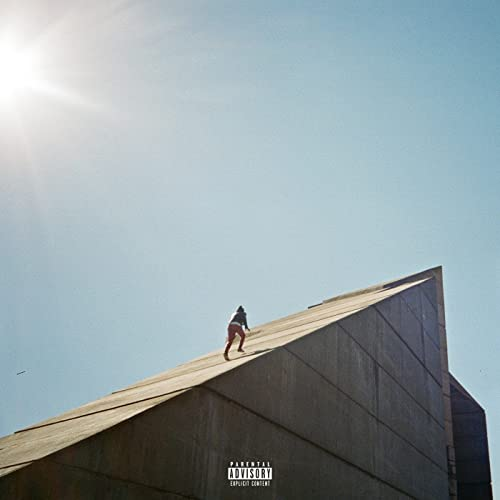

import { Slider, Button } from 'carbon-components-react';
import { ArrowUpRight24  } from '@carbon/icons-react';

import SliderJS1 from "../review/slider1"
import SliderJS2 from "../review/slider2"
import SliderJS3 from "../review/slider3"
import SliderJS4 from "../review/slider4"

import { Link } from "gatsby"

Album Review

<h1 className="h1--no--margin">{props.pageContext.frontmatter.title}</h1>

<Link to="/best50/2017/">2017 Black Music Album Best No.12</Link>

<Row  className="image-card-group">
	<Column colMd={"3"} colLg={"4"} noGutterMdLeft="">
       <ImageCard>

 
</ImageCard>
	</Column>
	<Column colMd={"4"} colLg={"8"} noGutterMdLeft="">
	

	CanadaはTronto出身の23歳、Daniel Caesarのデビューアルバム。アコースティックバンドによるミディアム～スロー中心の構成で、Neo Soulや90年代のOrganic Soulに茫洋感を加えたサウンドが心地よく、リラックスして聴ける。さらにはアンニョイで内省的な部分も。ゆったりとしたTrackに、ファルセット多めのDanielの唄という建付けも良いが、4人の個性的な女性Vocal Guestとの絡みが素晴らしい。Canada出身で以前からのコンビのMatthew BurnettとJordan EvansによるProduceも安定感を紡ぎだしている。ちなみにタイトルのFreudianとはフロイト派のことだそうだ。
	

	

	  <Button className="button-right-mergin"  href="https://amzn.to/3jckiUC" kind="primary" size="small" renderIcon={ArrowUpRight24}>
      amazon.com
    </Button>
    <Button className="button-right-mergin"  href="https://amzn.to/2Owp5m4" kind="secondary" size="small" renderIcon={ArrowUpRight24}>
      amazon.co.jp
    </Button>
	

	
	
	</Column>
</Row>
<Row >
	<Column colMd={"4"} colLg={"4"} noGutterMdLeft="">

    <h3>Score card</h3>
	<SliderJS1 value="2" />
    <SliderJS2 value="1" />
	<SliderJS3 value="2" />
    <SliderJS4 value="9" />

</Column>
<Column colMd={"8"} colLg={"8"} noGutterMdLeft="">

<h3>Producers</h3>

Matthew Burnett, Jordan Evans(1,2,3,4,6,7,8,9,10)
 Alex Ernewein(5)

<h3>Guests</h3>

Kali Uchis, H.E.R., Syd, Charlotte Day Wilson

</Column>
</Row>

<h3>Tracks</h3>

| No. |	 Title                          |	 Composers                    |	 Performer                             | Time  |
| --- |	------------------------------- | ------------------------------- | -------------------------------------- | ----- |
| 1	  |	Get You                        	| Daniel Caesar, Karly Loaiza     |	Daniel Caesar ft. Kali Uchis           | 04:38 |
| 2	  |	Best Part                      	| Daniel Caesar, Gabi Wilson      |	Daniel Caesar ft. H.E.R.               | 03:29 |
| 3	  |	Hold Me Down                   	| Daniel Caesar                   |	Daniel Caesar                          | 03:51 |
| 4	  |	Neu Roses (Transgressor's Song)	| Daniel Caesar                   |	Daniel Caesar                          | 03:01 |
| 5	  |	Loose                          	| Daniel Caesar                   |	Daniel Caesar                          | 03:05 |
| 6	  |	We Find Love                   	| Daniel Caesar                   |	Daniel Caesar                          | 04:14 |
| 7	  |	Blessed                        	| Daniel Caesar                   |	Daniel Caesar                          | 04:01 |
| 8	  |	Take Me Away                   	| Daniel Caesar, Sydney Bennett   |	Daniel Caesar ft, Syd                  | 03:46 |
| 9	  |	Transform                      	| Daniel Caesar, Charlotte Wilson |	Daniel Caesar ft. Charlotte Day Wilson | 04:40 |
| 10  |	Freudian                       	| Daniel Caesar                   |	Daniel Caesar                          | 10:02 |
