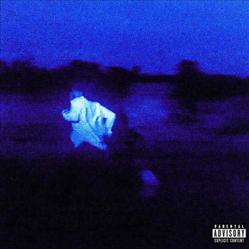

import { Slider, Button } from "@carbon/react";
import { ArrowUpRight } from "@carbon/icons-react";

import SliderJS1 from "../review/slider1";
import SliderJS2 from "../review/slider2";
import SliderJS3 from "../review/slider3";
import SliderJS4 from "../review/slider4";
import AdvJS2 from "../review/adv2";
import AdvJS3 from "../review/adv3";

import { Link } from "gatsby";

import Review1 from "../review/danielcaesar1.mdx";

Album Review

<h1 className="h1--no--margin">{props.pageContext.frontmatter.title}</h1>

<Row  className="image-card-group">
	<Column colMd={3} colLg={4} noGutterMdLeft="">
       <ImageCard>

</ImageCard>
	</Column>
	<Column colMd={4} colLg={8} noGutterMdLeft="">
		

			Daniel Caesarの4年ぶりとなる3rdアルバム。1作目に比べ2作目はあまり話題にならなかったが、当3作目は十分なクオリティを持つアルバムに仕上がっている。
			 R&B色は大分後退し、スローな美メロを中心に据えた、フォーキーで落ち着いたロックといった感じのTrackが多い。ビートルズっぽさも薄ーく感じられる。これに、Danielの繊細なVocalが加わって、しみじみとした印象を与えてくれる。
			 Guestに同郷のMustafaやserpentwithfeet、曲作りにはRaphael SaadiqやMark Ronsonも一部で加わり、的を得すぎた陣容となっている。それにしてもメロディメーカーとしてのDanielの才能は抜群で、それだけで評価に値する作品だと思う。
		

		

		  <Button className="button-right-mergin"  href="https://amzn.to/3tqgk4J" renderIcon={ArrowUpRight} size='sm' kind='primary'>
  	    amazon.com
  	  </Button>
  	  <Button className="button-right-mergin"  href="https://amzn.to/45iWWnb" renderIcon={ArrowUpRight} size='sm' kind='secondary'>
  	    amazon.co.jp
			</Button>
			<Button className="button-right-mergin"  href="https://apple.co/3ZP7bP8" renderIcon={ArrowUpRight} size='sm' kind='tertiary'>
  	    apple music
			</Button>
			<AdvJS2/>
		

	</Column>
</Row>
<Row >
	<Column colMd={4} colLg={4} noGutterMdLeft="">
		

		  <h3>Score card</h3>
			<SliderJS1 value="1" />
		  <SliderJS2 value="2" />
			<SliderJS3 value="1" />
		  <SliderJS4 value="9" />
		

	</Column>
	<Column colMd={8} colLg={8} noGutterMdLeft="">
		

			<h3>Producers</h3>
			

				Matthew Burnett, Jordan Evans(1,2,3,4,6,7,8,9,10)
				 Alex Ernewein(5)
			

			<h3>Guests</h3>
			

				Kali Uchis, H.E.R., Syd, Charlotte Day Wilson
			

		

	</Column>
</Row>

<h3>Tracks</h3>

| No. | Title              | Composers                                                                                                           | Performer                           | Time  |
| --- | ------------------ | ------------------------------------------------------------------------------------------------------------------- | ----------------------------------- | ----- |
| 1   | Ocho Rios          | Ashton Simmonds                                                                                                     | Daniel Caesar                       | 02:33 |
| 2   | Valentina          | Ashton Simmonds, Zachary Simmonds, Dylan Wiggins                                                                    | Daniel Caesar                       | 02:34 |
| 3   | Toronto 2014       | Ashton Simmonds, Mustafa Ahmed                                                                                      | Daniel Caesar feat. Mustafa         | 04:37 |
| 4   | Let Me Go          | Ashton Simmonds, James Napier, Rami Yacoub, Rupert Thomas, Jr.                                                      | Daniel Caesar                       | 03:36 |
| 5   | Do You Like Me     | Ashton Simmonds, Raphael Saadiq, Wiggins                                                                            | Daniel Caesar                       | 03:47 |
| 6   | Always             | Ashton Simmonds, Justin Lucas, Nolan Lambroza, Tobias Jesso Jr.                                                     | Daniel Caesar                       | 03:45 |
| 7   | Cool               | Ashton Simmonds, Sacha Rudy                                                                                         | Daniel Caesar                       | 04:04 |
| 8   | Disillusioned      | Ashton Simmonds, Josiah Wise                                                                                        | Daniel Caesar feat. serpentwithfeet | 04:01 |
| 9   | Buyer’s Remorse    | Ashton Simmonds, Omar VelascoSean Leon                                                                              | Daniel Caesar feat. Omar Apollo     | 02:32 |
| 10  | Shot My Baby       | Ashton Simmonds, Ahmed                                                                                              | Daniel Caesar                       | 04:28 |
| 11  | Pain Is Inevitable | Ashton Simmonds                                                                                                     | Daniel Caesar                       | 04:55 |
| 12  | Homiesexual        | Ashton Simmonds, Tyrone Griffin, Jr.                                                                                | Daniel Caesar, Ty Dolla Sign        | 03:50 |
| 13  | Vince Van Gogh     | Ashton Simmonds                                                                                                     | Daniel Caesar                       | 02:44 |
| 14  | Superpowers        | Ashton Simmonds, Joel Compass                                                                                       | Daniel Caesar                       | 02:54 |
| 15  | Unstoppable        | Ashton Simmonds, Chester Hansen, Alexander Sowinski, Leland Whitty, Matthew Burnett, Jordan Evans, Jamar McNaughton | Daniel Caesar                       | 04:07 |

<h3>Other Reviews</h3>

<Row>
  <Column colMd={3} colLg={3} noGutterMdLeft>
    <Review1 />
  </Column>
</Row>

<AdvJS3 />
