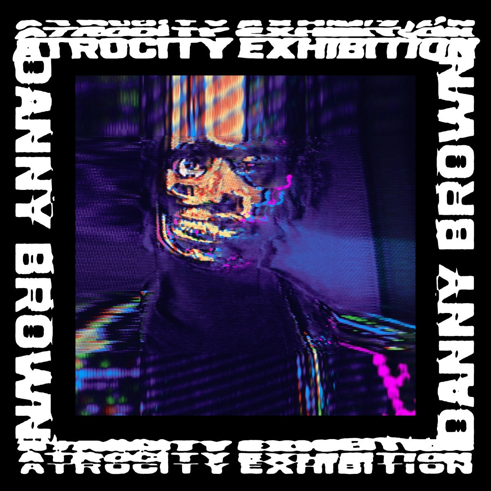

import { Slider, Button } from 'carbon-components-react';
import { ArrowUpRight24  } from '@carbon/icons-react';

import SliderJS1 from "../review/slider1"
import SliderJS2 from "../review/slider2"
import SliderJS3 from "../review/slider3"
import SliderJS4 from "../review/slider4"

import { Link } from "gatsby"

import Review1 from "../review/dannybrown4.mdx"

CD review

<h1 className="h1--no--margin">{props.pageContext.frontmatter.title}</h1>

<Link to="/best50/2016/">2016 Black Music Album Best No.8</Link>

 
<Row  className="image-card-group">
	<Column colMd={"4"} colLg={"4"} noGutterMdLeft="">
       <ImageCard>

 
</ImageCard>
	</Column>
	<Column colMd={"8"} colLg={"8"} noGutterMdLeft="">
		

			Warpに移籍したDanny Brownの3年ぶりのアルバム。J.G.Balladの小説とJoy Divisionの曲にインスパイアされたというタイトル(日本語で虐殺展覧会)にふさわしいブッ飛んだ内容になっている。Hip-Hopをベースに、プログレを数曲サンプリングしたり、バンド曲にトラップ、グライムなど、濃密かつ猥雑でトッ散らかった印象がかなり新鮮だ。そんなTrackにDanny Brownが高音でひしゃげたRapをグイグイとまくしたてている。DrugばかりのLyricはいただけないが、相当に面白い作品だといえる。
		

		

	  <Button href="https://amzn.to/35bGbik" kind="primary" size="small" renderIcon={ArrowUpRight24}>
      amazon.com
    </Button>
    <Button href="https://amzn.to/3jUbYZc" kind="secondary" size="small" renderIcon={ArrowUpRight24}>
      amazon.co.jp
    </Button>
		

		
		
		</Column>
</Row>
<Row >
	<Column colMd={"4"} colLg={"4"} noGutterMdLeft="">
		

    	<h3>Score card</h3>
			<SliderJS1 value="1" />
    	<SliderJS2 value="1" />
			<SliderJS3 value="2" />
    	<SliderJS4 value="9" />
		

	</Column>
	<Column colMd={"8"} colLg={"8"} noGutterMdLeft="">
		

			<h3>Producers</h3>
			

				Paul White(1,2,6,7,10,11,12,13,14,15)
				 Petit Noir(3)
				 Black Milk(4)
				 Playa Haze(5)
				 Alchemist(8)
				 Evian Christ(9)
			

			<h3>Guests</h3>
			

				Petit Noir, Kendrick Lamar, AB-Soul, Earl Sweatshirt, Kelela, B-Real
			

		

	</Column>
</Row>

<h3>Tracks</h3>

| No. |	 Title                    |	 Composers                                         	|	 Performer                                                    | Time	|
| --- |	------------------------- | --------------------------------------------------- | ------------------------------------------------------------- | ----- |
|	1	  |	Downward Spiral          	| Daniel Sewell / Paul White                         	|	Danny Brown                                                  	|	02:52 |
|	2	  |	Tell Me What I Don't Know	| Daniel Sewell / Paul White                         	|	Danny Brown                                                  	|	02:31 |
|	3	  |	Rolling Stone            	| Daniel Sewell                                      	|	Danny Brown feat. Petit Noir                                 	|	03:47 |
|	4	  |	Really Doe               	| Curtis Cross / Daniel Sewell / Herbert Stevens     	|	Danny Brown feat. Kendrick Lamar, AB-Soul and Earl Sweatshirt	|	05:19 |
|	5	  |	Lost                     	| Daniel Sewell                                      	|	Danny Brown                                                  	|	02:07 |
|	6	  |	Ain't It Funny           	| Daniel Sewell / Paul White                         	|	Danny Brown                                                  	|	02:57 |
|	7	  |	Goldust                  	| Daniel Sewell / Paul White                         	|	Danny Brown                                                  	|	02:24 |
|	8	  |	White Lines              	| Dave Greenslade / Daniel Alan Maman / Daniel Sewell	|	Danny Brown                                                  	|	02:23 |
|	9	  |	Pneumonia                	| Joshua Leary / Raz Mesinai / Daniel Sewell         	|	Danny Brown                                                  	|	03:39 |
|	10	|	Dance in the Water       	| Kim Davis / Daniel Sewell / Paul White             	|	Danny Brown                                                  	|	02:37 |
|	11	|	From the Ground          	| Daniel Sewell / Paul White                         	|	Danny Brown feat. Kelela                                     	|	02:18 |
|	12	|	When It Rain             	| Delia Derbyshire / Daniel Sewell / Paul White      	|	Danny Brown                                                  	|	03:15 |
|	13	|	Today                    	| Daniel Sewell / Paul White                         	|	Danny Brown                                                  	|	03:07 |
|	14	|	Get Hi                   	| Daniel Sewell / Paul White                         	|	Danny Brown feat. B-Real                                     	|	03:33 |
|	15	|	Hell for It              	| Daniel Sewell / Paul White                         	|	Danny Brown                                                  	|	03:49 |

<h3>Other Reviews</h3>

<Row>
<Column colMd={3} colLg={3} noGutterMdLeft>
<Review1 />
</Column>
</Row>