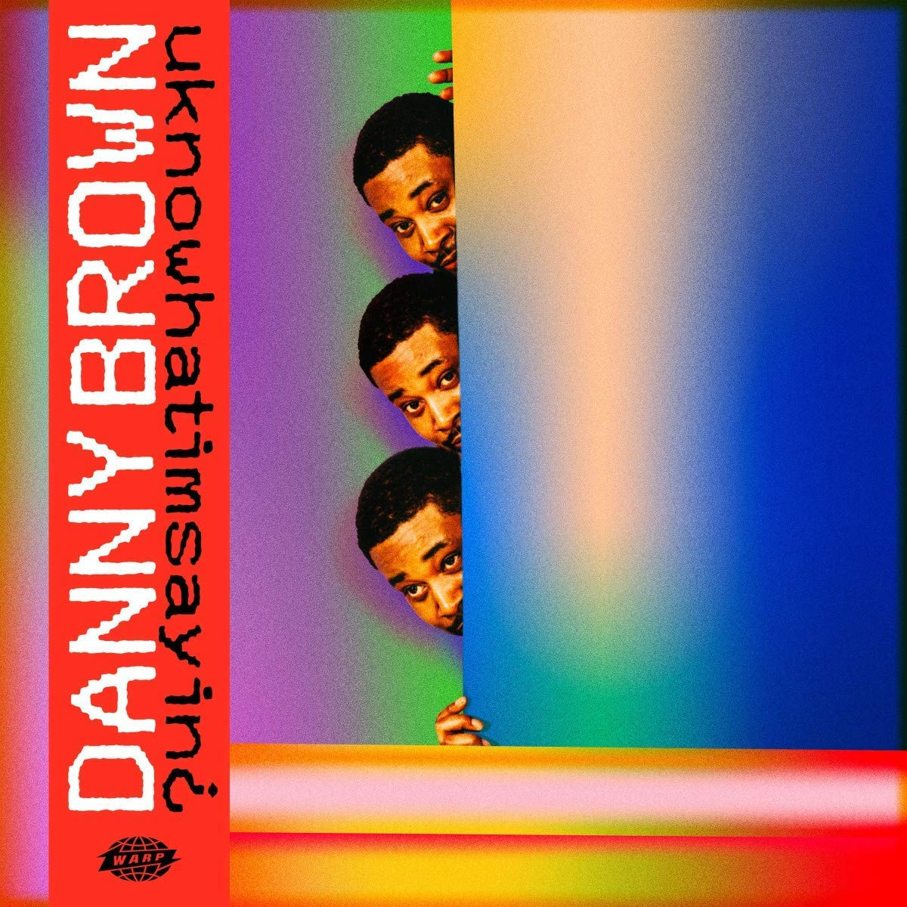

import { Slider, Button } from 'carbon-components-react';
import { ArrowUpRight24  } from '@carbon/icons-react';

import SliderJS1 from "../review/slider1"
import SliderJS2 from "../review/slider2"
import SliderJS3 from "../review/slider3"
import SliderJS4 from "../review/slider4"

import { Link } from "gatsby"

import Review1 from "../review/dannybrown3.mdx"

Album Review

<h1 className="h1--no--margin">{props.pageContext.frontmatter.title}</h1>

<Link to="/best50/2019/">2019 Black Music Album Best No.11</Link>

 
<Row  className="image-card-group">
	<Column colMd={"3"} colLg={"4"} noGutterMdLeft="">
       <ImageCard>

 
</ImageCard>
	</Column>
	<Column colMd={"4"} colLg={"8"} noGutterMdLeft="">
		

			Danny Brownの3年ぶり5作目。Executive ProducerにQ-Tipを迎えたということで話題になっている。そのQ-Tipが3曲、お馴染みPaul Whiteが4曲担当している。音楽で笑わせようと思って、と本人が言っているように、今までの異端児、鬼才的なキャラは残しつつ、Lyricなどはコミカルなところもある(自分には理解が足りませんが)。Trackも、不穏なところも残しつつも、明らかにカラフルになり、Funk, Jazz, Soulなどをベースにしていて、サンプリングも程よく、聴きどころ多数になっている。ひしゃげたRapは変わりようがないが、かえって、こういう路線に合ってるかと思う。
		

		

	  <Button className="button-right-mergin"  href="https://amzn.to/3eHNAI7" kind="primary" size="small" renderIcon={ArrowUpRight24}>
      amazon.com
    </Button>
    <Button className="button-right-mergin"  href="https://amzn.to/3eGnXr7" kind="secondary" size="small" renderIcon={ArrowUpRight24}>
      amazon.co.jp
    </Button>
		

		
		
	</Column>
</Row>
<Row >
	<Column colMd={"4"} colLg={"4"} noGutterMdLeft="">
		

    	<h3>Score card</h3>
			<SliderJS1 value="1" />
    	<SliderJS2 value="2" />
			<SliderJS3 value="2" />
    	<SliderJS4 value="9" />
		

	</Column>
	<Column colMd={"8"} colLg={"8"} noGutterMdLeft="">
		

			<h3>Producers</h3>
			

				Paul White(1,5,8)
				 Cartie Curt(2)
				 Q-Tip(3,7,11)
				 JPEGMAFIA(4)
				 Playa Haze(6)
				 Flying Lotus(9)
				 Paul White, Standing On The Corner and Slauson Malone(10)
			

			<h3>Guests</h3>
			

				Run The Jowels, Obongjayar, JPEGMAFIA, Blood Ogange, Thundercat
			

		

	</Column>
</Row>

<h3>Tracks</h3>

| No. |	 Title             |	 Composers                                                                  | Performer                        |  Time |
| --- |	------------------ | ------------------------------------------------------------------------------ | -------------------------------- | ----- |
| 1	  |	Change Up          | Daniel Sewell / Paul White                                                    	| Danny Brown                      | 02:41 |
| 2	  |	Theme Song         | Christopher Cross / Daniel Sewell                                             	| Danny Brown                      | 02:46 |
| 3	  |	Dirty Laundry      | Kamaal Fareed / Daniel Sewell                                                 	| Danny Brown feat. Run The Jowels | 03:03 |
| 4	  |	3 Tearz            | Barrington Devaugh Hendricks / Jaime Meline / Michael Render / Daniel Sewell  	| Danny Brown feat. Obongjayar     | 03:56 |
| 5	  |	Belly of the Beast | Daniel Sewell / Steven Umoh / Paul White                                      	| Danny Brown                      | 02:34 |
| 6	  |	Savage Nomad       | Daniel Sewell / Deven Welch                                                   	| Danny Brown                      | 03:28 |
| 7	  |	Best Life          | Kamaal Fareed / Daniel Sewell                                                 	| Danny Brown                      | 02:33 |
| 8	  |	uknowhatimsayin¿   | Daniel Sewell / Steven Umoh / Paul White                                      	| Danny Brown feat. Obongjayar     | 02:55 |
| 9	  |	Negro Spiritual    | Stephen Bruner / Steven Ellison / Barrington Devaugh Hendricks / Daniel Sewell	| Danny Brown feat. JPEGMAFIA      | 02:44 |
| 10  |	Shine              | Daniel Sewell                                                                 	| Danny Brown feat. Blood Ogange   | 03:18 |
| 11  |	Combat             | Kamaal Fareed / Daniel Sewell                                                 	| Danny Brown                      | 03:38 | 

<h3>Other Reviews</h3>

<Row>
<Column colMd={3} colLg={3} noGutterMdLeft>
<Review1 />
</Column>
</Row>