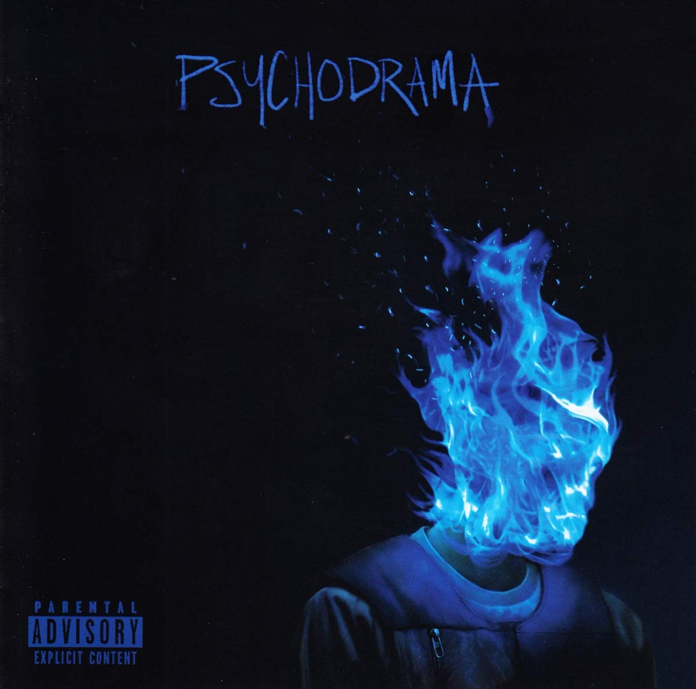

import { Slider, Button } from 'carbon-components-react';
import { ArrowUpRight24  } from '@carbon/icons-react';

import SliderJS1 from "../review/slider1"
import SliderJS2 from "../review/slider2"
import SliderJS3 from "../review/slider3"
import SliderJS4 from "../review/slider4"

import { Link } from "gatsby"

CD review

<h1 className="h1--no--margin">{props.pageContext.frontmatter.title}</h1>

<Link to="/best50/2019/">2019 Black Music Album Best No.12</Link>

 
<Row  className="image-card-group">
	<Column colMd={"4"} colLg={"4"} noGutterMdLeft="">
       <ImageCard>

 
</ImageCard>
	</Column>
	<Column colMd={"8"} colLg={"8"} noGutterMdLeft="">
	
South London出身のRapper, Daveの1st album。2019/3リリース当時は20歳と若手ではあるが、Brit AwardやUKチャート1位を獲得し、現地ではメジャーな存在になっている。Nigelia移民の両親を持つとのことで、⑤のGuestのBurna Boyとの相性の良さも示している。タイトルは心理療法のことで、アルバムのところどころで、カウンセラーのせりふが入ったりしている。貧困、ドラッグ、DV、人種問題などの社会的テーマや恋愛、成功してからの苦悩、ちょっとした自分自慢をRapしているのだが、そのリリシストぶりと卓越したワードプレイが話題になっている。Trackは、全体的に陰鬱気味で、明るい曲は1曲くらい。
	<Link href="https://note.com/nakam_24/n/neddb0587c970">ネットの全曲解説</Link>がとても参考になるので、これを読みながら聴くことをお勧めします。

	

	  <Button href="https://amzn.to/2WQpAvK" kind="primary" size="small" renderIcon={ArrowUpRight24}>
      amazon.com
      </Button>
      <Button href="https://amzn.to/32WsKBI" kind="secondary" size="small" renderIcon={ArrowUpRight24}>
      amazon.co.jp
      </Button>
	

	
	
</Column>
</Row>
<Row >
	<Column colMd={"4"} colLg={"4"} noGutterMdLeft="">

    <h3>Score card</h3>
	<SliderJS1 value="2" />
    <SliderJS2 value="1" />
	<SliderJS3 value="2" />
    <SliderJS4 value="8" />

</Column>
<Column colMd={"8"} colLg={"8"} noGutterMdLeft="">

<h3>Producers</h3>

Kyle Evans(1,4)
 Nana Rogues(2)
 Fraser T Smith(3,8,9,11)
 Jae5(5)
 TSB and IO(6)
 169, Fraser T Smith and Dave(7)
 1Mind(10)

<h3>Guests</h3>

Burna Boy, J Hus, Ruelle

</Column>
</Row>

<h3>Tracks</h3>

| No. |	 Title            |	 Composers                                                                                     |	 Performer        |	 Time |
| --- |	----------------- | ---------------------------------------------------------------------------------------------- | -------------------- | ----- |
| 1	  |	Psycho            | Maggie Eckford / Kyle Evans / Alexi von Guggenburg / David Omoregie / Josh Bruce Williams      | Dave                 |	04:09 |
| 2	  |	Streatham         | David Omoregie / Nana Rogues                                                                   | Dave                 |	03:26 |
| 3	  |	Black             | David Omoregie / Fraser T. Smith                                                               | Dave                 |	03:48 |
| 4	  |	Purple Heart      | Marsha Ambrosius / Kyle Evans / Lonnie Lynn / David Omoregie / Natalie Stewart / Scott Storch  | Dave                 |	02:44 |
| 5	  |	Location          | Jonathan Mensah / Damini Ebunoluwa Ogulu / David Omoregie                                      | Dave feat. Burna Boy |	04:01 |
| 6	  |	Disaster          | Momodou Jallow / Ikeoluwa Oladigbolu / David Omoregie                                          | Dave                 |	04:00 |
| 7	  |	Screwface Capital | David Omoregie / Tyrrell Paul / Fraser T. Smith / Setlam Woldehaimanot                         | Dave feat J Hus      |	04:13 |
| 8	  |	Environment       | David Omoregie / Fraser T. Smith                                                               | Dave                 |	03:23 |
| 9	  |	Lesley            | Maggie Eckford / James Napier / David Omoregie / Fraser T. Smith                               | Dave feat. Ruelle    |	11:08 |
| 10  |	Voices            | Keith Askey / David Omoregie / Jacob Reske / Fraser T. Smith / McCulloch Reid Sutphin          | Dave                 |	03:18 |
| 11  |	Drama             | Maggie Eckford / Alexi von Guggenburg / David Omoregie / Fraser T. Smith / Josh Bruce Williams | Dave                 |	07:04 |
