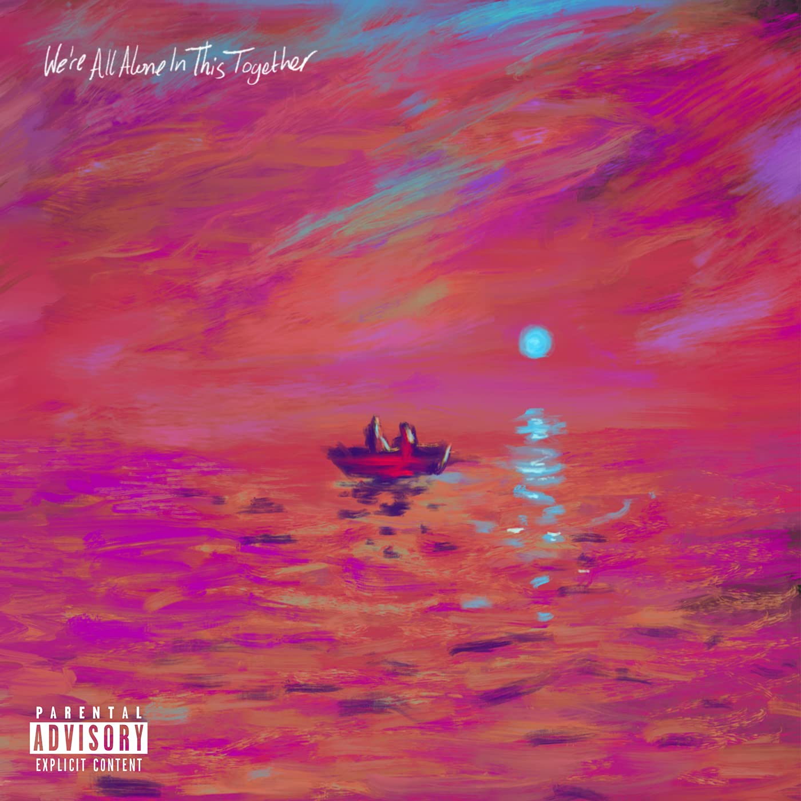

import { Slider, Button } from "carbon-components-react";
import { ArrowUpRight24 } from "@carbon/icons-react";

import SliderJS1 from "../review/slider1";
import SliderJS2 from "../review/slider2";
import SliderJS3 from "../review/slider3";
import SliderJS4 from "../review/slider4";
import AdvJS2 from "../review/adv2";
import AdvJS3 from "../review/adv3";

import { Link } from "gatsby";

import Review1 from "../review/dave1.mdx";

Album review

<h1 className="h1--no--margin">{props.pageContext.frontmatter.title}</h1>

  <Link to="/best50/2021/">2021 Black Music Album Best No.13</Link>

<Row  className="image-card-group">
	<Column colMd={"3"} colLg={"4"} noGutterMdLeft="">
       <ImageCard>

</ImageCard>
	</Column>
	<Column colMd={"4"} colLg={"8"} noGutterMdLeft="">
		

			Daveの2年ぶりとなる2nd album。デビュー作で、Brit Award, Mercury PrizeのAlbum Of The Yearを獲得し、チャート1位も記録して、UKでは時の人になったわけだが、この2作目も好調を維持し、既にチャート1位を獲得している。
			 アルバムタイトルにあるように孤独や、様々な社会的問題に加え、売れてからの本人の苦悩など、引き続きLyricはシリアスなものになっている。
			 Trackも哀愁感のあるダークなものから入っていくが、途中、Nigeria出身のWizkidをGuestに迎えたAfrican BeatとRegaeが混ざったような⑥あたりから、雰囲気が変わり、途端にカラフルでバラエティに富んだ展開となり、James Blakeとの⑨までが、個人的には面白いと思った。
			 ただ、⑩以降、元のトーンに戻り、Albumは締めくくられる。DaveのRapは力強く、その分、Lyricの訴求力も増していると思う。
		

		

		  <Button className="button-right-mergin"  href="https://amzn.to/3sLQ8yu" kind="primary" size="small" renderIcon={ArrowUpRight24}>
  	    amazon.com
  	  </Button>
  	  <Button className="button-right-mergin"  href="https://amzn.to/3KmfVmY" kind="secondary" size="small" renderIcon={ArrowUpRight24}>
  	    amazon.co.jp
  	  </Button>
			<Button className="button-right-mergin"  href="https://apple.co/3tzCQUR" kind="tertiary" size="small" renderIcon={ArrowUpRight24}>
  	   	apple music
  	  </Button>
			<AdvJS2/>
		

	</Column>
</Row>
<Row >
	<Column colMd={"4"} colLg={"4"} noGutterMdLeft="">
		

		  <h3>Score card</h3>
			<SliderJS1 value="2" />
		  <SliderJS2 value="1" />
			<SliderJS3 value="2" />
		  <SliderJS4 value="8" />
		

	</Column>
	<Column colMd={"8"} colLg={"8"} noGutterMdLeft="">
		

			<h3>Producers</h3>
			

				Kyle Evans, Santan and Nana Rogues(1)
				 Kyle Evans(2,3)
				 Santan and James Blake(4)
				 Kyle Evans and James Blake(5)
				 P2J and Kyle Evans(6)
				 Jae5(7,8)
				 James Blake, Dom Maker and Kyle Evans(9)
				 Santan, P2J and Kyle Evans(10)
				 Santan(11,12)
			

			<h3>Guests</h3>
			

				Stormzy, Wizkid, BOJ, Snoh Aalegra, James Blake
			

		

	</Column>
</Row>

<h3>Tracks</h3>

| No. | Title                 | Composers                                                                                                                 | Performer               | Time  |
| --- | --------------------- | ------------------------------------------------------------------------------------------------------------------------- | ----------------------- | ----- |
| 1   | We're All Alone       | Dave / Kyle Evans                                                                                                         | Dave                    | 04:40 |
| 2   | Verdansk              | Dave / Kyle Evans                                                                                                         | Dave                    | 03:02 |
| 3   | Clash                 | Dave / Kyle Evans / Luke Grieve / Stormzy                                                                                 | Dave feat: Stormzy      | 04:12 |
| 4   | In the Fire           | Milton Biggham / James Blake / Justin Clarke / Dave / Kyle Evans / Fredo / Giggs / Dominic Maker / Meekz / Jason Thompson | Dave                    | 07:03 |
| 5   | Three Rivers          | James Blake / Dave / Kyle Evans                                                                                           | Dave                    | 05:31 |
| 6   | System                | Ayodeji Balogun / Dave / Eight9FLY / Kyle Evans / Emmanuel Isong / Tay Iwar / P2J / Joe Reeves                            | Dave feat: Wizkid       | 03:01 |
| 7   | Lazarus               | BOJ / Dave / Jae5 / Joe Reeves                                                                                            | Dave feat: BOJ          | 03:24 |
| 8   | Law of Attraction     | Snoh Aalegra / Dave / Jae5                                                                                                | Dave feat: Snoh Aalegra | 03:01 |
| 9   | Both Sides of a Smile | James Blake / Dave                                                                                                        | Dave feat: James Blake  | 07:59 |
| 10  | Twenty to One         | Dave                                                                                                                      | Dave                    | 03:21 |
| 11  | Heart Attack          | James Blake / Dave / Joe Reeves                                                                                           | Dave                    | 09:55 |
| 12  | Survivor's Guilt      | Dave / Jorja Smith                                                                                                        | Dave                    | 05:40 |

<h3>Other Reviews</h3>

<Row>
  <Column colMd={3} colLg={3} noGutterMdLeft>
    <Review1 />
  </Column>
</Row>

<AdvJS3 />
