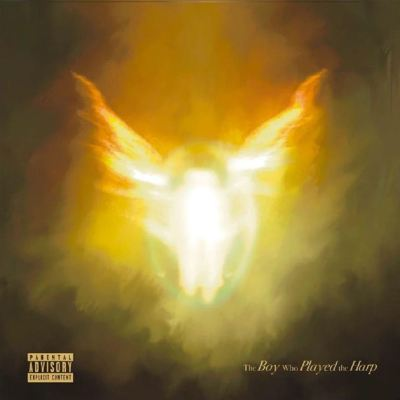

import { Slider, Button } from "@carbon/react";
import { ArrowUpRight } from "@carbon/icons-react";

import SliderJS1 from "../review/slider1";
import SliderJS2 from "../review/slider2";
import SliderJS3 from "../review/slider3";
import SliderJS4 from "../review/slider4";
import AdvJS2 from "../review/adv2";
import AdvJS3 from "../review/adv3";

import { Link } from "gatsby";
import Review1 from "../review/dave2.mdx";
import Review2 from "../review/dave1.mdx";

Album Review

<h1 className="h1--no--margin">{props.pageContext.frontmatter.title}</h1>

	<Link to="/best50/2025/">2025 Black Music Album Best No.23</Link>

<Row  className="image-card-group">
	<Column colMd={3} colLg={4} noGutterMdLeft="">
       <ImageCard>

</ImageCard>
	</Column>
	<Column colMd={4} colLg={8} noGutterMdLeft="">
		

			UKのRapper, Daveの2年ぶりとなる3作目。メディアでは高い評価を受け、Brit Awards最優秀ヒップホップ/グライム/ラップ賞を受賞している。
			 アルバム全体として非常に内省的で、静かで、聴き手に問いかけるような雰囲気が漂っており、成功の影にある孤独や不安、実存的危機を深く掘り下げるようなリリックとなっていて、聖書に登場するダビデ王がハープでサウル王を癒やした物語をモチーフに、「自身の使命」を問い直している。
       サウンド面では、ピアノの旋律を軸にした最小限で繊細な編曲が特徴で、抑制的でゆったりとした全体感がある。ハープ、ダブルベース、チェロといった生楽器が多用されたチェンバー・ラップといえるもので、これにゴスペルやアフロビーツの要素も織り交ぜ、幽玄な空気感を作り出している。これにDaveの真摯な語り口のRapが加わる。
			 制作はDave自身（Santan名義）に加え、Jo CalebやJonny Leslieらが主導していてる。ゲストには、複数曲でWritingにも参加しているJames BlakeやTems、重鎮Kano、Jim Legxacyなど。
		

		

		  <Button className="button-right-mergin"  href="https://amzn.to/4tjfD76" renderIcon={ArrowUpRight} size='sm' kind='primary'>
  	    amazon.com
  	  </Button>
  	  <Button className="button-right-mergin"  href="https://amzn.to/4tSqu82" renderIcon={ArrowUpRight} size='sm' kind='secondary'>
  	    amazon.co.jp
  	  </Button>
			<Button className="button-right-mergin"  href="https://apple.co/3QpxtXw" renderIcon={ArrowUpRight} size='sm' kind='tertiary'>
  	    apple music
  	  </Button>
		<AdvJS2/>
		

	</Column>
</Row>
<Row >
	<Column colMd={4} colLg={4} noGutterMdLeft="">
		

		  <h3>Score card</h3>
			<SliderJS1 value="2" />
		  <SliderJS2 value="1" />
			<SliderJS3 value="2" />
		  <SliderJS4 value="9" />
		

	</Column>
	<Column colMd={4} colLg={8} noGutterMdLeft="">
		

			<h3>Producers</h3>
			

				James Blake(1,11)
				 Santan(2,4,7)
				 Santan, Jim Legxacy, Jo Caleb, Jonny Leslie, Kyle Evans(3)
				 Kyle Evans(5)
				 Santan and James Blake(6)
				 Jo Caleb and Kyle Evans(8)
				 Santan, Jo Caleb and Kyle Evans(9)
				 Fraser T. Smith(10)
			

			<h3>Guests</h3>
			

				James Blake, Jim Legxacy, Kano, Tems, Nicole Blakk
			

		

	</Column>
</Row>

<h3>Tracks</h3>

| No. | Title                       | Composers                                                                | Performer              | Time |
| --- | --------------------------- | ------------------------------------------------------------------------ | ---------------------- | ---- |
| 1   | History                     | David Omoregie, James Blake                                              | Dave feat. James Blake | 4:06 |
| 2   | 175 Months                  | David Omoregie, James Blake, Harrison Fisher, Jamil Pierre, Boy Matthews | Dave                   | 4:34 |
| 3   | No Weapons                  | David Omoregie, Jim Legxacy, Jo Caleb, Jonny Leslie, Kyle Evans          | Dave feat. Jim Legxacy | 3:18 |
| 4   | Chapter 16                  | David Omoregie, Kane Robinson, James Blake                               | Dave feat. Kano        | 6:20 |
| 5   | Raindance                   | David Omoregie, Temilade Openiyi, Kyle Evans                             | Dave feat. Tems        | 3:39 |
| 6   | Selfish                     | David Omoregie, James Blake                                              | Dave feat. James Blake | 4:31 |
| 7   | My 27th Birthday            | David Omoregie, Jo Caleb, Jonny Leslie, Elijah Fox, Grayson Lane         | Dave                   | 7:51 |
| 8   | Marvellous                  | David Omoregie, Jo Caleb, Kyle Evans                                     | Dave                   | 3:01 |
| 9   | Fairchild                   | David Omoregie, Jo Caleb, Kyle Evans                                     | Dave                   | 5:46 |
| 10  | The Boy Who Played the Harp | David Omoregie, Fraser T. Smith, John Lennon, Paul McCartney             | Dave                   | 4:37 |

<h3>Other Reviews</h3>

<Row>
  <Column colMd={3} colLg={3} noGutterMdLeft>
    <Review1 />
  </Column>
  <Column colMd={3} colLg={3} noGutterMdLeft>
    <Review2 />
  </Column>
</Row>

<AdvJS3 />
