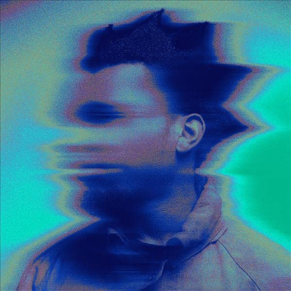

import { Slider, Button } from "@carbon/react";
import { ArrowUpRight } from "@carbon/icons-react";

import SliderJS1 from "../review/slider1";
import SliderJS2 from "../review/slider2";
import SliderJS3 from "../review/slider3";
import SliderJS4 from "../review/slider4";
import AdvJS2 from "../review/adv2";
import AdvJS3 from "../review/adv3";

import { Link } from "gatsby";

import Review1 from "../review/denzelcurry1.mdx";

Album Review

<h1 className="h1--no--margin">{props.pageContext.frontmatter.title}</h1>

  <Link to="/best50/2022/">2022 Black Music Album Best No.12</Link>

 
<Row  className="image-card-group">
	<Column colMd={3} colLg={4} noGutterMdLeft="">
       <ImageCard>

</ImageCard>
	</Column>
	<Column colMd={4} colLg={8} noGutterMdLeft="">
	

		Denzel Curryの4年ぶり、3作目。日本のサブカルチャー好きで知られる人ではあるが、現地盤では珍しいCDスリーブが日本語になっていて、タイトルも"目が溶ける 未来を目指せ"と記載されてたり、⑫⑬と日本映画にインスパイアされた曲があったりと、その影響を全面に出している。
		 冒頭のRobert Glasperによる①やThundercatによる⑪、さらには⑭などのJazzyでネオソウルっぽい曲や、⑧⑩などのメロウなTrackが新鮮なところで、これに加え、Trapやドラムンベースなど今まで路線のTrackもあって、サウンドは相当に多彩で飽きさせない。
		 また、女性コーラスの入った曲が多く、彩りを添えている。コロナ禍で自己と向き合ったというLyricや、淀みないRapも、もちろん聴きどころとなっている。
	

		

		  <Button className="button-right-mergin"  href="https://amzn.to/3ZWd90d" renderIcon={ArrowUpRight} size='sm' kind='primary'>
  	    amazon.com
  	  </Button>
  	  <Button className="button-right-mergin"  href="https://amzn.to/3D8K8EE" renderIcon={ArrowUpRight} size='sm' kind='secondary'>
  	    amazon.co.jp
  	  </Button>
			<Button className="button-right-mergin"  href="https://apple.co/3XOAYFq" renderIcon={ArrowUpRight} size='sm' kind='tertiary'>
  	    apple music
			</Button>
			<AdvJS2/>
		

	</Column>
</Row>
<Row >
	<Column colMd={4} colLg={4} noGutterMdLeft="">
		

		  <h3>Score card</h3>
			<SliderJS1 value="1" />
		  <SliderJS2 value="2" />
			<SliderJS3 value="2" />
		  <SliderJS4 value="9" />
		

</Column>
<Column colMd={8} colLg={8} noGutterMdLeft="">
	

		<h3>Producers</h3>
		

			Robert Glasper(1)
			 Kal Banx(2)
			 Dot Da Genius and Naz(3)
			 Jpegnafia(4)
			 FNZ and HWLS(5)
			 Elijah Fox, J Gramm and Mike Hector(6)
			 Kenny Beatz and DJ Kahlil(7)
			 Powers Pleasant(8,13)
			 Clutch George, Darko and Drtwrk(9)
			 Karriem Riggins and Mickey De Grand IV(10)
			 Thundercat(11)
			 CardoGotWings(12)
			 Dot Da Genius and Noah Goldstein(14)
		

		<h3>Guests</h3>
		

			Robert Glasper, Buzzzy Lee, Saul Williams, Bridget Perez, T-Pain, 6lack, Rico Nasty, J.I.D., Jasiah, Kitty Ca$h, Karriem Riggins, 454, Slowtai, Thundercat, Buddy
		

	

</Column>
</Row>

<h3>Tracks</h3>

| No. | Title                | Composers                                                                                                                                                                            | Performer                                                        | Time  |
| --- | -------------------- | ------------------------------------------------------------------------------------------------------------------------------------------------------------------------------------ | ---------------------------------------------------------------- | ----- |
| 1   | Melt Session #1      | Bridget Perez, Denzel Curry, Robert Glasper                                                                                                                                          | Denzel Curry feat. Robert Glasper                                | 04:01 |
| 2   | Walkin               | Denzel Curry, Kalon Berry, Keith Mansfield                                                                                                                                           | Denzel Curry                                                     | 04:39 |
| 3   | Worst Comes To Worst | Alain Macklovitch, Anna Wise, Bappi Lahiri, Denzel Curry, Jushua Portillo, Oladipo Omishore, Salma Agha                                                                              | Denzel Curry                                                     | 02:50 |
| 4   | John Wayne           | Barrington Hendricks, Denzel Curry, Sasha Spielberg                                                                                                                                  | Denzel Curry feat. Buzzzy Lee                                    | 02:36 |
| 5   | The Last             | Denzel Curry, Issac De Boni, Justin Elwin, Michael Mule, Ryan Degrandy                                                                                                               | Denzel Curry                                                     | 04:22 |
| 6   | Mental               | Bridget Perez, Denzel Curry, Elijah Fox, Julian Gramma, Mike Hector, Saul Williams                                                                                                   | Denzel Curry feat. Saul Williams, Bridget Perez                  | 02:26 |
| 7   | Troubles             | Denzel Curry, Faheem Najm, Kenneth Blume III, Kahlil Abdul-Rahman                                                                                                                    | Denzel Curry feat. T-Pain                                        | 02:39 |
| 8   | Ain’t No Way         | Cachee Livingston, Denzel Curry, Destin Route, Louis Leibfried, Malachi-Phree Pate, Maria Kelly, Powers Pleasant, Ricardo Valentine, Robert Glasper, Simmie Simms III, Tim Friedrich | Denzel Curry feat. 6lack, Rico Nasty, J.I.D., Jasiah, Kitty Ca$h | 04:24 |
| 9   | X-Wing               | Denzel Curry, George. Mardoyan, Julius Herold, Matthew Jehu Samuels, Michał Suski                                                                                                    | Denzel Curry                                                     | 02:55 |
| 10  | Angelz               | Bridget Perez, Denzel Curry, Karriem Riggins, Linda Hargrove, Mark Ellerbee, Ryan Degrandy, Sharina Castillo                                                                         | Denzel Curry feat. Karriem Riggins                               | 03:51 |
| 11  | The Smell Of Death   | Denzel Curry, Stephen Bruner                                                                                                                                                         | Denzel Curry                                                     | 01:20 |
| 12  | Sanjuro              | Willie Wilson, Denzel Curry, Kalon Berry, Ronald Latour Jr.                                                                                                                          | Denzel Curry feat. 454                                           | 02:07 |
| 13  | Zatoichi             | Bridget Perez, Denzel Curry, Jonathan Birkner, Powers Pleasant, Richard Spencer, Tyron Kaymone Frampton                                                                              | Denzel Curry feat. Slowtai                                       | 03:30 |
| 14  | The Ills             | Alain Macklovitch, Denzel Curry, Noah. Goldstein, Oladipo Omishore                                                                                                                   | Denzel Curry                                                     | 03:22 |

<h3>Other Reviews</h3>

<Row>
  <Column colMd={3} colLg={3} noGutterMdLeft>
    <Review1 />
  </Column>
</Row>

<AdvJS3 />
