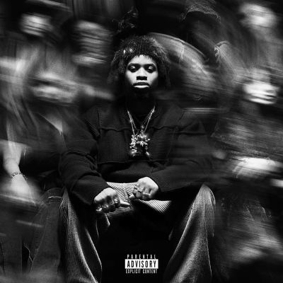

import { Slider, Button } from "@carbon/react";
import { ArrowUpRight } from "@carbon/icons-react";

import SliderJS1 from "../review/slider1";
import SliderJS2 from "../review/slider2";
import SliderJS3 from "../review/slider3";
import SliderJS4 from "../review/slider4";
import AdvJS2 from "../review/adv2";
import AdvJS3 from "../review/adv3";

import { Link } from "gatsby";

import Review1 from "../review/denzelcurry1.mdx";
import Review2 from "../review/denzelcurry2.mdx";

Album Review

<h1 className="h1--no--margin">{props.pageContext.frontmatter.title}</h1>

 
<Row  className="image-card-group">
	<Column colMd={3} colLg={4} noGutterMdLeft="">
       <ImageCard>

</ImageCard>
	</Column>
	<Column colMd={4} colLg={8} noGutterMdLeft="">
	

		2024年秋にリリースされたDenzel CurryのMix Tape。この少し前にドロップされたKing of the Mischievous South, Vol. 2に数曲足されたComplete盤である。ややこしいが、そのVol. 2は10年前にリリースされたVol. 1の続編である。
		 前作のMelt My Eyez See Your Futureはメローな印象が強かったが、今回はサウス色全開のコアなRap Albumになっている。GuestやProducerもA$AP Mobbの二人を除きサウス方面からの参加となり、メジャーな人たちは少な目。Trackもバウンシーなものが多く、ただ、後半にかけてはメローな曲も少々。
		 どうしても同じようなTrackがならんでしまうが、Denzalの唄うようなRapは芯が強く、個々の曲のクオリティは高い。
		 2024/11/21の恵比寿ガーデンホールのライブを見に行ったが、半数程度は、当作からの披露であり、盛り上がっていた。なお、④参加のTiaCorineは父方の祖父が日本人のクオーターだそう。
	

		

		  <Button className="button-right-mergin"  href="https://amzn.to/3W0v6dA" renderIcon={ArrowUpRight} size='sm' kind='primary'>
  	    amazon.com
  	  </Button>
  	  <Button className="button-right-mergin"  href="https://amzn.to/41Te84A" renderIcon={ArrowUpRight} size='sm' kind='secondary'>
  	    amazon.co.jp
  	  </Button>
			<Button className="button-right-mergin"  href="https://apple.co/4gTNU6yq" renderIcon={ArrowUpRight} size='sm' kind='tertiary'>
  	    apple music
			</Button>
			<AdvJS2/>
		

	</Column>
</Row>
<Row >
	<Column colMd={4} colLg={4} noGutterMdLeft="">
		

		  <h3>Score card</h3>
			<SliderJS1 value="1" />
		  <SliderJS2 value="2" />
			<SliderJS3 value="2" />
		  <SliderJS4 value="8" />
		

	</Column>
	<Column colMd={8} colLg={8} noGutterMdLeft="">
		

			<h3>Producers</h3>
			

				Montag Da Leadah and Mickey De Grand IV(1)
				 Montag Da Leadah, Mickey De Grand IV, DJ Poshtronaut, Nick León and DJ Qeys(2)
				 ilykimchi, Oogie Mane and Darkboy Santana(3)
				 FNZ and SkipOnDaBeat(4)
				 FNZ(5)
				 Payday and Kill(6)
				 Bizness Boi, Derelle Rideout, RicoRunDat and MUDDY(7,8)
				 DJ Poshtronaut and Julian Menkin(9)
				 Charlie Heat(10)
				 Powers Pleasant & Ben10k(11)
				 Hollywood Cole(12)
				 MAD WORLD and Mickey De Grand IV(13)
				 454 and Mickey De Grand IV(14)
				 MAD WORLD(15)
				 ilykimchi, Oogie Mane and Xydra(16)
				 Charlie Heat(17)
				 Kwes Darko(18)
				 Denzel Curry and Kingpin Skinny Pimp(19)
			

			<h3>Guests</h3>
			

				Kingpin Skinny Pimp, Key Nyata, axo Kream, A$AP Ferg, TiaCorine, Duke Deuxe, Slim Guerilla, That Mexican OT, 2 Chainz, Mike Dimes, Kenny Mason, Project Pat, Ty Dolla $ign, Juicy J, Sauce Walka, 454, Armani White, Ski Mask the Slump God, LAZER DIM 700, Btherula, Playthatboizay, A$AP Rocky
			

		

	</Column>
</Row>

<h3>Tracks</h3>

| No. | Title                  | Composers                                                                                                                                                                                                                     | Performer                                     | Time  |
| --- | ---------------------- | ----------------------------------------------------------------------------------------------------------------------------------------------------------------------------------------------------------------------------- | --------------------------------------------- | ----- |
| 1   | KOTMS II (INTRO)       | Ryan Degrandy, Vero La Grande De Durango, Darius Hill, Derrick Dewayne Hill, Montag Da Leadah                                                                                                                                 | Denzel Curry feat. Kingpin Skinny Pimp        | 00:33 |
| 2   | ULTRA SHXT             | K. Bailey, Kishaun Bailey, Denzel Curry, Ryan Degrandy, Vero La Grande De Durango, Darius Hill, Derrick Dewayne Hill, Nick León, Lowkey, Adam Porterfield, DJ Poshtronaut, DJ Qeys                                            | Denzel Curry feat. Key Nyata                  | 03:16 |
| 3   | SET IT                 | Denzel Curry, Darius Hill, Derrick Dewayne Hill, Emekwanem Biosah Jr., Jordan Ortiz                                                                                                                                           | Denzel Curry feat. Maxo Kream                 | 02:40 |
| 4   | HOT ONE                | Paul Beauregard, Isaac de Boni, Denzel Curry, Darold Ferguson, Edgar Ferrera, Darius Hill, Derrick Dewayne Hill, Nick Le?n, Julian Menkin, Michael Mule, Adam Porterfield, DJ Poshtronaut, DJ Qeys, T. Thompson, Tia Thompson | Denzel Curry feat. A$AP Ferg, TiaCorine       | 02:45 |
| 5   | ACT A DAMN FOOL        | Denzel Curry, Duke Deuce, Slim Guerilla, Finatik, Zac                                                                                                                                                                         | Denzel Curry feat. Duke Deuxe / Slim Guerilla | 03:43 |
| 6   | BLACK FLAG [FREESTYLE] | Denzel Curry, Virgil Gazca, Darius Hill, Derrick Dewayne Hill, R. Johnson, Wojciech Kilar, Rasheed Thomas, Rickie Thomas                                                                                                      | Denzel Curry feat. That Mexican OT            | 03:27 |
| 7   | HEADCRACK (INTERLUDE)  | Darius Hill, Derrick Dewayne Hill, Nick Le?n, Julian Menkin, Muddy, DJ Poshtronaut, RicoRunDat, Derelle Rideout                                                                                                               | Denzel Curry feat. Kingpin Skinny Pimp        | 00:29 |
| 8   | G’Z UP                 | Denzel Curry, Tauheed Epps, Michael Goode, Michael Goode Jr., Kanda, Derelle Rideout, Andre Robertson, Robertson, Kevin Da Silva                                                                                              | Denzel Curry feat. 2 Chainz, Mike Dimes       | 03:33 |
| 9   | LUNATIC (INTERLUDE)    | Paul Beauregard, Darius Hill, Derrick Dewayne Hill, Nick Le?n, Julian Menkin, DJ Poshtronaut                                                                                                                                  | Denzel Curry feat. Kingpin Skinny Pimp        | 00:39 |
| 10  | SKED                   | Apollo Brown, Denzel Curry, Edwin Green, Jordan Houston, Patrick Houston, Ernest Brown III                                                                                                                                    | Denzel Curry feat. Kenny Mason, Project Pat   | 03:43 |
| 11  | GOT ME GEEKED          | Denzel Curry, Powers Pleasant, Ben10k                                                                                                                                                                                         | Denzel Curry                                  | 02:32 |
| 12  | COLE PIMP              | Kameron Cole, Denzel Curry, Elija Sostrom Fox-Peck, Tyrone Griffin, Lily Honigberg, Jordan Houston, William E. Page II, Edward Page, Willis Page, Ashton Sellars                                                              | Denzel Curry feat. Ty Dolla $ign, Juicy J     | 03:38 |
| 13  | P.O.P                  | Denzel Curry, Key Nyata, Sauce Walka, MAD WORLD, Mickey De Grand IV                                                                                                                                                           | Denzel Curry feat. Key Nyata, Sauce Walka     | 04:02 |
| 14  | ANOTHA LATE NITE       | Denzel Curry, 454, Mickey De Grand IV                                                                                                                                                                                         | Denzel Curry feta. 454                        | 02:56 |
| 15  | WISHLIST               | Denzel Curry, Delgado, Willie Hutch, Armani White                                                                                                                                                                             | Denzel Curry feat. Armani White               | 03:06 |
| 16  | HIT THE FLOOR          | 1xydra, Denzel Curry, Stokeley Goulbourne, Jordan Ortiz, Nelida Yew                                                                                                                                                           | Denzel Curry feat. Ski Mask the Slump God     | 03:26 |
| 17  | STILL IN THE PAINT     | Denzel Curry, LAZER DIM 700, Bktherula, Charlie Heat, Waka Flocka Flame                                                                                                                                                       | Denzel Curry feat. LAZER DIM 700, Btherula    | 03:53 |
| 18  | HOODLUMZ               | Denzel Curry, Kwes Darko, Darius Hill, Derrick Dewayne Hill, Jordan Houston, Isaiah Loubeau, Rakim Mayers                                                                                                                     | Denzel Curry feat. Playthatboizay, A$AP Rocky | 02:09 |
| 19  | KOTMS II (OUTRO)       | Denzel Curry, Darius Hill, Derrick Dewayne Hill                                                                                                                                                                               | Denzel Curry feat. Kingpin Skinny Pimp        | 00:31 |

<h3>Other Reviews</h3>

<Row>
  <Column colMd={3} colLg={3} noGutterMdLeft>
    <Review2 />
  </Column>
	<Column colMd={3} colLg={3} noGutterMdLeft>
  	<Review1 />
  </Column>
</Row>

<AdvJS3 />
