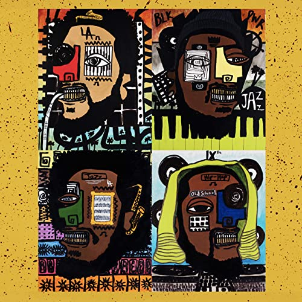

import { Slider, Button } from "@carbon/react";
import { ArrowUpRight } from "@carbon/icons-react";

import SliderJS1 from "../review/slider1";
import SliderJS2 from "../review/slider2";
import SliderJS3 from "../review/slider3";
import SliderJS4 from "../review/slider4";

import { Link } from "gatsby";

import Review1_1 from "../review/dinnerparty2.mdx";

import Review2_1 from "../review/terracemartin1.mdx";

import Review3_1 from "../review/robertglasper3.mdx";
import Review3_2 from "../review/robertglasper2.mdx";

import Review4_1 from "../review/kamasiwashington3.mdx";
import Review4_2 from "../review/kamasiwashington2.mdx";

Album review

<h1 className="h1--no--margin">{props.pageContext.frontmatter.title}</h1>

 
<Row  className="image-card-group">
	<Column colMd={3} colLg={4} noGutterMdLeft="">
       <ImageCard>

</ImageCard>
	</Column>
	<Column colMd={4} colLg={8} noGutterMdLeft="">
	

	Jazz Musician3人、Hip-Hop Producer1人によるオールスターユニット、Dinner Partyの2作目。7曲20分強という短めなので、EP相当か。
	 今年(2020年)7月にリリースされたオリジナルに唄やRapを乗せた本人たちによるRemix盤である。
	 ベースとなるのは、ゆったりとしたスムースなJazzであり、これにHip-Hop的味付けが載ったサウンドは、これはこれで心地よいが、さらに加わった豪華Guestによる唄やRapも見事に調和してると思う。これに昨今のBLM運動に呼応して、黒人コミュニティを描写したLyricが加わり、コンシャスな側面が強調されている。何重にも聴き応えがある作品である。
	

	

	  <Button className="button-right-mergin"  href="https://amzn.to/39PDJjS" renderIcon={ArrowUpRight} size='sm' kind='primary'>
      amazon.com
    </Button>
    <Button className="button-right-mergin"  href="https://amzn.to/37FT1VY" renderIcon={ArrowUpRight} size='sm' kind='secondary'>
      amazon.co.jp
    </Button>
		<Button className="button-right-mergin"  href="https://apple.co/2VLWYTh" renderIcon={ArrowUpRight} size='sm' kind='tertiary'>
      apple music
    </Button>
		<AdvJS2/>
	

	</Column>
</Row>
<Row >
	<Column colMd={4} colLg={4} noGutterMdLeft="">

  <h3>Score card</h3>
	<SliderJS1 value="4" />
  <SliderJS2 value="2" />
	<SliderJS3 value="1" />
  <SliderJS4 value="9" />

</Column>
<Column colMd={8} colLg={8} noGutterMdLeft="">

<h3>Producers</h3>

	9th Wonder, Kamasi Washington, Robert Glasper and Terrace Martin(all)

<h3>Guests</h3>

	Buddy, Phoelix, Snoop Dogg, Malaya, Tank and the Bangas, Bilal, Punch, Herbie Hancock, Rapsody, Cordae

</Column>
</Row>

<h3>Tracks</h3>

| No. | Title                     | Composers                                                                                                        | Performer                                                                                                  | Time  |
| --- | ------------------------- | ---------------------------------------------------------------------------------------------------------------- | ---------------------------------------------------------------------------------------------------------- | ----- |
| 1   | Sleepless Nights          | Buddy / Patrick Douthit / Robert Glasper / Terrace Martin / Michael E. Neil / Reuben Vincent / Kamasi Washington | Robert Glasper / Terrace Martin / Kamasi Washington / 9th Wonder feat. Buddy, Phoelix, Snoop Dogg          | 03:59 |
| 2   | Love You Bad              | Patrick Douthit / Robert Glasper / Terrace Martin / Michael E. Neil / Kamasi Washington / Malaya Watson          | Robert Glasper / Terrace Martin / Kamasi Washington / 9th Wonder feat. Malaya, Phoelix                     | 02:15 |
| 3   | From My Heart and My Soul | Tarriona 'Tank' Ball / Patrick Douthit / Robert Glasper / Terrace Martin / Michael E. Neil / Kamasi Washington   | Robert Glasper / Terrace Martin / Kamasi Washington / 9th Wonder feat. Phoelix, Tank and the Bangas        | 02:32 |
| 4   | First Responders          | Patrick Douthit / Robert Glasper / Terrence Henderson / Terrace Martin / Bilal Oliver / Kamasi Washington        | Robert Glasper / Terrace Martin / Kamasi Washington / 9th Wonder feat. Bilal, Punch                        | 03:02 |
| 5   | The Mighty Tree           | Patrick Douthit / Marlanna Evans / Robert Glasper / Herbie Hancock / Terrace Martin / Kamasi Washington          | Robert Glasper / Terrace Martin / Kamasi Washington / 9th Wonder feat. Rapsody, Herbie Hancock, Snoop Dogg | 02:16 |
| 6   | Freeze Tag                | Patrick Douthit / Cordae Dunston / Robert Glasper / Terrace Martin / Michael E. Neil / Kamasi Washington         | Robert Glasper / Terrace Martin / Kamasi Washington / 9th Wonder feat. Phoelix, Cordae, Snoop Dogg         | 03:11 |
| 7   | Luv U                     | Calvin Broadus / Patrick Douthit / Robert Glasper / Alex Isley / Terrace Martin / Kamasi Washington              | Robert Glasper / Terrace Martin / Kamasi Washington / 9th Wonder feat. Snoop Dogg, Alex Isley              | 03:18 |

<h3>Other Reviews</h3>

<Row>
  <Column colMd={3} colLg={3} noGutterMdLeft>
    <Review1_1 />
  </Column>
</Row>

<Row>
  <Column colMd={3} colLg={3} noGutterMdLeft>
    <Review2_1 />
  </Column>
</Row>

<Row>
  <Column colMd={3} colLg={3} noGutterMdLeft>
    <Review3_1 />
  </Column>
	<Column colMd={3} colLg={3} noGutterMdLeft>
    <Review3_2 />
  </Column>
</Row>

<Row>
  <Column colMd={3} colLg={3} noGutterMdLeft>
    <Review4_1 />
  </Column>
	<Column colMd={3} colLg={3} noGutterMdLeft>
    <Review4_2 />
  </Column>
</Row>

<AdvJS3 />