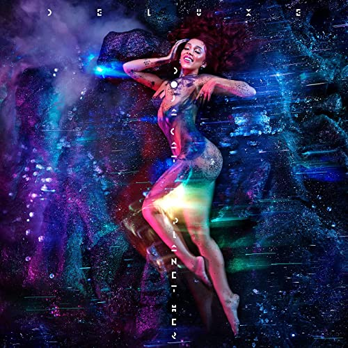

import { Slider, Button } from "carbon-components-react";
import { ArrowUpRight24 } from "@carbon/icons-react";

import SliderJS1 from "../review/slider1";
import SliderJS2 from "../review/slider2";
import SliderJS3 from "../review/slider3";
import SliderJS4 from "../review/slider4";
import AdvJS2 from "../review/adv2";
import AdvJS3 from "../review/adv3";

import { Link } from "gatsby";

Album review

<h1 className="h1--no--margin">{props.pageContext.frontmatter.title}</h1>

  <Link to="/best50/2021/">2021 Black Music Best No.11</Link>

<Row  className="image-card-group">
	<Column colMd={"3"} colLg={"4"} noGutterMdLeft="">
       <ImageCard>

</ImageCard>
	</Column>
	<Column colMd={"4"} colLg={"8"} noGutterMdLeft="">
	

		California出身のRapper, Singer、Doja Catの一年半ぶりの3作目。2018年デビュー以来、直実にステップアップし、コンスタントなアルバムリリースと勢いのあるアーティストである。
		 Nicki Minaj路線のビッチな印象の人ではあるが、今作では、Popな方向に重心を移しており、より広いオーディエンスへの訴求を狙ったように思える。本人もRapは抑えめで、唄が多めになっている。
		 このVocalが攻撃的なだけでなく、可愛らしい歌声など、いろいろ唄い分けており、器用な側面も魅せている。
		 Trackはミディアム～アップが中心となるが、ラテンフレーバーな曲や、後半にはしっとりとしたスローもあったりとバラエティに富んでおり、同じような曲は一曲たりとも存在しない。
		 Guestとの共演では、それっぽいWeeknd参加曲も良いが、ラストのSZA参加曲が軽快でカッコよく、ストリーミングでもダントツの再生数になっている。
	

	

	  <Button className="button-right-mergin"  href="https://amzn.to/3yOIofE" kind="primary" size="small" renderIcon={ArrowUpRight24}>
      amazon.com
    </Button>
    <Button className="button-right-mergin"  href="https://amzn.to/3ACdwzw" kind="secondary" size="small" renderIcon={ArrowUpRight24}>
      amazon.co.jp
    </Button>
		<Button className="button-right-mergin"  href="https://geo.music.apple.com/us/album/planet-her/1571168930?itsct=music_box_link&itscg=30200&at=11lcug&ct=albums_planet_her&ls=1&app=music" kind="tertiary" size="small" renderIcon={ArrowUpRight24}>
      apple music
    </Button>
		<AdvJS2/>
	

	</Column>
</Row>
<Row >
	<Column colMd={"4"} colLg={"4"} noGutterMdLeft="">
		

    	<h3>Score card</h3>
			<SliderJS1 value="4" />
    	<SliderJS2 value="2" />
			<SliderJS3 value="1" />
    	<SliderJS4 value="8" />
		

	</Column>
	<Column colMd={"8"} colLg={"8"} noGutterMdLeft="">
		

			<h3>Producers</h3>
			

				Linden Jay, Yeti Beats and Crate Classics(1)
				 Kurtis McKenzie and Al Shux(2)
				 Y2K(3)
				 Y2K and Sully(4,6)
				 Dr. Luke (5,8)
				 Kurtis McKenzie, Digi and Khaled Rohaim (7)
				 tizhimself, Yeti Beats and Aaron Bow(9)
				 Mayer Hawthorne and Y2K(10)
				 tizhimself, Yeti Beats, Rogét Chahayed and Kurtis McKenzie(11)
				 Mike Hector and tizhimself(12)
				 Linden Jay and Yeti Beats(13)
				 Rogét Chahayed and Yeti Beats (14)
			

			<h3>Guests</h3>
			

				Young Thug, Ariana Grande, JID, SZA
			

		

	</Column>
</Row>

<h3>Tracks</h3>

| No. | Title             | Composers                                                                                                                                            | Performer                    | Time  |
| --- | ----------------- | ---------------------------------------------------------------------------------------------------------------------------------------------------- | ---------------------------- | ----- |
| 1   | Woman             | Amala Zandile Dlamini, Lydia Asrat, Aaron Horn, Linden Jay, Jidenna, Ainsley Jones                                                                   | Doja Cat                     | 02:52 |
| 2   | Naked             | Amala Zandile Dlamini, Marcus Erik Joons, Kurtis McKenzie, Al Shuckburgh, Daniel Gustav Peter Tjaeder                                                | Doja Cat                     | 03:43 |
| 3   | Payday            | Amala Zandile Dlamini, Jeffery Lamar Williams, David Sprecher                                                                                        | Doja Cat feat. Young Thug    | 03:32 |
| 4   | Get into It (Yuh) | Amala Zandile Dlamini ,Sheldon Yu-Ting Cheung                                                                                                        | Doja Cat                     | 02:18 |
| 5   | Need to Know      | Amala Zandile Dlamini, Łukasz Gottwald                                                                                                               | Doja Cat                     | 03:30 |
| 6   | I Don't Do Drugs  | Amala Zandile Dlamini, Sheldon Yu-Ting Cheung,, Ariana Grande                                                                                        | Doja Cat feat. Ariana Grande | 03:08 |
| 7   | Love to Dream     | Amala Zandile Dlamini, Łukasz Gottwald, Jamil Chammas, Kurtis McKenzie, Khaled Rohaim                                                                | Doja Cat                     | 03:36 |
| 8   | You Right         | Abel Tesfaye , Amala Zandile Dlamini , Łukasz Gottwald                                                                                               | Doja Cat                     | 03:06 |
| 9   | Been Like This    | Amala Zandile Dlamini, Aaron Bow, Gerard A. Powell II, David Sprecher                                                                                | Doja Cat                     | 02:57 |
| 10  | Options           | Amala Zandile Dlamini, Destin Route, Mayer Hawthorne、Kurtis McKenzie                                                                                | Doja Cat feat. JID           | 02:39 |
| 11  | Ain't Shit        | Amala Zandile Dlamini, Destin Route, Gerard A. Powell II, David Sprecher                                                                             | Doja Cat                     | 02:54 |
| 12  | Imagine           | Amala Zandile Dlamini, Mike Hector, Gerard A. Powell II                                                                                              | Doja Cat                     | 02:28 |
| 13  | Alone             | Amala Zandile Dlamini, Linden Jay, David Sprecher                                                                                                    | Doja Cat                     | 03:48 |
| 14  | Kiss Me More      | Amala Zandile Dlamini, Rogét Chahayed , Łukasz Gottwald, Carter Lang, Gerard A. Powell II, Terry Shaddick, Sol?na Rowe, David Sprecher, Stephen Kipn | Doja Cat feat. SZA           | 03:28 |

<AdvJS3 />
