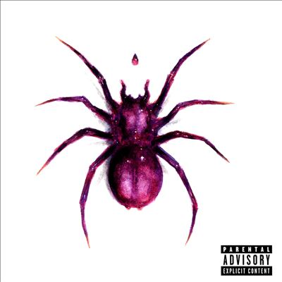

import { Slider, Button } from "@carbon/react";
import { ArrowUpRight } from "@carbon/icons-react";

import SliderJS1 from "../review/slider1";
import SliderJS2 from "../review/slider2";
import SliderJS3 from "../review/slider3";
import SliderJS4 from "../review/slider4";
import AdvJS2 from "../review/adv2";
import AdvJS3 from "../review/adv3";

import { Link } from "gatsby";

import Review1 from "../review/dojacat1.mdx";

Album review

<h1 className="h1--no--margin">{props.pageContext.frontmatter.title}</h1>

  <Link to="/best50/2023/">2023 Black Music Best No.10</Link>

<Row  className="image-card-group">
	<Column colMd={3} colLg={4} noGutterMdLeft="">
       <ImageCard>

</ImageCard>
	</Column>
	<Column colMd={4} colLg={8} noGutterMdLeft="">
	

		近年、勢いを増す女性Rapper陣の中核をなすDoja Catの2年ぶりの3rdアルバム。前作はPopな方向に振った感じではあったが、今作は初心に戻ったのか、Hip-Hop色を少し強めている。ただ、中盤以降ではコンテンポラリーなR&B曲も続き、トータルでは、今どきのHip-Hop Soulとして象徴的な作品になっている。
		 また、主な制作陣は、Earl On The Beat, Kurtis McKenzieあたりと、そこまでメジャーな人たちではなく、ゲストも無しと自身のアーティストパワーに相当、自身がありそうだ。
		 TrackはTrap色が強く、とんがった曲も多くて、力がこもったものになってる。Doja Catも攻撃的でストレートなRap, 唄うようなRap, しっとりした歌唱と、曲に応じて、様々な面を魅せている。
	

	

	  <Button className="button-right-mergin"  href="https://amzn.to/3yOIofE" renderIcon={ArrowUpRight} size='sm' kind='primary'>
      amazon.com
    </Button>
    <Button className="button-right-mergin"  href="https://amzn.to/3tZ05Mj" renderIcon={ArrowUpRight} size='sm' kind='secondary'>
      amazon.co.jp
    </Button>
		<Button className="button-right-mergin"  href="https://apple.co/3Se1pnX" renderIcon={ArrowUpRight} size='sm' kind='tertiary'>
      apple music
    </Button>
		<AdvJS2/>
	

	</Column>
</Row>
<Row >
	<Column colMd={4} colLg={4} noGutterMdLeft="">
		

    	<h3>Score card</h3>
			<SliderJS1 value="3" />
    	<SliderJS2 value="1" />
			<SliderJS3 value="1" />
    	<SliderJS4 value="9" />
		

	</Column>
	<Column colMd={8} colLg={8} noGutterMdLeft="">
		

			<h3>Producers</h3>
			

				Earl On The Beat, Karl Rubin, Jean Baptiste and DJ Replay(1)
				 d. a. Got That Dope(2)
				 Kurtis McKenzie, Cadenza and Flip_00(3)
				 Kurtis McKenzie and Scribz Riley(4)
				 London On Da Track, Devon Rhys Roberts and Sean Momberger(5)
				 Jay Versace and Sam Barsh(6)
				 Kurtis McKenzie and Fallen(7,8)
				 Earl On The Beat, GENTI, Jean Baptiste and Bangs(9)
				 Earl On The Beat, Jean Baptiste and Jasper Harris(10)
				 Jay Versace and Ben Narley(11)
				 Jay Versace(12)
				 Ayo The Producer and Kaeyos(13)
				 Y2K and Rogét Chahayed(14)
				 Yeti Beatz, Rogét Chahayed and Kurtis McKenzie(15)
			

			<h3>Guests</h3>
			

			

		

	</Column>
</Row>

<h3>Tracks</h3>

| No. | Title                  | Composers             | Performer | Time  |
| --- | ---------------------- | --------------------- | --------- | ----- |
| 1   | Paint the Town Red     | Amala Zandile Dlamini | Doja Cat  | 03:50 |
| 2   | Demons                 | Amala Zandile Dlamini | Doja Cat  | 03:15 |
| 3   | Wet Vagina             | Amala Zandile Dlamini | Doja Cat  | 03:12 |
| 4   | F\*\*k the Girls (FTG) | Amala Zandile Dlamini | Doja Cat  | 02:32 |
| 5   | Ouchies                | Amala Zandile Dlamini | Doja Cat  | 02:02 |
| 6   | 97                     | Amala Zandile Dlamini | Doja Cat  | 02:57 |
| 7   | Gun                    | Amala Zandile Dlamini | Doja Cat  | 02:56 |
| 8   | Go Off                 | Amala Zandile Dlamini | Doja Cat  | 03:17 |
| 9   | Agora Hills            | Amala Zandile Dlamini | Doja Cat  | 04:25 |
| 10  | Can't Wait             | Amala Zandile Dlamini | Doja Cat  | 03:55 |
| 11  | Often                  | Amala Zandile Dlamini | Doja Cat  | 03:18 |
| 12  | Love Life              | Amala Zandile Dlamini | Doja Cat  | 03:56 |
| 13  | Skull and Bones        | Amala Zandile Dlamini | Doja Cat  | 04:08 |
| 14  | Attention              | Amala Zandile Dlamini | Doja Cat  | 04:35 |
| 15  | Balut                  | Amala Zandile Dlamini | Doja Cat  | 03:27 |

<h3>Other Reviews</h3>

<Row>
  <Column colMd={3} colLg={3} noGutterMdLeft>
    <Review1 />
  </Column>
</Row>

<AdvJS3 />
