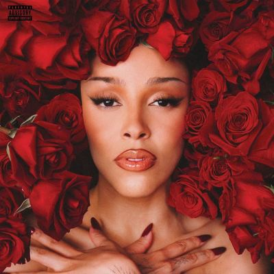

import { Slider, Button } from "@carbon/react";
import { ArrowUpRight } from "@carbon/icons-react";

import SliderJS1 from "../review/slider1";
import SliderJS2 from "../review/slider2";
import SliderJS3 from "../review/slider3";
import SliderJS4 from "../review/slider4";
import AdvJS2 from "../review/adv2";
import AdvJS3 from "../review/adv3";

import { Link } from "gatsby";

import Review2 from "../review/dojacat2.mdx";
import Review1 from "../review/dojacat1.mdx";

Album review

<h1 className="h1--no--margin">{props.pageContext.frontmatter.title}</h1>

  <Link to="/best50/2025/">2025 Black Music Best No.39</Link>

<Row  className="image-card-group">
	<Column colMd={3} colLg={4} noGutterMdLeft="">
       <ImageCard>

</ImageCard>
	</Column>
	<Column colMd={4} colLg={8} noGutterMdLeft="">
		

			Doja Catの2年ぶりの4thアルバム。前作は原点回帰でHip-Hop色を強めたわけだが、今回は真逆で、今までで一番Popな作品になっている。
			 Jack Antonoffをメインプロデューサーに据え、サウンドはゴージャスな煌びやかな80'sポップになっていて、ミディアムな曲中心にアップ、スローと取り交ぜた構成。
			 VocalをベースにRapを乗せた曲がほとんどで、スイートな唄声と力強いラップを別人のように使い分けている。一ランク高いところに到達したことを感じさせつつ、単純に楽しいアルバムでもある。
			 なお、レビューしたのはCD版であるが、Digital版では⑧にSZAがゲスト参加している。
		

		

		  <Button className="button-right-mergin"  href="https://amzn.to/4pbbrTY" renderIcon={ArrowUpRight} size='sm' kind='primary'>
  	    amazon.com
  	  </Button>
  	  <Button className="button-right-mergin"  href="https://amzn.to/4b6pc2Y" renderIcon={ArrowUpRight} size='sm' kind='secondary'>
  	    amazon.co.jp
  	  </Button>
			<Button className="button-right-mergin"  href="https://apple.co/48XzPE4" renderIcon={ArrowUpRight} size='sm' kind='tertiary'>
  	    apple music
  	  </Button>
			<AdvJS2/>
		

	</Column>
</Row>
<Row >
	<Column colMd={4} colLg={4} noGutterMdLeft="">
		

    	<h3>Score card</h3>
			<SliderJS1 value="3" />
    	<SliderJS2 value="1" />
			<SliderJS3 value="1" />
    	<SliderJS4 value="9" />
		

	</Column>
	<Column colMd={8} colLg={8} noGutterMdLeft="">
		

			<h3>Producers</h3>
			

				Jack Antonoff, Y2K and Gavin Bennett(1)
				 Jack Antonoff and Y2K(2)
				 Jack Antonoff(3,15)
				 Jack Antonoff and Benjamin Boukris(4)
				 Jack Antonoff, George Daniel, Sounwave, Kurtis McKenzie, Fallen and Stavros(5)
				 Jack Antonoff, Sounwave, Kurtis McKenzie, Fallen and Stavros(6)
				 Kurtis McKenzie, Jeff "Gitty"Gitelman, Scribz Riley(7)
				 Jack Antonoff, and Gavin Bennett(8)
				 Jack Antonoff, Kurtis McKenzie, Felix Joseph, AoD and Finn Wigan(9)
				 Rob Bisel(10)
				 Jack Antonoff, Kurtis McKenzie, Fallen and Stavros(11)
				 Y2K and Gavin Bennett(12)
				 Jack Antonoff, Kurtis McKenzie, Ambezza and Scribz Riley(13)
				 Jack Antonoff, Kurtis McKenzie, Scribz Riley, Kaeyos and Budee(14)
			

			<h3>Guests</h3>
			

			

		

	</Column>
</Row>

<h3>Tracks</h3>

| No. | Title           | Composers             | Performer | Time  |
| --- | --------------- | --------------------- | --------- | ----- |
| 1   | Cards           | Amala Zandile Dlamini | Doja Cat  | 03:43 |
| 2   | Jealous Type    | Amala Zandile Dlamini | Doja Cat  | 02:43 |
| 3   | Aaahh men!      | Amala Zandile Dlamini | Doja Cat  | 03:13 |
| 4   | Couples Therapy | Amala Zandile Dlamini | Doja Cat  | 02:41 |
| 5   | Gorgeous        | Amala Zandile Dlamini | Doja Cat  | 04:26 |
| 6   | Stranger        | Amala Zandile Dlamini | Doja Cat  | 03:21 |
| 7   | All Mine        | Amala Zandile Dlamini | Doja Cat  | 03:22 |
| 8   | Take Me Dancing | Amala Zandile Dlamini | Doja Cat  | 02:38 |
| 9   | Lipstain        | Amala Zandile Dlamini | Doja Cat  | 03:23 |
| 10  | Silly! Fun!     | Amala Zandile Dlamini | Doja Cat  | 02:32 |
| 11  | Acts of Service | Amala Zandile Dlamini | Doja Cat  | 03:31 |
| 12  | Make It Up      | Amala Zandile Dlamini | Doja Cat  | 03:10 |
| 13  | Happy           | Amala Zandile Dlamini | Doja Cat  | 03:24 |
| 14  | One More Time   | Amala Zandile Dlamini | Doja Cat  | 03:26 |
| 15  | Come Back       | Amala Zandile Dlamini | Doja Cat  | 03:40 |

<h3>Other Reviews</h3>

<Row>
  <Column colMd={3} colLg={3} noGutterMdLeft>
    <Review2 />
  </Column>
  <Column colMd={3} colLg={3} noGutterMdLeft>
    <Review1 />
  </Column>
</Row>

<AdvJS3 />
